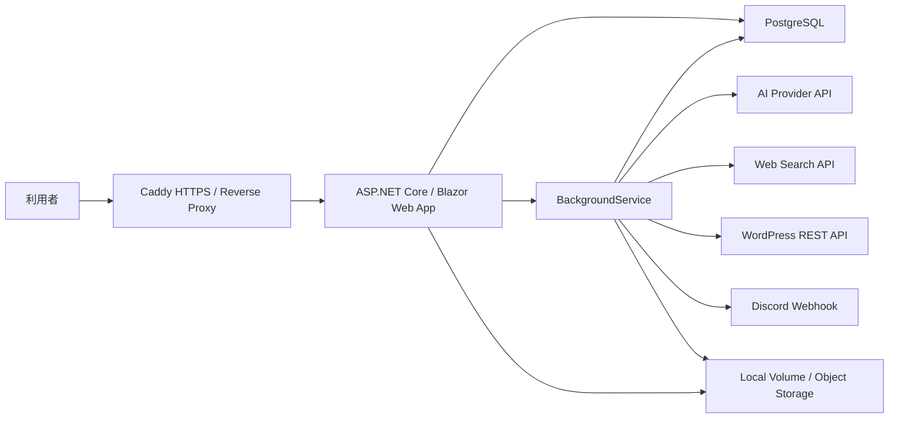
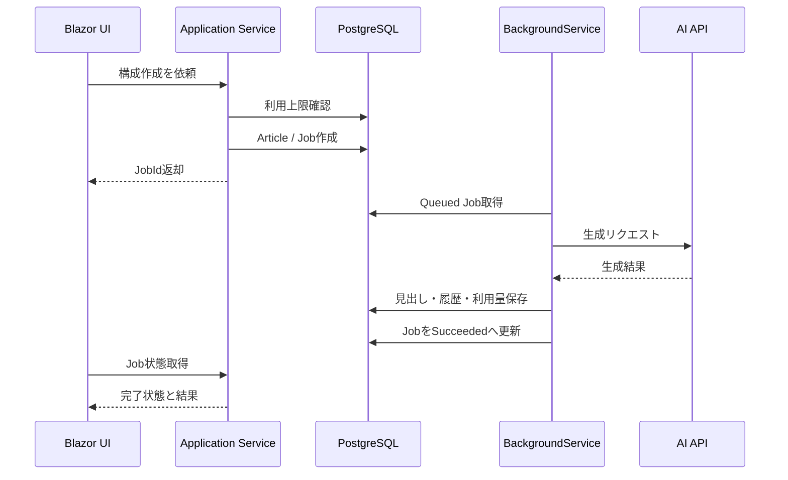

# 基本設計書

## 1. 目的

本書は、`docs/requirements.md` の要件を実装へ落とし込むための基本設計を定義する。対象は、AI記事作成、記事管理、本文生成、WordPress投稿、通知、利用上限管理を備えたBlazor Web Appである。

現時点では実装コードが存在しないため、本書では新規開発時の標準構成、責務分割、データ設計、画面設計、ジョブ処理設計を定める。

## 2. システム全体構成

### 2.1 論理構成



### 2.2 コンテナ構成

| サービス | 役割 | 外部公開 |
| --- | --- | --- |
| `caddy` | HTTPS終端、リバースプロキシ | 80, 443 |
| `app` | Blazor Web App、API、BackgroundService | なし |
| `postgres` | アプリケーションDB | なし |

MVPでは`app`コンテナ内でWebアプリとBackgroundServiceを同居させる。ジョブ量が増えた場合は、同一イメージを使って`worker`コンテナを分離する。

## 3. アプリケーション構成

### 3.1 採用アプリケーションモデル

- Blazor Web Appを採用する。
- 初期表示、一覧、設定画面はSSRを基本とする。
- 記事編集、見出し並び替え、ジョブ状態更新など操作が多い画面はInteractive Serverを使用する。
- 外部システム連携や画面非依存の操作はMinimal APIとして提供する。

### 3.2 プロジェクト構成

単一ソリューション内に以下のプロジェクトを配置する。

```text
src/
  WebWritingTool.Web/
    Components/
    Features/
    Layout/
    Pages/
    Program.cs
    wwwroot/
  WebWritingTool.Application/
    Articles/
    Generation/
    Wordpress/
    Notifications/
    Usage/
  WebWritingTool.Domain/
    Entities/
    Enums/
    ValueObjects/
  WebWritingTool.Infrastructure/
    Data/
    Ai/
    Search/
    Wordpress/
    Notifications/
    BackgroundJobs/
tests/
  WebWritingTool.UnitTests/
  WebWritingTool.IntegrationTests/
  WebWritingTool.E2ETests/
```

### 3.3 レイヤー責務

| レイヤー | 責務 |
| --- | --- |
| Web | Blazor画面、Minimal API、認証、認可、入力モデル、画面状態 |
| Application | ユースケース、バリデーション、トランザクション境界、DTO |
| Domain | エンティティ、値オブジェクト、列挙型、業務ルール |
| Infrastructure | EF Core、外部API、ファイル保存、ジョブ実行、暗号化 |

Web層からEF Coreの`DbContext`を直接操作しない。画面はApplication層のサービスを呼び出す。

## 4. ASP.NET Core設計

### 4.1 `Program.cs`構成

`Program.cs`では以下を登録する。

- Razor Components / Interactive Server Components
- ASP.NET Core Identity
- Authentication / Authorization
- EF Core `ApplicationDbContext`
- `IDbContextFactory<ApplicationDbContext>`
- Applicationサービス
- Infrastructureサービス
- `IHttpClientFactory`
- BackgroundService
- Health Checks
- Rate Limiting
- Response Compression
- Forwarded Headers
- ProblemDetails

### 4.2 ミドルウェア順序

```text
UseForwardedHeaders
UseExceptionHandler / UseDeveloperExceptionPage
UseHsts
UseHttpsRedirection
UseStaticFiles
UseRouting
UseAuthentication
UseAuthorization
UseRateLimiter
MapRazorComponents
MapMinimalApis
MapHealthChecks
```

Caddy配下で動作するため、Forwarded Headersは認証、HTTPSリダイレクト、リンク生成より前に処理する。

### 4.3 設定管理

設定はOptionsクラスへバインドする。

| Options | 主な設定 |
| --- | --- |
| `AiProviderOptions` | Provider、Model、API Key、Timeout、MaxInputChars。MVPはGoogle Gemini 3.1 Pro Preview |
| `SearchProviderOptions` | Provider、Tavily API Key、X Bearer Token、DefaultRegion、MaxResults、環境別CacheTtl |
| `WordpressOptions` | Timeout、AllowedSchemes、RetryCount |
| `NotificationOptions` | Provider、Timeout。Discord Webhook URLはユーザー別にDB暗号化保存する |
| `UsageLimitOptions` | DefaultMonthlyChars、ResetPolicy。MVPでは課金換算しない |
| `StorageOptions` | MVPでは画像保存に使用しない。後続フェーズのファイル保存で追加 |

秘密情報は開発時はUser Secrets、本番では環境変数またはVPS上の安全なシークレット配置から読み込む。

## 5. 画面設計

### 5.1 ルーティング

| URL | 画面 | Render Mode | 認可 |
| --- | --- | --- | --- |
| `/login` | ログイン | SSR | 匿名 |
| `/articles` | 記事一覧 | Interactive Server | 認証必須 |
| `/articles/create` | 記事作成 | Interactive Server | 認証必須 |
| `/articles/{articleId:guid}` | 生成結果編集 | Interactive Server | 所有者または管理者 |
| `/articles/{articleId:guid}/preview` | 記事表示 | SSR | 所有者または管理者 |
| `/articles/settings` | 記事作成設定 | Interactive Server | 認証必須 |
| `/admin/users` | ユーザー管理 | Interactive Server | 管理者 |

### 5.2 共通レイアウト

共通レイアウトは以下で構成する。

- `MainLayout`: ヘッダー、ナビゲーション、本文、フッター
- `TopNavigation`: 主要機能ナビゲーション
- `UsageSummary`: 文字数上限設定、利用モデル、残り構成数表示。MVPでは残り文字数を表示しない
- `UserMenu`: ユーザー情報、退会、ログアウト

### 5.3 記事一覧画面

コンポーネント構成:

| コンポーネント | 役割 |
| --- | --- |
| `ArticleListPage` | 一覧画面全体 |
| `ArticleSearchForm` | タグ、キーワード検索 |
| `ArticleTable` | 記事一覧表示 |
| `ArticleRowActions` | 表示、投稿、削除 |
| `BulkCreateModal` | 一括登録 |
| `WordpressPostModal` | WordPress投稿 |

一覧取得条件:

- 作成日の降順
- 論理削除済みを除外
- ユーザーは自身の記事のみ表示
- 管理者は全ユーザーの記事を検索可能
- 1ページ10件または30件を選択可能

### 5.4 記事作成画面

入力モデル:

| 項目 | 型 | 必須 | 備考 |
| --- | --- | --- | --- |
| `Keyword` | string | 必須 | 最大200文字 |
| `Title` | string | 任意 | 最大200文字 |
| `GenerateImage` | bool | MVPではfalse固定 | trueは受け付けない |
| `H2Count` | int? | 任意 | 1から20 |
| `H3Count` | int? | 任意 | 0から60 |
| `Tone` | enum | 任意 | Normalなど |
| `Tags` | string | 任意 | カンマ区切り |
| `Memo` | string | 任意 | 最大1000文字 |
| `SuggestedKeywords` | string | 任意 | 複数行 |
| `RelatedKeywords` | string | 任意 | 複数行 |
| `LearningType` | enum | 任意 | None / Text / Url |
| `LearningText` | string | 任意 | 上限は設定で管理 |
| `AdditionalPrompt` | string | 任意 | 最大3000文字 |
| `WritingProfileWordpressSiteId` | Guid? | 任意 | サイト別ライティング設定 |
| `OutlineMethod` | enum | 必須 | Keyword / Search / Ai |
| `GenerationModel` | string | 必須 | モデル設定から選択 |
| `SearchMode` | bool | 必須 | 既定はfalse |
| `NotificationMode` | enum | 任意 | None / Discord |

主要操作:

- タイトル候補生成
- 詳細設定の展開/折りたたみ
- 構成作成ジョブ登録
- 入力内容の一時保存

### 5.5 生成結果編集画面

画面は左右2カラムとする。

左カラム:

- メタディスクリプション
- 見出し構成ツリー
- 記事全体操作ボタン

MVPではアイキャッチ画像の作成・生成・加工、外部画像URLの保存・表示、画像ファイル保存、画像メタデータ保存は行わない。

右カラム:

- 選択見出しタイトル
- 本文編集エリア
- 本文操作ボタン
- 生成ステータス
- 文字数表示

見出しツリーの操作:

- H2追加
- H3追加
- 削除
- 上下移動
- Web検索適用
- 本文生成

保存方式:

- 明示的な保存ボタンで保存する。
- 本文操作や見出し操作の前には未保存変更を検知して確認する。
- 将来対応として自動保存を追加できる設計にする。

### 5.6 設定画面

設定画面は以下のセクションに分割する。

- 通知設定
- WordPress管理。接続情報、既定カテゴリ、管理人プロフィール、語り手・キャラ設定、読者ペルソナを扱う。
- 高度な記事設定
- 事前学習設定
- 本文文字数設定
- 記事作成ステータス
- ライター管理

MVPではライター管理は実装せず、画面にも表示しない。

## 6. API設計

Blazor画面から直接サービスを呼べる処理はApplicationサービスを利用する。フォーム以外の非同期操作、ジョブ状態取得、将来のAPI公開に備える処理はMinimal APIとして境界を明確にする。
MVPでは外部公開APIを正式提供せず、`/api`配下はBlazor Web Appが同一オリジンで利用する内部APIとする。外部公開が必要になった段階で`/api/v1`を新設し、認証方式、スコープ、レート制限、監査ログ、互換性ポリシーを定義する。管理者APIは外部公開対象に含めない。

### 6.1 Minimal API一覧

| Method | Path | 用途 | 認可 |
| --- | --- | --- | --- |
| `GET` | `/api/articles` | 記事一覧取得 | 認証必須 |
| `POST` | `/api/articles` | 記事作成 | 認証必須 |
| `POST` | `/api/articles/bulk` | 一括記事作成 | 認証必須 |
| `GET` | `/api/articles/{articleId}` | 記事詳細取得 | 所有者または管理者 |
| `PUT` | `/api/articles/{articleId}` | 記事更新 | 所有者または管理者 |
| `DELETE` | `/api/articles/{articleId}` | 論理削除 | 所有者または管理者 |
| `POST` | `/api/articles/{articleId}/generation/title-candidates` | タイトル候補生成ジョブ登録 | 所有者または管理者 |
| `POST` | `/api/articles/{articleId}/generation/outline` | 構成生成ジョブ登録 | 所有者または管理者 |
| `POST` | `/api/articles/{articleId}/generation/headings/{headingId}/body` | 本文生成ジョブ登録 | 所有者または管理者 |
| `POST` | `/api/articles/{articleId}/wordpress-posts` | WordPress投稿ジョブ登録 | 所有者または管理者 |
| `GET` | `/api/jobs/{jobId}` | ジョブ状態取得 | 所有者または管理者 |
| `POST` | `/api/wordpress-sites` | WordPressサイト登録 | 認証必須 |
| `POST` | `/api/wordpress-sites/{wordpressSiteId}/test` | WordPress接続テスト | 所有者または管理者 |
| `POST` | `/api/notifications/test` | 通知送信テスト | 認証必須 |
| `DELETE` | `/api/account` | 本人退会、ユーザー物理削除 | 認証必須 |
| `GET` | `/api/admin/users` | ユーザー一覧取得 | 管理者 |
| `POST` | `/api/admin/users` | 管理者によるユーザー作成 | 管理者 |
| `PUT` | `/api/admin/users/{userId}` | 表示名・有効状態変更 | 管理者 |
| `PUT` | `/api/admin/users/{userId}/role` | ユーザーロール変更 | 管理者 |
| `PUT` | `/api/admin/users/{userId}/usage-limit` | 利用上限更新 | 管理者 |
| `DELETE` | `/api/admin/users/{userId}` | ユーザー物理削除 | 管理者 |
| `GET` | `/api/admin/audit-logs` | ユーザー管理監査ログ取得 | 管理者 |

### 6.2 レスポンス方針

- 成功時はDTOを返す。
- 入力エラーは`400 Bad Request`とProblemDetailsを返す。
- 認証エラーは`401 Unauthorized`を返す。
- 権限エラーは`403 Forbidden`を返す。
- 対象なしは`404 Not Found`を返す。
- ジョブ登録系は`202 Accepted`と`JobId`を返す。

## 7. ドメイン設計

### 7.1 主な集約

| 集約 | ルート | 説明 |
| --- | --- | --- |
| 記事 | `Article` | 記事本文、見出し、投稿状態を管理。MVPでは画像を持たない |
| ジョブ | `ArticleGenerationJob` | AI生成、投稿、通知などの実行状態を管理 |
| 外部連携 | `WordpressSite` | WordPress接続情報とサイト別ライティング設定を管理 |
| 利用量 | `UsageLedger` | AI生成ごとの文字数利用履歴を管理。MVPでは月次集計しない |

### 7.2 列挙型

```csharp
public enum ArticleStatus
{
    Draft,
    OutlineQueued,
    OutlineGenerating,
    OutlineReady,
    BodyQueued,
    BodyGenerating,
    Completed,
    Posted,
    Failed
}

public enum JobStatus
{
    Queued,
    Running,
    Succeeded,
    Failed,
    Canceled
}

public enum JobType
{
    TitleGeneration,
    OutlineGeneration,
    BodyGeneration,
    Rewrite,
    WebSearch,
    XFullArchiveSearch,
    WordpressPost,
    Notification
}
```

### 7.3 業務ルール

- 記事は必ず`UserId`を持つ。
- 自分以外の記事は参照、更新、削除できない。ただし管理者は例外とする。
- 初期Adminは起動時Seedで作成し、既にAdminが存在する場合は作成しない。
- 2人目以降のAdminは管理画面で既存ユーザーを昇格する、または管理者が新規ユーザー作成時にAdminロールを付与する。
- ユーザーは現在パスワードを再確認したうえで本人退会できる。退会時は対象ユーザーに紐づく業務データと、対象ユーザーが操作した既存監査ログをトランザクション内で物理削除する。
- 本人退会は`Running`ジョブがある場合と最後のAdminユーザーの場合に拒否する。
- 管理者はユーザーを削除できる。ユーザー削除時は、そのユーザーに紐づく業務データをトランザクション内で物理削除する。
- 管理者自身の削除と最後のAdminユーザーの削除、降格、無効化は拒否する。
- `Completed`または`Posted`の記事のみWordPress投稿できる。
- 記事作成時に選択されたWordPressサイトの管理人プロフィール、語り手・キャラ設定、読者ペルソナは記事へスナップショットし、タイトル候補、見出し構成、本文生成、リライトのプロンプトへ反映する。
- 一括作成でWordPress自動投稿を有効にした記事は、本文生成とHTML変換が完了した後に下書き投稿ジョブを一度だけ登録する。
- MVPでは月次利用量集計と文字数消費に基づく残量算出は行わない。構成生成回数など明示的な残数がある場合のみジョブ登録前に確認する。
- MVPでは記事本文の履歴管理を行わない。本文編集、再取得、要約、長文化、リライト、HTML変換は現在値を上書きし、同時更新は`RowVersion`で検出する。
- ジョブ失敗時は記事ステータスを失敗に寄せるが、既存本文は保持する。
- WordPress接続情報は削除時も投稿履歴から参照できるよう、論理削除とする。

## 8. データベース設計

### 8.1 テーブル一覧

| テーブル | 用途 |
| --- | --- |
| `AspNetUsers` | Identityユーザー |
| `Articles` | 記事本体 |
| `ArticleHeadings` | 見出し階層と本文。MVPでは本文履歴を持たない |
| `ArticleGenerationJobs` | バックグラウンドジョブ |
| `AiGenerationLogs` | AI生成履歴 |
| `UsageLedgers` | 文字数利用履歴 |
| `SearchResults` | Web検索結果 |
| `XSearchPosts` | X投稿検索結果 |
| `WordpressSites` | WordPress連携先 |
| `WordpressPosts` | WordPress投稿履歴 |
| `NotificationSettings` | 通知設定 |
| `NotificationLogs` | 通知履歴 |
| `AiModelSettings` | 利用可能AIモデル設定 |
| `UserUsageLimits` | ユーザー別利用上限 |
| `AuditLogs` | 管理操作・重要操作ログ |

### 8.2 `Articles`

| カラム | 型 | 制約 |
| --- | --- | --- |
| `Id` | uuid | PK |
| `UserId` | text | FK, required |
| `Keyword` | varchar(200) | required |
| `Title` | varchar(250) | nullable |
| `Status` | varchar(40) | required |
| `Tone` | varchar(40) | nullable |
| `Tags` | text[] | default empty |
| `Memo` | text | nullable |
| `Body` | text | nullable |
| `HtmlBody` | text | nullable |
| `MetaDescription` | varchar(320) | nullable |
| `GenerationModel` | varchar(80) | nullable |
| `OutlineMethod` | varchar(40) | required |
| `SearchMode` | boolean | required |
| `IsDomesticOnly` | boolean | default true |
| `NotificationMode` | varchar(40) | default 'None' |
| `StrictMode` | boolean | default false |
| `TopicRisk` | varchar(40) | nullable |
| `HumanReviewRequired` | boolean | default false |
| `HumanReviewedAt` | timestamptz | nullable |
| `HumanReviewedByUserId` | text | FK, nullable |
| `WritingProfileWordpressSiteId` | uuid | FK, nullable |
| `WritingProfileSnapshotJson` | jsonb | nullable |
| `AutoPostToWordpress` | boolean | default false |
| `AutoPostWordpressSiteId` | uuid | FK, nullable |
| `AutoPostWordpressCategoryId` | integer | nullable |
| `AutoPostQueuedAt` | timestamptz | nullable |
| `CompletedAt` | timestamptz | nullable |
| `PostedAt` | timestamptz | nullable |
| `CreatedAt` | timestamptz | required |
| `UpdatedAt` | timestamptz | required |
| `DeletedAt` | timestamptz | nullable |
| `RowVersion` | bytea | concurrency |

インデックス:

- `(UserId, CreatedAt DESC)`
- `(UserId, Status)`
- `(UserId, Title)`
- `DeletedAt`
- `Tags` GIN

### 8.3 `ArticleHeadings`

| カラム | 型 | 制約 |
| --- | --- | --- |
| `Id` | uuid | PK |
| `ArticleId` | uuid | FK, required |
| `ParentId` | uuid | nullable |
| `Level` | integer | required, 2 or 3 |
| `Title` | varchar(250) | required |
| `Body` | text | nullable |
| `DisplayOrder` | integer | required |
| `TargetLength` | integer | nullable |
| `ActualLength` | integer | nullable |
| `Status` | varchar(40) | required |
| `UseWebSearch` | boolean | required |
| `SearchQuery` | varchar(300) | nullable |
| `CreatedAt` | timestamptz | required |
| `UpdatedAt` | timestamptz | required |
| `DeletedAt` | timestamptz | nullable |
| `RowVersion` | bytea | concurrency |

インデックス:

- `(ArticleId, DisplayOrder)`
- `(ArticleId, ParentId)`

### 8.4 `ArticleGenerationJobs`

| カラム | 型 | 制約 |
| --- | --- | --- |
| `Id` | uuid | PK |
| `UserId` | text | FK, required |
| `ArticleId` | uuid | FK, nullable |
| `HeadingId` | uuid | FK, nullable |
| `JobType` | varchar(40) | required |
| `Status` | varchar(40) | required |
| `Priority` | integer | required |
| `Progress` | integer | default 0 |
| `PayloadJson` | jsonb | required |
| `ResultJson` | jsonb | nullable |
| `AttemptCount` | integer | required |
| `MaxAttempts` | integer | required |
| `NextRunAt` | timestamptz | nullable |
| `LockedBy` | varchar(100) | nullable |
| `LockedAt` | timestamptz | nullable |
| `ErrorCode` | varchar(80) | nullable |
| `ErrorMessage` | text | nullable |
| `QueuedAt` | timestamptz | required |
| `StartedAt` | timestamptz | nullable |
| `FinishedAt` | timestamptz | nullable |
| `CanceledAt` | timestamptz | nullable |

インデックス:

- `(Status, Priority, QueuedAt)`
- `(Status, NextRunAt)`
- `(UserId, QueuedAt DESC)`
- `(ArticleId, JobType)`
- `HeadingId`

### 8.5 文字数利用履歴

`UsageLedgers`は加算専用の台帳とする。MVPではAI生成ごとの利用履歴を保存するだけに留め、月次利用量集計、残り文字数算出、課金計算、文字数消費に基づく上限制御は行わない。
MVPではProvider別の文字数/トークン換算とトークン事前見積もりを実装しない。後続フェーズでProvider別TokenCounterを追加し、公式APIまたは公式Tokenizerを使って事前見積もりする。

| カラム | 型 | 制約 |
| --- | --- | --- |
| `Id` | uuid | PK |
| `UserId` | text | FK, required |
| `ArticleId` | uuid | nullable |
| `JobId` | uuid | nullable |
| `Provider` | varchar(40) | required |
| `Model` | varchar(80) | required |
| `PromptChars` | integer | required |
| `OutputChars` | integer | required |
| `UsageChars` | integer | required |
| `OccurredAt` | timestamptz | required |

## 9. EF Core設計

### 9.1 DbContext

- `ApplicationDbContext`はIdentity用DbContextを継承する。
- 主キーは原則`Guid`を使う。IdentityユーザーIDは既定の`string`を許容する。
- 日時はUTCで保存する。
- 削除は原則`DeletedAt`による論理削除とする。ただし、本人退会と管理者によるユーザー削除では対象ユーザーに紐づく業務データを物理削除する。
- enumは文字列として保存し、可読性を優先する。
- `jsonb`はジョブPayloadなど、スキーマ変化が多い補助情報に限定する。

### 9.2 マイグレーション方針

- スキーマ変更はEF Core Migrationsで管理する。
- 本番適用前にSQLスクリプトを生成して確認する。
- 既存データの破壊的変更はマイグレーション内で明示的に扱う。

## 10. Applicationサービス設計

### 10.1 サービス一覧

| サービス | 責務 |
| --- | --- |
| `IArticleService` | 記事CRUD、検索、保存 |
| `IArticleCommandService` | 作成、更新、削除、ステータス変更、サイト別ライティング設定のスナップショット保存、一括作成時のWordPress自動投稿設定保存 |
| `IHeadingService` | 見出し追加、削除、並び替え、保存 |
| `IGenerationJobService` | ジョブ登録、状態取得、再実行 |
| `IUsageLimitService` | 利用上限設定確認、利用文字数履歴記録。MVPでは月次集計と課金換算を行わない |
| `IReferenceResearchService` | Tavily検索、X投稿検索、キャッシュ参照、重複排除 |
| `ITitleGenerationService` | タイトル候補生成プロンプト作成 |
| `IOutlineGenerationService` | 見出し生成プロンプト作成 |
| `IBodyGenerationService` | 本文生成、リライト、要約 |
| `IWordpressSiteService` | WordPressサイト管理、サイト別ライティング設定管理 |
| `IWordpressPostService` | WordPress投稿ジョブ登録、自動投稿ジョブ登録、投稿履歴 |
| `INotificationService` | 通知設定、送信テスト、通知ジョブ登録 |

### 10.2 DTO方針

- 画面入力用DTOとDBエンティティを分離する。
- 外部APIレスポンスを直接画面に渡さない。
- ID、ステータス、日時は画面用DTOで表示しやすい形式へ整形する。

## 11. 外部連携設計

### 11.1 AI Provider

MVPではGoogle Geminiを採用し、既定モデルをGoogle Gemini 3.1 Pro Previewとする。APIモデルIDは`gemini-3.1-pro-preview`、利用可能リージョンはJapanとする。

インターフェース:

```csharp
public interface IAiTextGenerationClient
{
    Task<AiTextGenerationResult> GenerateAsync(
        AiTextGenerationRequest request,
        CancellationToken cancellationToken);
}
```

Providerごとの実装:

- `GeminiTextGenerationClient`

設計方針:

- プロンプト生成はApplication層で行う。
- サイト別ライティング設定は、記事に保存された`WritingProfileSnapshotJson`から読み取り、事実確認・安全性・追加プロンプトより低い優先度の文体コンテキストとして組み込む。
- HTTP通信、認証ヘッダー、リトライ、タイムアウトはInfrastructure層で行う。
- APIキーはOptionsから取得し、ログに出力しない。
- レスポンスは共通DTOへ変換する。
- Gemini以外のAI Provider対応はMVP対象外とし、後続フェーズでOpenAI GPT、Anthropic Claudeなどを選択できるようにする。
- 後続フェーズで別Providerを追加できるよう、Application層は`IAiTextGenerationClient`にのみ依存する。

### 11.2 Web検索

インターフェース:

```csharp
public interface IWebSearchClient
{
    Task<IReadOnlyList<SearchResultDto>> SearchAsync(
        WebSearchRequest request,
        CancellationToken cancellationToken);
}
```

検索結果はDBへ保存し、本文生成時の参照情報として利用する。

Providerごとの実装:

- `TavilyWebSearchClient`
- `XFullArchiveSearchClient`

設計方針:

- 通常のWeb検索はTavily Search APIを使用する。
- キーワードに関するSNS上の実例、口コミ、時系列情報はX API Full-Archive Searchから取得する。
- X検索は検索期間、言語、除外条件、最大件数を指定して検索範囲を絞る。
- Tavily検索結果は`SearchResults`へ保存する。
- X投稿検索結果は`XSearchPosts`へ保存する。
- 同一クエリ、同一条件、同一期間の検索はキャッシュを優先する。
- X投稿は外部投稿IDで一意制約を設け、同じ投稿を再取得・再保存しない。
- 検索結果をAIプロンプトへ渡す際は、URL、スニペット、投稿本文の要約など必要最小限に整形する。
- X APIはPay-per-use契約を前提とし、Full-Archive Searchは必要時のみ実行する。
- X API Full-Archive Searchの`max_results`は通常100、大量調査時500を上限とする。
- 月間安全上限は10,000から50,000 posts程度から開始する。
- Tavily検索結果JSONは1から24時間、Tavily本文・要約・スニペットは24時間から7日、Tavilyメタデータは30から180日を保持期間の目安とする。
- X投稿の本文、投稿者名、プロフィール情報、メディアURLは最大24時間保持とし、X Post ID、User ID、個別投稿を復元できない集計データは長期保持できる。
- 生成済み記事内でX投稿を引用する場合は、WordPress投稿前に再hydrationして削除・非公開・編集の有無を確認する。

環境別上書き:

| 環境 | Tavily検索結果JSON | Tavily本文・要約・スニペット | X投稿生データ | X ID | X表示・公開前 |
| --- | --- | --- | --- | --- | --- |
| `dev` | 24時間 | 24時間 | 6時間 | 長期保持可 | 任意 |
| `staging` | 6時間 | 24時間 | 6時間 | 長期保持可 | 推奨 |
| `production` | 24時間 | 7日 | 24時間 | 長期保持可 | 必ず再取得 |
| `strict` | 24時間 | 24時間 | 1時間 | 長期保持可 | 必ず再取得 |

TTL解決ルール:

| 単位 | 役割 | 例 | 上書き方向 |
| --- | --- | --- | --- |
| 環境単位 | システム全体の上限・安全装置 | productionではX raw 24時間以下、strict環境では1時間以下 | 必ず優先 |
| ユーザー単位 | 顧客、プラン、組織ごとの標準設定 | 法務が厳しい企業は常にstrict、個人ユーザーはnormal | 厳しくできる |
| 記事単位 | その記事だけのリスク制御 | ニュース、医療、金融、法律、X引用あり記事だけstrict | 厳しくできる |
| データソース単位 | API規約差分の吸収 | Xは短期、Tavilyはやや長め | 厳しくできる |
| トピック単位 | 鮮度・リスク反映 | news、trend、legal、priceは短TTL | 厳しくできる |

最終TTLは、候補TTLのうち最も短い値を採用する。productionとstrictでは、X投稿を表示または公開利用する前に必ず再hydrationする。

トピック自動判定:

| 判定 | 対象 | 実装上の扱い |
| --- | --- | --- |
| `normal` | 一般SEO記事、ハウツー記事、技術メモ、ブログ下書き、evergreen記事 | 通常TTL |
| `strict` | 最新情報、ニュース、X投稿を使う記事、料金比較、API料金、商品価格、在庫、ランキング、口コミ・評判、SaaS比較 | strict TTL |
| `compliance_strict` | 医療、法律、税金、投資、保険、政治、選挙、災害、事件、個人や企業の不祥事 | strict TTL + 人間確認必須 |

MVPでは`compliance_strict`専用の複雑なワークフローは作らず、`HumanReviewRequired`相当のフラグを立て、公開前に確認を要求する。

初期辞書カテゴリ:

| カテゴリ | 判定 | 用途 |
| --- | --- | --- |
| `freshness` | `strict` | 最新性、変更、リリース、終了予定など |
| `newsTrend` | `strict` | ニュース、トレンド、SNS反応、ランキングなど |
| `pricing` | `strict` | 価格、料金、課金、キャンペーン、API料金など |
| `productAvailability` | `strict` | 在庫、入荷、販売状況、発売日、対応状況など |
| `comparisonReview` | `strict` | 比較、レビュー、口コミ、ランキング、競合など |
| `techSaaS` | `strict` | API、SDK、AIモデル、制限、Preview、GAなど |
| `sourceSignals` | `strict` | X投稿、ツイート、引用、SNS投稿、コメントなど |
| `legalFinanceHealth` | `compliance_strict` | 法律、税金、投資、保険、医療など |
| `politicsSafetyReputation` | `compliance_strict` | 政治、選挙、災害、事件、不祥事など |

辞書メンテナンス:

| 項目 | 方針 |
| --- | --- |
| 担当 | 運営者本人 |
| 更新頻度 | 月1回 + 誤判定に気づいた時 |
| 更新対象 | strict判定キーワード、除外キーワード、トピックカテゴリ、TTLポリシー |
| 管理形式 | YAMLまたはJSON |
| 反映条件 | テストケース追加、判定結果確認後に反映 |

### 11.3 WordPress

インターフェース:

```csharp
public interface IWordpressClient
{
    Task<WordpressPostResult> CreatePostAsync(
        WordpressPostRequest request,
        CancellationToken cancellationToken);

    Task<IReadOnlyList<WordpressCategoryDto>> GetCategoriesAsync(
        WordpressSiteConnection connection,
        CancellationToken cancellationToken);
}
```

設計方針:

- Application Passwordは暗号化保存する。
- 投稿先URLはHTTPSを必須とする。
- WordPress投稿ステータスは下書きを既定値とする。
- カテゴリ一覧はDBキャッシュせず、画面/APIで必要になった時にWordPress REST APIから都度取得する。
- DBに保存するカテゴリ情報は、サイト既定カテゴリと投稿履歴に使うカテゴリIDに限定する。
- 投稿失敗時はHTTPステータス、WordPressエラーコード、メッセージを保存する。

### 11.4 通知

初期実装はDiscord Webhookを対象とする。

- 記事作成完了
- WordPress投稿完了
- ジョブ失敗
- 送信テスト

通知本文には記事タイトル、ステータス、対象URL、エラー概要を含める。秘密情報やプロンプト全文は含めない。

## 12. バックグラウンドジョブ設計

### 12.1 実行方式

- `ArticleJobWorker : BackgroundService`を実装する。
- 一定間隔で`Queued`ジョブを取得する。
- 取得時に`Running`へ更新し、`LockedBy`と`LockedAt`を設定する。
- 処理成功時は`Succeeded`、失敗時は`Failed`または再試行可能なら`Queued`へ戻す。

### 12.2 ジョブ取得

PostgreSQLの行ロックを使い、複数ワーカーでも同一ジョブを処理しない。

```sql
SELECT *
FROM "ArticleGenerationJobs"
WHERE "Status" = 'Queued'
ORDER BY "Priority" DESC, "QueuedAt" ASC
FOR UPDATE SKIP LOCKED
LIMIT 1;
```

### 12.3 ジョブ共通処理



### 12.4 再試行

- タイムアウト、429、5xxは再試行対象とする。
- 400系の入力不正、認証失敗、利用上限超過は再試行しない。
- 再試行間隔は指数バックオフを基本とする。
- 最大試行回数はジョブ種別ごとに設定する。

## 13. セキュリティ設計

### 13.1 認証・認可

- ASP.NET Core Identityを利用する。
- Cookie認証を基本とする。
- 管理画面は`Admin`ロール必須とする。
- Adminロールはユーザー作成、ロール変更、他ユーザー削除ができるが、自分自身の管理者削除と最後のAdminユーザーの削除、降格、無効化はできない。本人退会は最後のAdminでない場合のみ許可する。
- 記事、WordPressサイト、通知設定は所有者チェックを行う。
- UI上の非表示だけに頼らず、ApplicationサービスまたはAPIで認可を検証する。

### 13.2 秘密情報

- APIキー、Application Password、Discord Webhook URLはGit管理しない。
- WordPress Application PasswordはDB保存前に暗号化する。
- 本番ではData Protection Keyを永続化する。
- ログには秘密情報、Authorizationヘッダー、Cookie、プロンプト全文を出さない。

### 13.3 入力検証

- URLはHTTPSのみ許可する。
- タイトル、タグ、メモ、追加プロンプトには長さ制限を設ける。
- WordPress投稿HTMLは許可するが、プレビュー表示時はXSS対策を行う。
- 外部URL取得はSSRF対策としてプライベートIP、localhost、メタデータIPを拒否する。

## 14. 画像・ファイル保存設計

MVPでは画像生成、アイキャッチ画像の作成・加工、外部画像URLの保存・表示を行わない。画像ファイル、画像URL、画像メタデータはDBにもファイルストレージにも保存しない。

後続フェーズで画像生成または画像URL管理を追加する場合は、生成画像をアプリコンテナにマウントした永続ボリュームへ保存する。

```text
/app-data/images/{userId}/{articleId}/{imageId}.webp
```

後続フェーズで検討する保存情報:

- 元プロンプト
- 生成モデル
- 保存パス
- 公開URL
- 画像サイズ
- 作成日時

将来的にS3互換ストレージへ移行できるよう、`IFileStorage`インターフェース越しに扱う。

## 15. HTML変換設計

記事本文は内部的には見出し単位のプレーンテキストまたはMarkdown相当で保持し、投稿時にHTMLへ変換する。

変換ルール:

- H2は`<h2>`へ変換する。
- H3は`<h3>`へ変換する。
- 段落は`<p>`へ変換する。
- 改行設定が有効な場合、句点で段落または`<br>`を挿入する。
- MVPではWordPress投稿時にアイキャッチ画像を指定しない。WordPressメディア登録とアイキャッチ画像URL指定は後続フェーズで追加する。

## 16. ログ・監視設計

### 16.1 ログ

| ログ | 内容 |
| --- | --- |
| アプリログ | リクエスト、認証、画面操作エラー |
| ジョブログ | ジョブ開始、終了、失敗、再試行 |
| 外部連携ログ | AI、検索、WordPress、通知の結果概要 |
| 監査ログ | 設定変更、WordPress連携情報変更、削除操作 |

### 16.2 ヘルスチェック

| Path | 用途 |
| --- | --- |
| `/health/live` | アプリプロセスの生存確認 |
| `/health/ready` | PostgreSQL接続、BackgroundService状態確認 |
| `/health/deps` | 外部依存先の簡易疎通確認。管理者限定 |

## 17. Docker / Caddy設計

### 17.1 Docker Compose方針

`docker-compose.yml`では以下を定義する。

- `app`は`ASPNETCORE_URLS=http://+:8080`で起動する。
- `postgres`は外部公開しない。
- `caddy`のみ80/443を公開する。
- `postgres-data`、`caddy-data`、`app-data`をvolumeで永続化する。
- 本番秘密情報は`.env`またはVPS側の環境変数で渡し、リポジトリには含めない。

### 17.2 Caddyfile方針

```text
example.com {
    reverse_proxy app:8080
}
```

本番ではドメイン、メールアドレス、ログ出力先、アップロードサイズ、タイムアウトを運用設計で確定する。

## 18. テスト設計

### 18.1 単体テスト

- 記事ステータス遷移
- 利用文字数計算
- Tavily検索結果キャッシュ
- X投稿検索の重複排除
- 一括登録パーサー
- HTML変換
- WordPress投稿DTO生成
- ジョブ再試行判定

### 18.2 結合テスト

- 認証必須画面のアクセス制御
- 記事CRUD
- ジョブ登録
- EF CoreとPostgreSQLのCRUD
- 所有者チェック
- WordPress接続テストの成功/失敗

### 18.3 E2Eテスト

Playwright for .NETを想定する。

- ログイン
- 記事作成
- タイトル候補生成ジョブ登録
- 構成作成ジョブ登録
- 記事一覧検索
- WordPress投稿モーダル表示

## 19. 実装順序

1. ソリューションとプロジェクト作成
2. Docker ComposeとPostgreSQL接続
3. Identityログイン
4. EF Coreエンティティと初期マイグレーション
5. 記事一覧、記事作成、記事編集の最小画面
6. ジョブテーブルとBackgroundService
7. AIテキスト生成連携
8. 見出し生成と本文生成
9. Tavily検索連携
10. X Full-Archive Search連携
11. 利用文字数の記録・表示
12. WordPress連携
13. 通知連携
14. Caddy経由のVPSデプロイ

## 20. 決定事項

- WordPress投稿時のメディアアップロードはMVPに含めない。MVPではアイキャッチ画像URL指定も対応しない。
- MVPではアイキャッチ画像の作成・生成・加工、外部画像URLの保存・表示、画像ファイル保存、画像メタデータ保存に対応しない。
- 初期実装の通知プロバイダーはDiscordのみとし、Discord以外の通知プロバイダーは後続フェーズで扱う。
- Gemini以外のAI Provider対応はMVPに含めない。後続フェーズでOpenAI GPT、Anthropic Claudeなどを選択可能にする。
- Discord Webhook URLは環境変数による全体共有ではなく、ユーザー別にDB暗号化保存する。
- Provider別の文字数/トークン換算ルールはMVPでは実装しない。後続フェーズでProvider別TokenCounterを実装し、公式APIまたは公式Tokenizerを使って事前見積もりする。
