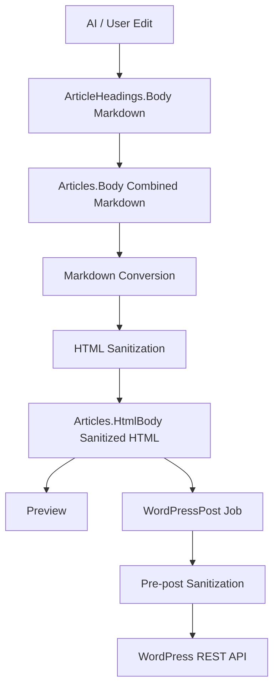

# コンテンツレンダリング設計書

## 1. 目的

本書は、AI生成本文とユーザー編集本文をMarkdownとして保存し、画面プレビューとWordPress投稿用HTMLへ変換する方針を定義する。

対象は、見出し本文、記事結合本文、HTML変換、HTMLプレビュー、WordPress投稿HTML、X投稿引用、XSS対策、変換失敗時の扱いである。

## 2. 基本方針

- 生成本文と編集本文はMarkdownとして扱う。
- `ArticleHeadings.Body`と`Articles.Body`はMarkdown本文を保存する。
- `Articles.HtmlBody`はMarkdownから変換し、サニタイズ済みHTMLとして保存する。
- 画面プレビューではサニタイズ済みHTMLだけを描画する。
- WordPress投稿では投稿直前にもHTMLを再サニタイズする。
- HTML、Markdown、検索結果、X投稿、WordPress由来データを安全な表示内容として信頼しない。
- `<script>`、イベントハンドラ属性、危険なURLスキーム、外部埋め込みスクリプトを許可しない。
- MVPでは画像、iframe、X公式埋め込みスクリプト、note向け変換を扱わない。X投稿は再取得済み情報からアプリ側で生成する引用元カードとして表示する。
- 本文履歴は作成せず、本文、HTML本文、見出し本文は現在値のみ保持する。

## 3. データフロー



HTML変換は本文生成と分離する。本文生成ジョブはMarkdown本文を保存し、HTML変換APIまたは本文生成完了後の変換処理が`Articles.HtmlBody`を更新する。

## 4. 保存形式

| 保存先 | 形式 | 方針 |
| --- | --- | --- |
| `ArticleHeadings.Body` | Markdown | 見出し単位の本文。対象見出しタイトルは含めない |
| `Articles.Body` | Markdown | 見出しタイトルと見出し本文を結合した記事本文 |
| `Articles.HtmlBody` | Sanitized HTML | 画面プレビューとWordPress投稿の元データ |
| `WordpressPosts` | 投稿履歴 | 投稿結果、投稿URL、ErrorCodeを保存する。HTML本文全文は重複保存しない |

未サニタイズHTMLは保存しない。WordPress投稿モーダルでHTMLを編集する場合も、保存または投稿前にサーバー側でサニタイズする。

## 5. Markdown許可範囲

MVPで扱うMarkdownは以下に限定する。

| 要素 | 方針 |
| --- | --- |
| 段落 | 許可 |
| H2 / H3 | 許可。記事結合時に見出し構造から生成する |
| 箇条書き | `-`、番号付きリストを許可 |
| 強調 | `**strong**`、`*em*`を許可 |
| 引用 | `>`を許可。X投稿引用は再取得条件を満たす場合のみ |
| リンク | HTTPS、相対パス、ページ内アンカーのみ許可 |
| インラインコード | MVPでは任意。HTML変換時はエスケープする |
| コードブロック | MVPでは任意。HTML変換時はエスケープする |
| テーブル | MVPでは原則扱わない |
| 画像 | MVPでは扱わない |
| 生HTML | 原則禁止。入力された場合はエスケープまたはサニタイズ対象にする |

生成AIには本文Markdownを要求するが、出力を信用せず、変換前後に検証する。

## 6. HTML許可範囲

サニタイズ後のHTMLで許可するタグは以下を基本とする。

| タグ | 用途 |
| --- | --- |
| `h2`, `h3` | 見出し |
| `p` | 段落 |
| `br` | 句点改行、明示改行 |
| `ul`, `ol`, `li` | リスト |
| `strong`, `em` | 強調 |
| `blockquote` | 引用、X引用元カード |
| `a` | リンク |
| `code`, `pre` | コード表示 |
| `cite` | 引用元名 |
| `time` | 投稿日時 |

許可属性:

| タグ | 属性 | 方針 |
| --- | --- | --- |
| `a` | `href`, `title`, `target`, `rel` | `href`検証後に許可 |
| `blockquote` | `cite` | X投稿URLなどHTTPS URLのみ許可 |
| `time` | `datetime` | ISO 8601形式のみ許可 |
| すべて | なし | `style`, `class`, `id`, `on*`はMVPでは許可しない |

禁止タグ:

- `script`
- `style`
- `iframe`
- `object`
- `embed`
- `form`
- `input`
- `button`
- `textarea`
- `select`
- `img`
- `video`
- `audio`
- `svg`
- `math`
- `link`
- `meta`

`img`はMVPで画像生成と画像アップロードを扱わないため禁止する。後続フェーズで画像を扱う場合は、画像保存、URL検証、代替テキスト、WordPressメディアアップロードの設計を追加する。

## 7. URLとリンク

リンクの`href`は以下のみ許可する。

| 種別 | 例 | 方針 |
| --- | --- | --- |
| HTTPS URL | `https://example.com/article` | 許可 |
| 相対パス | `/articles/123` | 自アプリ内リンクとして許可 |
| ページ内アンカー | `#section` | 許可 |

以下は拒否または除去する。

- `javascript:`
- `data:`
- `vbscript:`
- `file:`
- `ftp:`
- `http:`
- `mailto:`
- `tel:`
- 制御文字や改行を含むURL

外部リンクには`target="_blank"`を付与する場合、必ず`rel="noopener noreferrer"`を付与する。広告・SEO方針が必要になった段階で`nofollow`や`sponsored`を検討する。

## 8. HTML変換ルール

### 8.1 見出し結合

`Articles.Body`は`ArticleHeadings`から生成する。

変換方針:

- H2見出しは`## {title}`としてMarkdownへ追加する。
- H3見出しは`### {title}`としてMarkdownへ追加する。
- 各見出し本文は見出し直下へ追加する。
- 空本文の見出しは、HTML変換時に本文なしの見出しとして残してよい。
- 見出し順は`DisplayOrder`に従う。

### 8.2 句点改行

`insertLineBreakAfterPeriod = true`の場合、本文段落内の日本語句点`。`の後に改行を挿入する。

適用対象:

- 通常段落
- リスト項目内の通常文

適用しない対象:

- 見出し
- URL
- コード
- HTMLタグ内
- 既に段落末尾の句点

HTMLでは`<br>`へ変換する。Markdown保存値そのものを書き換えるか、HTML変換時だけ適用するかは実装時に選べるが、MVPでは`Articles.HtmlBody`生成時の変換処理として扱う。

### 8.3 HTML変換API

APIは[API設計書](api-design.md)の以下を使用する。

```http
POST /api/articles/{articleId}/generation/html
```

入力:

| 項目 | 方針 |
| --- | --- |
| `insertLineBreakAfterPeriod` | 句点改行を適用するか |

出力:

| 項目 | 方針 |
| --- | --- |
| `htmlBody` | サニタイズ済みHTML |
| `convertedAt` | UTC変換時刻 |

HTML変換成功時は`Articles.Body`と`Articles.HtmlBody`の現在値を更新する。

## 9. サニタイズ

サニタイズはサーバー側で必ず行う。クライアント側プレビューだけに依存しない。

適用タイミング:

| タイミング | 対象 |
| --- | --- |
| MarkdownからHTMLへ変換した直後 | `Articles.HtmlBody`保存前 |
| HTMLプレビュー表示前 | 念のため再確認 |
| WordPress投稿ジョブ登録時 | 投稿リクエスト保存前 |
| WordPress REST API送信直前 | 最終防衛 |
| WordPress投稿モーダルでHTML編集後 | 保存または投稿前 |

除去対象:

- 禁止タグ
- `onload`、`onclick`などのイベントハンドラ属性
- `style`属性
- 危険なURLスキーム
- `srcdoc`
- 不明な属性
- 制御文字

サニタイズ後に本文が空になった場合は、変換または投稿を拒否する。

## 10. 画面プレビュー

画面プレビューでは以下を守る。

- 生MarkdownをHTMLとして直接描画しない。
- 未サニタイズHTMLを描画しない。
- Blazorの通常のテキスト表示では出力エンコードを使う。
- `MarkupString`相当を使う場合は、サニタイズ済みHTMLだけを渡す。
- プレビューでスクリプトが実行されないことをテストする。

プレビュー表示は編集補助であり、WordPress側の最終表示と完全一致する保証はしない。WordPressテーマ、プラグイン、CSSの差分は投稿後表示で確認する。

## 11. WordPress投稿HTML

WordPress投稿では`Articles.HtmlBody`を投稿本文として使う。

投稿前チェック:

| チェック | 方針 |
| --- | --- |
| 所有者 | 記事とWordPressサイトが同一ユーザーに属すること |
| 記事状態 | `Completed`または`Posted`のみ投稿可能 |
| HTML本文 | 空ではなく、サニタイズ済みであること |
| 投稿ステータス | 未指定時は`Draft` |
| `Publish` | `HumanReviewRequired = true`では拒否 |
| X引用 | production/strictでは公開前再取得済みであること |

WordPress REST APIへ送る前にもHTMLを再サニタイズする。WordPress側が追加サニタイズを行う場合でも、アプリ側のサニタイズを省略しない。

## 12. X投稿引用

MVPではX公式の埋め込みスクリプトやiframeを使わない。X投稿を本文へ反映する場合は、再取得済みの投稿情報からアプリ側で安全なHTMLの引用元カードを生成して表示する。

方針:

- X投稿本文は短期保持する。
- X Post IDは再取得、重複排除、監査用途で保持できる。
- production/strictでは表示またはWordPress投稿前に再取得する。
- 削除、非公開、編集、取得不能の場合は引用を停止し、必要に応じて人間確認へ回す。
- X投稿の個別内容を長期保持前提でHTML本文へ大量複製しない。
- 引用元カードには投稿本文の短い引用、投稿者表示名、投稿日時、X投稿URLを含める。
- 引用元カード内の投稿URLは`https://x.com/...`または`https://twitter.com/...`のみ許可する。

HTML例:

```html
<blockquote cite="https://x.com/example/status/1234567890">
  <p>引用対象の投稿本文を短く表示する。</p>
  <cite>
    <a href="https://x.com/example/status/1234567890" target="_blank" rel="noopener noreferrer">X投稿を表示</a>
  </cite>
  <time datetime="2026-05-19T00:00:00Z">2026-05-19</time>
</blockquote>
```

`blockquote`で引用元カードを表示する場合も、HTMLは許可タグ範囲に限定し、外部スクリプトを使わない。X公式ウィジェットによるリッチな埋め込み表示が必要になった場合は、CSP、プライバシー、Cookie、外部スクリプト、WordPressテーマ影響を別途設計してから導入する。

## 13. compliance_strict

`TopicRisk = compliance_strict`または`HumanReviewRequired = true`の記事は、人間確認前にWordPress公開投稿できない。人間確認済み状態は`HumanReviewedAt`が設定されていることで判定する。

扱い:

| 操作 | 方針 |
| --- | --- |
| HTML変換 | 許可 |
| 画面プレビュー | 許可。ただし人間確認状態を表示する |
| WordPress下書き投稿 | 許可 |
| WordPress公開投稿 | 人間確認前は拒否 |

HTML変換とサニタイズは、`compliance_strict`でも通常どおり実行する。公開可否は投稿時の業務ルールとして判定する。
人間確認後にHTML本文、Markdown本文、タイトル、メタディスクリプション、X引用など公開判断へ影響する値を変更した場合は、確認済み状態を解除する。

## 14. エラー処理

MVPではHTML変換専用のErrorCodeを追加せず、既存コードで扱う。

| 状況 | ErrorCode | 方針 |
| --- | --- | --- |
| Markdown本文が空 | `ValidationError` | 変換を拒否する |
| HTMLサニタイズ後に本文が空 | `ValidationError` | 変換または投稿を拒否する |
| 許可外HTMLが入力された | `ValidationError` | 保存または投稿を拒否するか、除去後の内容を保存する |
| 記事が投稿可能状態ではない | `ArticleNotPostable` | WordPress投稿を拒否する |
| 人間確認未完了でPublish指定 | `HumanReviewRequired` | 公開投稿を拒否する |
| X再取得が必要 | `XRehydrationRequired` | 表示または投稿前に再取得を要求する |
| X再取得失敗 | `XRehydrationFailed` | 引用停止または人間確認へ回す |
| 予期しない変換失敗 | `UnknownError` | ログに`traceId`を残し、本文全文は出さない |

`ErrorMessage`には利用者に表示できる短い概要だけを保存する。Markdown本文、HTML本文、外部APIレスポンス全文は保存しない。

## 15. ログ・監査

ログへ出してよい情報:

- `traceId`
- `userId`
- `articleId`
- `jobId`
- `eventName`
- `errorCode`
- 変換前後の文字数
- サニタイズで除去したタグ種別と件数

ログへ出さない情報:

- Markdown本文全文
- HTML本文全文
- X投稿本文全文
- プロンプト全文
- WordPress Application Password
- Discord Webhook URL
- 外部APIレスポンス全文

監査ログには、WordPress投稿、公開投稿拒否、人間確認完了などの操作結果を記録する。本文全文は保存しない。

## 16. テスト観点

| ID | 観点 | 期待結果 |
| --- | --- | --- |
| `RND-001` | Markdown段落変換 | 段落が`p`へ変換される |
| `RND-002` | H2/H3変換 | 見出し階層が`h2`、`h3`へ変換される |
| `RND-003` | 句点改行 | 段落内の`。`後に`br`が入る |
| `RND-004` | リスト変換 | 箇条書きが`ul`/`ol`/`li`へ変換される |
| `RND-005` | リンク検証 | `https`だけが許可され、`javascript:`が除去される |
| `RND-006` | 生HTML拒否 | `script`とイベント属性が除去される |
| `RND-007` | プレビューXSS | 画面プレビューでスクリプトが実行されない |
| `RND-008` | WordPress投稿HTML | 投稿直前に再サニタイズされる |
| `RND-009` | X引用再取得 | production/strictで再取得前の公開利用が拒否される |
| `RND-010` | X引用元カード | 許可タグだけで投稿URL、投稿者、投稿日時が表示される |
| `RND-011` | X公式埋め込み禁止 | `script`、`iframe`、`widgets.js`が除去される |
| `RND-012` | compliance_strict公開抑止 | 人間確認前のPublish指定が拒否される |
| `RND-013` | ログ除外 | Markdown本文全文とHTML本文全文がログに出ない |
| `RND-014` | 空本文 | 空本文またはサニタイズ後空本文が拒否される |

## 17. 実装順序

1. Markdown結合サービスを実装する。
2. MarkdownからHTMLへの変換サービスを実装する。
3. HTMLサニタイズサービスを実装する。
4. `POST /api/articles/{articleId}/generation/html`へ組み込む。
5. 画面プレビューでサニタイズ済みHTMLだけを描画する。
6. WordPress投稿ジョブ登録時のHTML検証を実装する。
7. WordPress送信直前の再サニタイズを実装する。
8. X引用再取得チェックを投稿前に組み込む。
9. `RND-*`テストを追加する。

Markdown変換とHTMLサニタイズには専用ライブラリの利用を検討する。新しい本番依存関係を追加する場合は、実装タスクで依存追加の理由と代替案を確認する。

## 18. 決定事項

- 生成本文はMarkdownとして保存する。
- HTML本文はサニタイズ済みHTMLとして保存する。
- 未サニタイズHTMLは保存しない。
- MVPでは画像、iframe、外部埋め込みスクリプトを許可しない。
- X投稿は外部スクリプトではなく、アプリ側で生成する引用元カードとして表示する。
- WordPress投稿ステータスは未指定時`Draft`とする。
- `HumanReviewRequired = true`の記事は`HumanReviewedAt`が設定されるまでPublishできない。
- production/strictではX引用の表示・公開前に再取得する。

## 19. 関連ドキュメント

- [要件定義書](requirements.md)
- [API設計書](api-design.md)
- [DB設計書](db-design.md)
- [ジョブ設計書](job-design.md)
- [外部連携設計書](external-integration-design.md)
- [プロンプト設計書](prompt-design.md)
- [セキュリティ設計書](security-design.md)
- [エラーコードリファレンス](error-codes.md)
- [テスト設計書](test-design.md)
