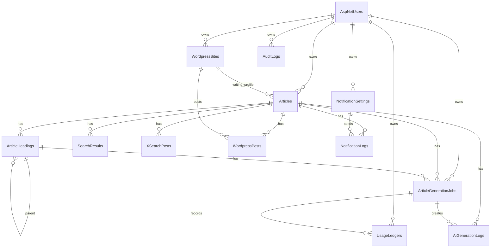

# DB設計書

## 1. 目的

本書は、AIライティングツールで使用するPostgreSQLデータベースの論理設計と物理設計方針を定義する。対象は、記事管理、見出し、AI生成ジョブ、利用文字数、WordPress連携、通知、監査ログである。

実装はEF Coreを前提とし、スキーマ変更はEF Core Migrationsで管理する。

## 2. 基本方針

- DBMSはPostgreSQLを使用する。
- ORMはEF Coreを使用する。
- `ApplicationDbContext`はASP.NET Core Identity用DbContextを継承する。
- アプリケーション独自テーブルの主キーは原則`uuid`とする。
- IdentityユーザーIDはASP.NET Core Identityの既定に合わせて`text`とする。
- 日時はUTCで保存し、型は`timestamptz`を使用する。
- enumは可読性と運用確認を優先し、`varchar`で保存する。
- ユーザー操作で削除する主要データは論理削除を基本とする。
- 本人退会と管理者によるユーザー削除では例外的に対象ユーザーと紐づく業務データを物理削除する。
- 外部APIキー、WordPress Application Password、Discord Webhook URLなどの秘密情報は平文保存しない。
- 大きな本文、HTML、ジョブPayloadは`text`または`jsonb`を使用する。
- APIレスポンスDTOとDBエンティティは分離する。

## 3. ER図



## 4. テーブル一覧

| テーブル | 種別 | 用途 |
| --- | --- | --- |
| `AspNetUsers` | Identity | ユーザー |
| `Articles` | 業務 | 記事本体 |
| `ArticleHeadings` | 業務 | 見出し階層と本文 |
| `ArticleGenerationJobs` | 業務 | バックグラウンドジョブ |
| `AiGenerationLogs` | 履歴 | AI生成履歴 |
| `UsageLedgers` | 台帳 | AI生成ごとの文字数利用履歴。MVPでは月次集計しない |
| `SearchResults` | 履歴 | Tavily Web検索結果 |
| `XSearchPosts` | 履歴 | X API Full-Archive Search投稿結果 |
| `WordpressSites` | 設定 | WordPress連携先、サイト別ライティング設定 |
| `WordpressPosts` | 履歴 | WordPress投稿履歴 |
| `NotificationSettings` | 設定 | 通知設定 |
| `NotificationLogs` | 履歴 | 通知送信履歴 |
| `AiModelSettings` | 設定 | 利用可能AIモデル |
| `UserUsageLimits` | 設定 | ユーザー別利用上限 |
| `AuditLogs` | 監査 | 管理操作・重要操作ログ |

## 5. 共通カラム方針

### 5.1 監査系カラム

主要テーブルには以下を持たせる。

| カラム | 型 | NULL | 説明 |
| --- | --- | --- | --- |
| `CreatedAt` | `timestamptz` | No | 作成日時 |
| `UpdatedAt` | `timestamptz` | No | 更新日時 |
| `DeletedAt` | `timestamptz` | Yes | 論理削除日時 |

履歴・台帳テーブルは原則`CreatedAt`のみでよい。

### 5.2 同時更新制御

ユーザーが画面から更新する主要テーブルには`RowVersion`を持たせる。

| カラム | 型 | NULL | 説明 |
| --- | --- | --- | --- |
| `RowVersion` | `bytea` | No | EF Core同時更新制御用 |

対象:

- `Articles`
- `ArticleHeadings`
- `WordpressSites`
- `NotificationSettings`
- `UserUsageLimits`

### 5.3 命名

- テーブル名はPascalCaseの複数形とする。
- カラム名はPascalCaseとする。
- EF CoreからPostgreSQLへマッピングするため、SQL上も引用符付きPascalCaseを前提とする。

## 6. テーブル定義

### 6.1 `AspNetUsers`

ASP.NET Core Identityの標準テーブルを使用する。以下の拡張カラムを追加する。

| カラム | 型 | NULL | 制約 | 説明 |
| --- | --- | --- | --- | --- |
| `DisplayName` | `varchar(100)` | Yes |  | 表示名 |
| `IsEnabled` | `boolean` | No | default true | 有効状態 |
| `LastLoginAt` | `timestamptz` | Yes |  | 最終ログイン日時 |
| `CreatedAt` | `timestamptz` | No |  | 作成日時 |
| `UpdatedAt` | `timestamptz` | No |  | 更新日時 |

Identity標準テーブル:

- `AspNetRoles`
- `AspNetUserRoles`
- `AspNetUserClaims`
- `AspNetUserLogins`
- `AspNetUserTokens`
- `AspNetRoleClaims`

削除方針:

- ユーザー本人による退会機能をMVPで提供する。
- 本人退会時は現在パスワードで再確認し、対象ユーザーと紐づく業務データをトランザクション内で物理削除する。
- 本人退会時も対象ユーザーに`Running`ジョブがある場合は拒否する。
- 本人退会時も最後のAdminユーザーであれば拒否する。
- Adminロールを持つユーザーは他のユーザーを削除できる。
- 管理者自身の削除と最後のAdminユーザーの削除は拒否する。
- 管理者削除時は対象ユーザーに紐づく業務データをトランザクション内で物理削除する。
- 削除監査ログは削除対象ユーザーへのFKを持たず、対象ユーザーIDは文字列スナップショットとして保存する。本人退会の場合は`UserId`をNULLにし、`Action = SelfWithdraw`として記録する。

### 6.2 `Articles`

記事本体を保存する。MVPでは記事本文の履歴テーブルを持たず、`Body`と`HtmlBody`は現在値のみ保存する。

| カラム | 型 | NULL | 制約 | 説明 |
| --- | --- | --- | --- | --- |
| `Id` | `uuid` | No | PK | 記事ID |
| `UserId` | `text` | No | FK -> `AspNetUsers.Id` | 所有ユーザー |
| `Keyword` | `varchar(200)` | No |  | キーワード |
| `Title` | `varchar(250)` | Yes |  | 記事タイトル |
| `Status` | `varchar(40)` | No |  | 記事ステータス |
| `Tone` | `varchar(40)` | Yes |  | 文章トーン |
| `Tags` | `text[]` | No | default empty | タグ配列 |
| `Memo` | `text` | Yes |  | メモ |
| `Body` | `text` | Yes |  | 結合済み本文 |
| `HtmlBody` | `text` | Yes |  | HTML本文 |
| `MetaDescription` | `varchar(320)` | Yes |  | メタディスクリプション |
| `GenerationModel` | `varchar(80)` | Yes |  | 生成モデル |
| `OutlineMethod` | `varchar(40)` | No |  | 見出し構築方法 |
| `SearchMode` | `boolean` | No | default false | 検索モード |
| `IsDomesticOnly` | `boolean` | No | default true | 日本国内情報限定 |
| `NotificationMode` | `varchar(40)` | No | default 'None' | 通知設定 |
| `StrictMode` | `boolean` | No | default false | 記事単位のstrict指定 |
| `TopicRisk` | `varchar(40)` | Yes |  | normal / strict / compliance_strict |
| `HumanReviewRequired` | `boolean` | No | default false | 公開前の人間確認必須 |
| `HumanReviewedAt` | `timestamptz` | Yes |  | 人間確認日時 |
| `HumanReviewedByUserId` | `text` | Yes | FK -> `AspNetUsers.Id` | 確認者 |
| `WritingProfileWordpressSiteId` | `uuid` | Yes | FK -> `WordpressSites.Id` | 記事生成に使用するサイト別ライティング設定 |
| `WritingProfileSnapshotJson` | `jsonb` | Yes |  | 記事作成時点の管理人プロフィール、キャラ設定、読者ペルソナのスナップショット |
| `AutoPostToWordpress` | `boolean` | No | default false | 生成完了後にWordPress自動投稿するか |
| `AutoPostWordpressSiteId` | `uuid` | Yes | FK -> `WordpressSites.Id` | 自動投稿先WordPressサイト |
| `AutoPostWordpressCategoryId` | `integer` | Yes |  | 自動投稿カテゴリ。未指定時はサイト既定カテゴリ |
| `AutoPostQueuedAt` | `timestamptz` | Yes |  | 自動投稿ジョブを登録した日時 |
| `CompletedAt` | `timestamptz` | Yes |  | 生成完了日時 |
| `PostedAt` | `timestamptz` | Yes |  | 最終投稿日時 |
| `CreatedAt` | `timestamptz` | No |  | 作成日時 |
| `UpdatedAt` | `timestamptz` | No |  | 更新日時 |
| `DeletedAt` | `timestamptz` | Yes |  | 論理削除日時 |
| `RowVersion` | `bytea` | No | concurrency | 同時更新制御 |

インデックス:

| 名称 | カラム | 用途 |
| --- | --- | --- |
| `IX_Articles_UserId_CreatedAt` | `UserId`, `CreatedAt DESC` | 一覧 |
| `IX_Articles_UserId_Status` | `UserId`, `Status` | ステータス絞り込み |
| `IX_Articles_UserId_Title` | `UserId`, `Title` | タイトル検索補助 |
| `IX_Articles_DeletedAt` | `DeletedAt` | 論理削除除外 |
| `IX_Articles_Tags_Gin` | `Tags` GIN | タグ検索 |

タグ設計方針:

- MVPでは`Articles.Tags text[]`で保持し、`IX_Articles_Tags_Gin`でタグ検索に対応する。
- Application層でtrim、空文字除外、重複除去、1タグ50文字以内、最大件数を検証してから保存する。
- タグマスター管理、タグメタデータ、タグ候補サジェスト、タグ別集計、WordPressタグID同期、タグ統合・リネームが必要になった段階で`Tags` / `ArticleTags`への正規化を検討する。

本文履歴方針:

- MVPでは`ArticleBodyHistories`、`ArticleRevisions`、差分テーブルなどの記事本文履歴管理テーブルを作成しない。
- 本文編集、本文再取得、要約、長文化、リライト、HTML変換は`Articles.Body`、`Articles.HtmlBody`、`ArticleHeadings.Body`の現在値を上書きする。
- 同時更新は`RowVersion`で検出する。
- `AiGenerationLogs`と`ArticleGenerationJobs`は生成実行の監査・再実行確認に使う。本文の版管理や復元用途には使わない。

削除方針:

- ユーザー操作では`DeletedAt`を設定する。
- 関連する見出し、ジョブ、履歴は削除しない。
- 本人退会または管理者によるユーザー削除時は対象ユーザーの記事と関連データを物理削除する。
- `WritingProfileWordpressSiteId`は同一ユーザーの有効な`WordpressSites.Id`のみ許可する。記事作成時に`WritingProfileSnapshotJson`へコピーし、生成途中のサイト設定変更でプロンプトが変わらないようにする。
- `AutoPostToWordpress = true`の場合、`AutoPostWordpressSiteId`は同一ユーザーの有効な`WordpressSites.Id`を指す。自動投稿ジョブ登録後は`AutoPostQueuedAt`を設定し、二重登録を防ぐ。

### 6.3 `ArticleHeadings`

H2/H3の階層と本文を保存する。MVPでは見出し本文も現在値のみ保持し、本文履歴は作らない。

| カラム | 型 | NULL | 制約 | 説明 |
| --- | --- | --- | --- | --- |
| `Id` | `uuid` | No | PK | 見出しID |
| `ArticleId` | `uuid` | No | FK -> `Articles.Id` | 記事ID |
| `ParentId` | `uuid` | Yes | FK -> `ArticleHeadings.Id` | 親H2 |
| `Level` | `integer` | No | 2 or 3 | 見出し階層 |
| `Title` | `varchar(250)` | No |  | 見出しタイトル |
| `Body` | `text` | Yes |  | 見出し本文 |
| `DisplayOrder` | `integer` | No |  | 表示順 |
| `TargetLength` | `integer` | Yes |  | 文字数目安 |
| `ActualLength` | `integer` | Yes |  | 実文字数 |
| `Status` | `varchar(40)` | No |  | 生成ステータス |
| `UseWebSearch` | `boolean` | No | default false | Web検索利用 |
| `SearchQuery` | `varchar(300)` | Yes |  | 見出し別検索クエリ |
| `CreatedAt` | `timestamptz` | No |  | 作成日時 |
| `UpdatedAt` | `timestamptz` | No |  | 更新日時 |
| `DeletedAt` | `timestamptz` | Yes |  | 論理削除日時 |
| `RowVersion` | `bytea` | No | concurrency | 同時更新制御 |

インデックス:

| 名称 | カラム | 用途 |
| --- | --- | --- |
| `IX_ArticleHeadings_ArticleId_DisplayOrder` | `ArticleId`, `DisplayOrder` | 見出し表示 |
| `IX_ArticleHeadings_ArticleId_ParentId` | `ArticleId`, `ParentId` | 階層取得 |
| `IX_ArticleHeadings_Status` | `Status` | 生成中判定 |

制約:

- `Level`は2または3。
- `Level = 2`の場合、`ParentId`はNULL。
- `Level = 3`の場合、`ParentId`は同一記事内のH2。
- 同一記事内の`DisplayOrder`は重複しない運用とする。

### 6.4 `ArticleGenerationJobs`

AI生成、Tavily検索、X投稿検索、WordPress投稿、通知などのバックグラウンドジョブを保存する。画像生成ジョブはMVPでは登録しない。

| カラム | 型 | NULL | 制約 | 説明 |
| --- | --- | --- | --- | --- |
| `Id` | `uuid` | No | PK | ジョブID |
| `UserId` | `text` | No | FK -> `AspNetUsers.Id` | 所有ユーザー |
| `ArticleId` | `uuid` | Yes | FK -> `Articles.Id` | 関連記事 |
| `HeadingId` | `uuid` | Yes | FK -> `ArticleHeadings.Id` | 関連見出し |
| `JobType` | `varchar(40)` | No |  | ジョブ種別 |
| `Status` | `varchar(40)` | No |  | ジョブ状態 |
| `Priority` | `integer` | No | default 0 | 優先度 |
| `Progress` | `integer` | No | default 0 | 進捗 0から100 |
| `PayloadJson` | `jsonb` | No |  | 実行入力 |
| `ResultJson` | `jsonb` | Yes |  | 実行結果 |
| `AttemptCount` | `integer` | No | default 0 | 試行回数 |
| `MaxAttempts` | `integer` | No | default 3 | 最大試行回数 |
| `NextRunAt` | `timestamptz` | Yes |  | 次回実行予定 |
| `LockedBy` | `varchar(100)` | Yes |  | ワーカーID |
| `LockedAt` | `timestamptz` | Yes |  | ロック日時 |
| `ErrorCode` | `varchar(80)` | Yes |  | エラーコード |
| `ErrorMessage` | `text` | Yes |  | エラー概要 |
| `QueuedAt` | `timestamptz` | No |  | 登録日時 |
| `StartedAt` | `timestamptz` | Yes |  | 開始日時 |
| `FinishedAt` | `timestamptz` | Yes |  | 終了日時 |
| `CanceledAt` | `timestamptz` | Yes |  | キャンセル日時 |

インデックス:

| 名称 | カラム | 用途 |
| --- | --- | --- |
| `IX_ArticleGenerationJobs_Status_Priority_QueuedAt` | `Status`, `Priority DESC`, `QueuedAt` | ジョブ取得 |
| `IX_ArticleGenerationJobs_Status_NextRunAt` | `Status`, `NextRunAt` | 再試行待ち |
| `IX_ArticleGenerationJobs_UserId_QueuedAt` | `UserId`, `QueuedAt DESC` | ユーザー別履歴 |
| `IX_ArticleGenerationJobs_ArticleId_JobType` | `ArticleId`, `JobType` | 記事別ジョブ |
| `IX_ArticleGenerationJobs_HeadingId` | `HeadingId` | 見出し別ジョブ |

ジョブ取得SQL方針:

```sql
SELECT *
FROM "ArticleGenerationJobs"
WHERE "Status" = 'Queued'
  AND ("NextRunAt" IS NULL OR "NextRunAt" <= now())
ORDER BY "Priority" DESC, "QueuedAt" ASC
FOR UPDATE SKIP LOCKED
LIMIT 1;
```

削除方針:

- 削除しない。
- 長期運用では古い成功ジョブをアーカイブ対象にする。

### 6.5 `AiGenerationLogs`

AI生成の入力・出力概要を保存する。プロンプト全文は原則保存しない。

| カラム | 型 | NULL | 制約 | 説明 |
| --- | --- | --- | --- | --- |
| `Id` | `uuid` | No | PK | ログID |
| `UserId` | `text` | No | FK -> `AspNetUsers.Id` | ユーザー |
| `ArticleId` | `uuid` | Yes | FK -> `Articles.Id` | 記事 |
| `JobId` | `uuid` | Yes | FK -> `ArticleGenerationJobs.Id` | ジョブ |
| `Provider` | `varchar(40)` | No |  | AIプロバイダー |
| `Model` | `varchar(80)` | No |  | モデル |
| `Operation` | `varchar(40)` | No |  | Title / Outline / Bodyなど |
| `PromptHash` | `varchar(128)` | Yes |  | プロンプトハッシュ |
| `PromptChars` | `integer` | No |  | 入力文字数 |
| `OutputChars` | `integer` | No |  | 出力文字数 |
| `UsageChars` | `integer` | No |  | 利用文字数。MVPでは課金換算しない |
| `LatencyMs` | `integer` | Yes |  | 応答時間 |
| `Succeeded` | `boolean` | No |  | 成否 |
| `ErrorCode` | `varchar(80)` | Yes |  | エラーコード |
| `CreatedAt` | `timestamptz` | No |  | 作成日時 |

インデックス:

- `IX_AiGenerationLogs_UserId_CreatedAt`
- `IX_AiGenerationLogs_ArticleId`
- `IX_AiGenerationLogs_JobId`
- `IX_AiGenerationLogs_Model_CreatedAt`

### 6.6 `UsageLedgers`

AI生成ごとの利用文字数を保存する加算専用台帳。MVPでは月次利用量集計、残量算出、課金計算、文字数上限制御には使用せず、ジョブ結果の監査と運用確認に限定する。

| カラム | 型 | NULL | 制約 | 説明 |
| --- | --- | --- | --- | --- |
| `Id` | `uuid` | No | PK | 台帳ID |
| `UserId` | `text` | No | FK -> `AspNetUsers.Id` | ユーザー |
| `ArticleId` | `uuid` | Yes | FK -> `Articles.Id` | 記事 |
| `JobId` | `uuid` | Yes | FK -> `ArticleGenerationJobs.Id` | ジョブ |
| `Provider` | `varchar(40)` | No |  | AIプロバイダー |
| `Model` | `varchar(80)` | No |  | モデル |
| `Operation` | `varchar(40)` | No |  | 操作種別 |
| `PromptChars` | `integer` | No |  | 入力文字数 |
| `OutputChars` | `integer` | No |  | 出力文字数 |
| `UsageChars` | `integer` | No |  | 利用文字数 |
| `OccurredAt` | `timestamptz` | No |  | 発生日時 |

インデックス:

| 名称 | カラム | 用途 |
| --- | --- | --- |
| `IX_UsageLedgers_UserId_OccurredAt` | `UserId`, `OccurredAt DESC` | 履歴表示 |
| `IX_UsageLedgers_JobId` | `JobId` | 二重計上防止確認 |

方針:

- 更新・削除しない。
- MVPでは`UserId`と月での集計APIや集計テーブルを作らない。
- 補正が必要な場合は負の`UsageChars`を追加する。

### 6.7 `SearchResults`

Tavily Search APIの検索結果を保存する。同一条件の検索ではキャッシュを優先し、不要なAPI呼び出しを抑制する。

| カラム | 型 | NULL | 制約 | 説明 |
| --- | --- | --- | --- | --- |
| `Id` | `uuid` | No | PK | 検索結果ID |
| `UserId` | `text` | No | FK -> `AspNetUsers.Id` | ユーザー |
| `ArticleId` | `uuid` | No | FK -> `Articles.Id` | 記事 |
| `HeadingId` | `uuid` | Yes | FK -> `ArticleHeadings.Id` | 見出し |
| `Query` | `varchar(300)` | No |  | 検索クエリ |
| `Title` | `varchar(500)` | Yes |  | 検索結果タイトル |
| `Url` | `text` | No |  | URL |
| `Snippet` | `text` | Yes |  | スニペット |
| `Rank` | `integer` | No |  | 順位 |
| `Provider` | `varchar(40)` | Yes |  | 検索プロバイダー |
| `QueryHash` | `varchar(128)` | Yes |  | クエリ条件ハッシュ |
| `CacheExpiresAt` | `timestamptz` | Yes |  | キャッシュ有効期限 |
| `RawJsonExpiresAt` | `timestamptz` | Yes |  | 検索結果JSON保持期限。1から24時間目安 |
| `ContentExpiresAt` | `timestamptz` | Yes |  | 本文・要約・スニペット保持期限。24時間から7日目安 |
| `MetadataExpiresAt` | `timestamptz` | Yes |  | URL、タイトル、取得日時、ドメイン名の保持期限。30から180日目安 |
| `FetchedAt` | `timestamptz` | No |  | 取得日時 |

インデックス:

- `IX_SearchResults_ArticleId_FetchedAt`
- `IX_SearchResults_HeadingId`
- `IX_SearchResults_Query`
- `IX_SearchResults_QueryHash_CacheExpiresAt`

### 6.8 `XSearchPosts`

X API Full-Archive Searchで取得した投稿を保存する。キーワードに関する実例、口コミ、時系列情報を本文生成の参考情報として利用する。

| カラム | 型 | NULL | 制約 | 説明 |
| --- | --- | --- | --- | --- |
| `Id` | `uuid` | No | PK | X投稿検索結果ID |
| `UserId` | `text` | No | FK -> `AspNetUsers.Id` | ユーザー |
| `ArticleId` | `uuid` | No | FK -> `Articles.Id` | 記事 |
| `HeadingId` | `uuid` | Yes | FK -> `ArticleHeadings.Id` | 見出し |
| `Query` | `varchar(300)` | No |  | 検索クエリ |
| `QueryHash` | `varchar(128)` | No |  | 検索条件ハッシュ |
| `PostId` | `varchar(80)` | No |  | X投稿ID |
| `AuthorId` | `varchar(80)` | Yes |  | 投稿者ID |
| `Text` | `text` | Yes |  | 投稿本文。最大24時間保持 |
| `Url` | `text` | Yes |  | 投稿URL |
| `Language` | `varchar(20)` | Yes |  | 言語 |
| `PostedAt` | `timestamptz` | Yes |  | 投稿日時 |
| `FetchedAt` | `timestamptz` | No |  | 取得日時 |
| `CacheExpiresAt` | `timestamptz` | Yes |  | キャッシュ有効期限 |
| `ContentExpiresAt` | `timestamptz` | Yes |  | 本文、投稿者名、プロフィール情報、メディアURLの保持期限。最大24時間 |
| `MetadataExpiresAt` | `timestamptz` | Yes |  | PostId、UserId、取得日時などの保持期限。長期保持可 |

インデックス:

- `UX_XSearchPosts_PostId`: `PostId`
- `IX_XSearchPosts_ArticleId_FetchedAt`
- `IX_XSearchPosts_HeadingId`
- `IX_XSearchPosts_QueryHash_CacheExpiresAt`
- `IX_XSearchPosts_PostedAt`

方針:

- `PostId`で一意制約を設け、同じ投稿を再取得・再保存しない。
- 検索条件は正規化し、`QueryHash`でキャッシュ判定する。
- X APIのレスポンス全文は保存せず、本文生成に必要な項目のみ保存する。
- X投稿の本文、投稿者名、プロフィール情報、メディアURLは最大24時間で削除または匿名化する。
- X Post ID、User ID、個別投稿を復元できない集計データは再取得・再検証・重複排除のため長期保持できる。

環境別保持:

| 環境 | Tavily検索結果JSON | Tavily本文・要約・スニペット | X投稿生データ |
| --- | --- | --- | --- |
| `dev` | 24時間 | 24時間 | 6時間 |
| `staging` | 6時間 | 24時間 | 6時間 |
| `production` | 24時間 | 7日 | 24時間 |
| `strict` | 24時間 | 24時間 | 1時間 |

TTL解決方針:

- 環境単位TTLをシステム全体の上限として扱う。
- ユーザー単位、記事単位、データソース単位、トピック単位のTTLは、環境単位より厳しくする場合のみ有効とする。
- 最終TTLは候補TTLのうち最も短い値を採用する。
- `Articles.StrictMode`または高リスク`TopicRisk`が有効な場合、記事単位でstrict相当のTTLを適用できる。
- `TopicRisk = 'compliance_strict'`の場合は`HumanReviewRequired = true`を設定し、公開投稿前の確認を必須とする。
- `legalFinanceHealth`または`politicsSafetyReputation`カテゴリに一致した場合は`TopicRisk = 'compliance_strict'`を保存する。
- その他のstrict辞書カテゴリに一致した場合は`TopicRisk = 'strict'`を保存する。

### 6.9 後続フェーズ: 画像アセット

MVPでは画像生成、アイキャッチ画像作成、外部画像URL保存・表示を扱わないため、画像データと画像メタデータはDBへ保存しない。

初期マイグレーションに含めないもの:

- `ImageAssets`
- `ArticleImages`
- `Articles.ThumbnailUrl`
- `Articles.FeaturedImageUrl`
- 画像生成プロンプト、保存パス、公開URL、サイズ、Content-Typeなどの画像メタデータカラム

後続フェーズで画像生成または画像URL管理を追加する場合に、生成画像または登録画像URLを保存するテーブルとして再設計する。

### 6.10 `WordpressSites`

WordPress連携先を保存する。

| カラム | 型 | NULL | 制約 | 説明 |
| --- | --- | --- | --- | --- |
| `Id` | `uuid` | No | PK | サイトID |
| `UserId` | `text` | No | FK -> `AspNetUsers.Id` | 所有ユーザー |
| `SiteName` | `varchar(100)` | No |  | サイト名 |
| `BaseUrl` | `text` | No |  | サイトURL |
| `LoginId` | `varchar(100)` | No |  | WordPressログインID |
| `EncryptedApplicationPassword` | `text` | No |  | 暗号化Application Password |
| `DefaultCategoryId` | `integer` | Yes |  | 既定カテゴリID |
| `DefaultCategoryName` | `varchar(200)` | Yes |  | 既定カテゴリ名 |
| `SiteAdminProfile` | `text` | Yes |  | 管理人プロフィール。最大2000文字 |
| `WritingCharacter` | `text` | Yes |  | サイトの語り手・キャラ設定。最大3000文字 |
| `ReaderPersona` | `text` | Yes |  | 想定読者ペルソナ。最大3000文字 |
| `LastConnectedAt` | `timestamptz` | Yes |  | 最終接続成功日時 |
| `CreatedAt` | `timestamptz` | No |  | 作成日時 |
| `UpdatedAt` | `timestamptz` | No |  | 更新日時 |
| `DeletedAt` | `timestamptz` | Yes |  | 論理削除日時 |
| `RowVersion` | `bytea` | No | concurrency | 同時更新制御 |

インデックス:

- `IX_WordpressSites_UserId_CreatedAt`
- `IX_WordpressSites_UserId_DeletedAt`

制約:

- `BaseUrl`はアプリケーション層でHTTPSのみ許可する。
- `EncryptedApplicationPassword`はレスポンスへ返さない。
- ライティング設定は秘密情報ではないがユーザー入力本文として扱い、プロンプト全文やログへそのまま出さない。

WordPressカテゴリ方針:

- MVPではWordPressカテゴリ一覧をDBキャッシュしない。
- 投稿モーダルや設定画面でカテゴリ一覧が必要な場合は、WordPress REST APIから都度取得する。
- DBに保存するカテゴリ情報は、既定カテゴリの`DefaultCategoryId` / `DefaultCategoryName`と、投稿履歴の`WordpressPosts.CategoryId`に限定する。
- `WordpressCategories`や`WordpressCategoryCaches`のようなカテゴリ一覧キャッシュテーブルは初期マイグレーションに含めない。
- 後続フェーズでカテゴリ取得頻度や応答速度が問題になった場合は、まず短時間のメモリキャッシュを検討し、サイト横断検索や同期管理が必要になった段階でDBキャッシュを再検討する。

### 6.11 `WordpressPosts`

WordPress投稿履歴を保存する。

| カラム | 型 | NULL | 制約 | 説明 |
| --- | --- | --- | --- | --- |
| `Id` | `uuid` | No | PK | 投稿履歴ID |
| `UserId` | `text` | No | FK -> `AspNetUsers.Id` | ユーザー |
| `ArticleId` | `uuid` | No | FK -> `Articles.Id` | 記事 |
| `WordpressSiteId` | `uuid` | No | FK -> `WordpressSites.Id` | 投稿先 |
| `JobId` | `uuid` | Yes | FK -> `ArticleGenerationJobs.Id` | 投稿ジョブ |
| `Title` | `varchar(250)` | No |  | 投稿タイトル |
| `PostId` | `integer` | Yes |  | WordPress投稿ID |
| `PostUrl` | `text` | Yes |  | 投稿URL |
| `CategoryId` | `integer` | Yes |  | カテゴリID |
| `RequestedStatus` | `varchar(40)` | No | default 'Draft' | 要求ステータス。Draft / Publish |
| `Status` | `varchar(40)` | No |  | 投稿結果 |
| `ErrorCode` | `varchar(80)` | Yes |  | エラーコード |
| `ErrorMessage` | `text` | Yes |  | エラー概要 |
| `CreatedAt` | `timestamptz` | No |  | 作成日時 |
| `PostedAt` | `timestamptz` | Yes |  | 投稿完了日時 |

インデックス:

- `IX_WordpressPosts_ArticleId_CreatedAt`
- `IX_WordpressPosts_WordpressSiteId_CreatedAt`
- `IX_WordpressPosts_UserId_CreatedAt`
- `IX_WordpressPosts_JobId`

### 6.12 `NotificationSettings`

通知設定を保存する。MVPではユーザーごとにDiscord Webhook 1件を想定する。

| カラム | 型 | NULL | 制約 | 説明 |
| --- | --- | --- | --- | --- |
| `Id` | `uuid` | No | PK | 通知設定ID |
| `UserId` | `text` | No | FK -> `AspNetUsers.Id` | ユーザー |
| `Provider` | `varchar(40)` | No |  | Discordなど |
| `DestinationMasked` | `varchar(500)` | No |  | マスク済みWebhook URL |
| `EncryptedWebhookUrl` | `text` | No |  | 暗号化Webhook URL |
| `Enabled` | `boolean` | No | default true | 有効 |
| `CreatedAt` | `timestamptz` | No |  | 作成日時 |
| `UpdatedAt` | `timestamptz` | No |  | 更新日時 |
| `DeletedAt` | `timestamptz` | Yes |  | 論理削除日時 |
| `RowVersion` | `bytea` | No | concurrency | 同時更新制御 |

インデックス:

- `UX_NotificationSettings_UserId_Provider_Active`: `UserId`, `Provider` where `DeletedAt IS NULL`

### 6.13 `NotificationLogs`

通知送信履歴を保存する。

| カラム | 型 | NULL | 制約 | 説明 |
| --- | --- | --- | --- | --- |
| `Id` | `uuid` | No | PK | 通知ログID |
| `UserId` | `text` | No | FK -> `AspNetUsers.Id` | ユーザー |
| `ArticleId` | `uuid` | Yes | FK -> `Articles.Id` | 記事 |
| `JobId` | `uuid` | Yes | FK -> `ArticleGenerationJobs.Id` | ジョブ |
| `NotificationSettingId` | `uuid` | Yes | FK -> `NotificationSettings.Id` | 通知設定 |
| `Provider` | `varchar(40)` | No |  | プロバイダー |
| `DestinationMasked` | `varchar(500)` | No |  | マスク済み送信先 |
| `EventType` | `varchar(40)` | No |  | 完了、失敗など |
| `Status` | `varchar(40)` | No |  | 成否 |
| `Message` | `text` | Yes |  | 送信メッセージ概要 |
| `ErrorCode` | `varchar(80)` | Yes |  | エラーコード |
| `ErrorMessage` | `text` | Yes |  | エラー概要 |
| `CreatedAt` | `timestamptz` | No |  | 作成日時 |

インデックス:

- `IX_NotificationLogs_UserId_CreatedAt`
- `IX_NotificationLogs_ArticleId`
- `IX_NotificationLogs_JobId`

### 6.14 `AiModelSettings`

利用可能AIモデル設定を保存する。

| カラム | 型 | NULL | 制約 | 説明 |
| --- | --- | --- | --- | --- |
| `Id` | `uuid` | No | PK | モデル設定ID |
| `Provider` | `varchar(40)` | No |  | GoogleGeminiなど |
| `Model` | `varchar(80)` | No |  | モデル名 |
| `DisplayName` | `varchar(100)` | No |  | 表示名 |
| `Region` | `varchar(80)` | No | default 'Japan' | 利用可能リージョン |
| `Enabled` | `boolean` | No | default true | 利用可否 |
| `MaxInputChars` | `integer` | Yes |  | 最大入力文字数 |
| `MaxOutputChars` | `integer` | Yes |  | 最大出力文字数 |
| `SortOrder` | `integer` | No | default 0 | 表示順 |
| `CreatedAt` | `timestamptz` | No |  | 作成日時 |
| `UpdatedAt` | `timestamptz` | No |  | 更新日時 |

インデックス:

- `UX_AiModelSettings_Provider_Model`
- `IX_AiModelSettings_Enabled_SortOrder`

### 6.15 `UserUsageLimits`

ユーザー別の利用上限設定を保存する。MVPでは文字数の月次消費集計とは連動せず、設定値の管理と構成生成回数など明示的な残数制御に限定する。

| カラム | 型 | NULL | 制約 | 説明 |
| --- | --- | --- | --- | --- |
| `Id` | `uuid` | No | PK | 利用上限ID |
| `UserId` | `text` | No | FK -> `AspNetUsers.Id` | ユーザー |
| `MonthlyLimitChars` | `integer` | No |  | 将来の月間文字数上限。MVPでは保存のみ |
| `RemainingOutlineCount` | `integer` | No |  | 残り構成数 |
| `DefaultStrictMode` | `boolean` | No | default false | ユーザー単位のstrict既定 |
| `MaxSearchCachePolicy` | `varchar(40)` | Yes |  | normal / strictなど |
| `CreatedAt` | `timestamptz` | No |  | 作成日時 |
| `UpdatedAt` | `timestamptz` | No |  | 更新日時 |
| `RowVersion` | `bytea` | No | concurrency | 同時更新制御 |

インデックス:

- `UX_UserUsageLimits_UserId`

方針:

- MVPでは利用量を`UsageLedgers`から月次集計しない。
- 上限値の履歴を残したい場合は、別途監査ログに記録する。

### 6.16 `AuditLogs`

管理操作や重要操作を記録する。

| カラム | 型 | NULL | 制約 | 説明 |
| --- | --- | --- | --- | --- |
| `Id` | `uuid` | No | PK | 監査ログID |
| `UserId` | `text` | Yes | FK -> `AspNetUsers.Id` | 操作ユーザー |
| `Action` | `varchar(80)` | No |  | 操作名 |
| `EntityType` | `varchar(80)` | Yes |  | 対象種別 |
| `EntityId` | `varchar(100)` | Yes |  | 対象ID |
| `Summary` | `text` | Yes |  | 概要 |
| `MetadataJson` | `jsonb` | Yes |  | 補助情報 |
| `IpAddress` | `varchar(80)` | Yes |  | IPアドレス |
| `UserAgent` | `text` | Yes |  | User-Agent |
| `CreatedAt` | `timestamptz` | No |  | 作成日時 |

インデックス:

- `IX_AuditLogs_UserId_CreatedAt`
- `IX_AuditLogs_EntityType_EntityId`
- `IX_AuditLogs_Action_CreatedAt`

## 7. enum定義

### 7.1 `ArticleStatus`

| 値 | 説明 |
| --- | --- |
| `Draft` | 下書き |
| `OutlineQueued` | 構成作成待ち |
| `OutlineGenerating` | 構成作成中 |
| `OutlineReady` | 構成作成済み |
| `BodyQueued` | 本文生成待ち |
| `BodyGenerating` | 本文生成中 |
| `Completed` | 完了 |
| `Posted` | 投稿済み |
| `Failed` | 失敗 |

### 7.2 `HeadingStatus`

| 値 | 説明 |
| --- | --- |
| `Pending` | 未生成 |
| `Queued` | 生成待ち |
| `Generating` | 生成中 |
| `Generated` | 生成済み |
| `Failed` | 失敗 |

### 7.3 `JobStatus`

| 値 | 説明 |
| --- | --- |
| `Queued` | 待機 |
| `Running` | 実行中 |
| `Succeeded` | 成功 |
| `Failed` | 失敗 |
| `Canceled` | キャンセル |

### 7.4 `JobType`

| 値 | 説明 |
| --- | --- |
| `TitleGeneration` | タイトル候補生成 |
| `OutlineGeneration` | 見出し構成生成 |
| `BodyGeneration` | 本文生成 |
| `Rewrite` | リライト、要約、長文化 |
| `WebSearch` | Tavily Web検索 |
| `XFullArchiveSearch` | X API Full-Archive Search |
| `WordpressPost` | WordPress投稿 |
| `Notification` | 通知 |

### 7.5 `WordpressPostStatus`

| 値 | 説明 |
| --- | --- |
| `Queued` | 投稿待ち |
| `Succeeded` | 投稿成功 |
| `Failed` | 投稿失敗 |

## 8. 外部キーと削除動作

| 子テーブル | 親テーブル | 削除動作 | 理由 |
| --- | --- | --- | --- |
| `Articles` | `AspNetUsers` | Restrict | 通常は記事を論理削除する。ユーザー物理削除時はサービス層で明示的に物理削除 |
| `ArticleHeadings` | `Articles` | Restrict | 通常は記事を論理削除する。ユーザー物理削除時はサービス層で明示的に物理削除 |
| `ArticleHeadings` | `ArticleHeadings` | Restrict | 階層の事故削除防止。ユーザー物理削除時は子から順に物理削除 |
| `ArticleGenerationJobs` | `Articles` | SetNull | 履歴保持 |
| `ArticleGenerationJobs` | `ArticleHeadings` | SetNull | 見出し削除後も履歴保持 |
| `Articles` | `WordpressSites` | SetNull | ライティング設定サイト削除後も記事本文とスナップショットは保持 |
| `AiGenerationLogs` | `ArticleGenerationJobs` | SetNull | ジョブ削除や整理に備える |
| `UsageLedgers` | `ArticleGenerationJobs` | SetNull | 台帳保持 |
| `XSearchPosts` | `Articles` | Restrict | 通常は記事を論理削除する。ユーザー物理削除時はサービス層で明示的に物理削除 |
| `WordpressPosts` | `WordpressSites` | Restrict | 通常は投稿先履歴保持。ユーザー物理削除時はサービス層で明示的に物理削除 |
| `NotificationLogs` | `NotificationSettings` | SetNull | 設定変更後も履歴保持 |
| `AuditLogs` | `AspNetUsers` | Restrict | 通常は操作ユーザーを参照する。ユーザー物理削除時は対象ユーザーが操作ユーザーの監査ログを削除し、削除監査ログはFKなしのスナップショットで残す |

本人退会または管理者によるユーザー削除ではDBカスケードだけに依存せず、アプリケーションサービスで以下をトランザクション内に明示削除する。

1. 対象ユーザーの`Running`ジョブがないことを確認する。
2. `NotificationLogs`、`WordpressPosts`、`XSearchPosts`、`SearchResults`、`UsageLedgers`、`AiGenerationLogs`、対象ユーザーが操作ユーザーの`AuditLogs`を削除する。
3. `ArticleGenerationJobs`、`ArticleHeadings`、`Articles`を削除する。
4. `WordpressSites`、`NotificationSettings`、`UserUsageLimits`を削除する。
5. Identity関連テーブルの`AspNetUserRoles`、`AspNetUserClaims`、`AspNetUserLogins`、`AspNetUserTokens`を削除する。
6. `AspNetUsers`を`UserManager`経由で削除する。
7. `AuditLogs`へ削除件数サマリを記録する。管理者削除では削除実行者の`UserId`を持つ。本人退会では削除対象ユーザーへのFKを残さないため`UserId`をNULLにする。

## 9. インデックス設計方針

### 9.1 一覧画面

記事一覧は以下の条件が多い。

- `UserId`
- `CreatedAt`
- `Status`
- `Tags`
- `Title` / `Keyword` / `Memo`

初期実装ではB-treeとGINで対応する。全文検索が必要になった場合は`tsvector`列またはPostgreSQL全文検索インデックスを追加する。

### 9.2 ジョブ処理

ジョブ取得は`Status`, `Priority`, `QueuedAt`, `NextRunAt`を中心にする。

大量ジョブが想定される場合は、`Status = 'Queued'`の部分インデックスを検討する。

```sql
CREATE INDEX "IX_ArticleGenerationJobs_Queued"
ON "ArticleGenerationJobs" ("Priority" DESC, "QueuedAt")
WHERE "Status" = 'Queued';
```

### 9.3 利用量集計

MVPでは月次利用量集計機能を実装しない。`UsageLedgers`は時系列履歴として保存し、月次集計API、月次集計テーブル、残量算出は後続フェーズで追加する。

## 10. jsonb設計

`jsonb`は以下の用途に限定する。

| カラム | 用途 |
| --- | --- |
| `ArticleGenerationJobs.PayloadJson` | ジョブ入力 |
| `ArticleGenerationJobs.ResultJson` | ジョブ結果概要 |
| `AuditLogs.MetadataJson` | 監査補助情報 |

方針:

- 業務検索に使う値は通常カラムとして持つ。
- `PayloadJson`内の構造に依存した一覧検索をしない。
- 長期的に検索要件が出たキーは通常カラムへ昇格する。

## 11. 秘密情報保存方針

対象:

- WordPress Application Password
- Discord Webhook URL
- 将来的なユーザー別AI APIキー

方針:

- DB保存前に暗号化する。
- 暗号化キーはアプリ設定またはData Protectionで管理し、Git管理しない。
- レスポンスDTOには絶対に含めない。
- 監査ログにも保存しない。

## 12. EF Coreマッピング方針

### 12.1 型変換

| .NET型 | PostgreSQL型 | 備考 |
| --- | --- | --- |
| `Guid` | `uuid` | 主キー |
| `DateTimeOffset` | `timestamptz` | UTC |
| `string[]` | `text[]` | タグ |
| `enum` | `varchar` | `.HasConversion<string>()` |
| `Dictionary<string, object>` | `jsonb` | Payload等 |
| `byte[]` | `bytea` | RowVersion |

### 12.2 DbContext

- `ApplicationDbContext`はIdentityDbContextを継承する。
- `DbSet<T>`は業務テーブルごとに定義する。
- `OnModelCreating`でテーブル名、カラム長、インデックス、外部キー、enum変換を定義する。
- クエリフィルターで`DeletedAt == null`を適用する対象を明確にする。

論理削除フィルター対象:

- `Articles`
- `ArticleHeadings`
- `WordpressSites`
- `NotificationSettings`

履歴・台帳テーブルには原則フィルターを設定しない。

### 12.3 BackgroundServiceでのDbContext

- BackgroundServiceでは`IDbContextFactory<ApplicationDbContext>`または`IServiceScopeFactory`を使用する。
- SingletonのBackgroundServiceにScoped DbContextを直接注入しない。
- ジョブ取得とロック更新はトランザクション内で行う。

## 13. マイグレーション方針

- 初期マイグレーションでIdentityと業務テーブルを作成する。
- 本番DBへの適用前にSQLスクリプトを生成してレビューする。
- カラム削除、型変更、NOT NULL化などの破壊的変更は段階的に行う。
- enum文字列を変更する場合は既存データ移行SQLを明示する。
- シードデータはAIモデル設定など最小限に限定する。

初期シード候補:

- `AiModelSettings`
  - GoogleGemini / gemini-3.1-pro-preview / Google Gemini 3.1 Pro Preview / Japan
- 管理者ロール
- 一般ユーザーロール
- 初期Adminユーザー
  - `AdminSeed__Email`と`AdminSeed__Password`が設定されている場合のみ作成する。
  - 既にAdminユーザーが存在する場合は作成しない。
  - 既存Adminのパスワードは上書きしない。
  - 作成はASP.NET Core Identityの`UserManager` / `RoleManager`を通して行う。

## 14. バックアップ・保守

### 14.1 バックアップ対象

- PostgreSQLデータボリューム
- Caddy証明書ボリューム
- Data Protection Key保存先

### 14.2 DBバックアップ

VPS運用では`pg_dump`による日次バックアップを想定する。

保存方針:

- 日次バックアップを7世代保持
- 週次バックアップを4世代保持
- バックアップはVPS外へ退避する

### 14.3 データ削除・アーカイブ

初期実装では自動削除しない。運用が安定した後に以下を検討する。

- 成功済みジョブのアーカイブ
- 古い検索結果の削除
- 古い通知ログの削除
- 退会ユーザーは物理削除済みとするため匿名化しない。

## 15. テスト観点

- EF Core MigrationがPostgreSQLへ適用できる。
- Identityユーザーと記事の関連が作成できる。
- 記事一覧が`UserId`と`CreatedAt`で取得できる。
- 論理削除済み記事が通常検索から除外される。
- 見出し階層をH2/H3順に取得できる。
- H3が別記事のH2を親にできない。
- ジョブ取得で`FOR UPDATE SKIP LOCKED`相当の排他が効く。
- `UsageLedgers`にAI生成ごとの利用文字数履歴を保存できる。
- 記事本文は履歴テーブルを作らず、現在値を更新できる。
- WordPress Application Passwordが平文で保存されない。
- 通知設定がユーザーごとに一意になる。
- `RowVersion`による同時更新競合を検出できる。
