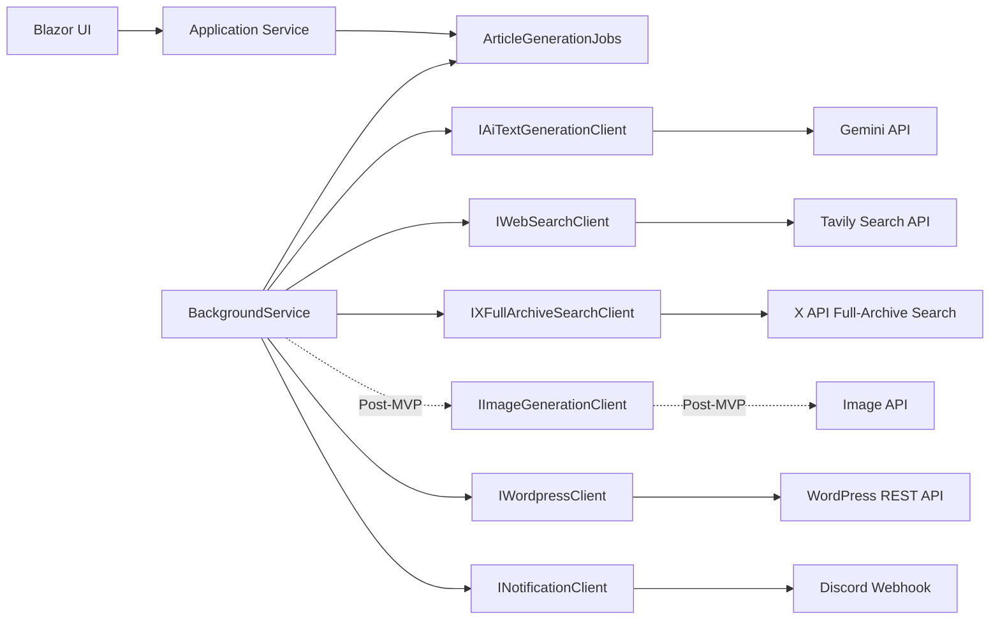

# 外部連携設計書

## 1. 目的

本書は、AIライティングツールが外部サービスと連携するための設計を定義する。対象は、AIテキスト生成、Tavily Web検索、X API Full-Archive Search、WordPress投稿、Discord通知である。画像生成はMVPに含めず、後続フェーズの外部連携として扱う。

外部サービスは仕様変更、障害、レート制限、認証失敗が発生しうるため、アプリケーション本体から直接依存させず、Infrastructure層のクライアント実装で差分を吸収する。

## 2. 対象連携

| 連携先 | 用途 | 実行主体 | MVP対象 |
| --- | --- | --- | --- |
| Google Gemini | タイトル、見出し、本文、リライト生成 | BackgroundService | 対象 |
| OpenAI GPT / Anthropic ClaudeなどのAI Provider | テキスト生成Providerの追加・選択 | BackgroundService | 対象外 |
| Tavily Search API | 構成生成、本文生成の参考情報取得 | BackgroundService | 対象 |
| X API Full-Archive Search | キーワード関連投稿、口コミ、時系列情報の取得 | BackgroundService | 対象 |
| 画像生成API | アイキャッチ画像生成 | BackgroundService | 対象外 |
| WordPress REST API | 記事投稿、カテゴリ取得、接続テスト | BackgroundService / API | 対象 |
| Discord Webhook | 完了通知、失敗通知、送信テスト | BackgroundService / API | 対象 |

## 3. 基本方針

- 外部API呼び出しは原則BackgroundService内で実行する。
- UI/API層は外部APIを直接呼び出さない。
- 外部APIクライアントは`IHttpClientFactory`で生成する。
- プロバイダー固有のリクエスト/レスポンスはInfrastructure層で共通DTOへ変換する。
- APIキー、Application Password、Discord Webhook URLはソースコード、ログ、レスポンスへ出さない。
- タイムアウト、リトライ、エラー変換を連携先ごとに定義する。
- 連携失敗時も、記事本文や既存データを失わない。
- 連携先の最新仕様は実装開始時に各公式ドキュメントで確認する。

## 4. アーキテクチャ



## 5. 共通実装方針

### 5.1 HttpClient

外部サービスごとにTyped ClientまたはNamed Clientを定義する。

| Client | 用途 |
| --- | --- |
| `GeminiTextGenerationClient` | Geminiテキスト生成 |
| `TavilyWebSearchClient` | Tavily Web検索 |
| `XFullArchiveSearchClient` | X投稿検索 |
| `DefaultImageGenerationClient` | 画像生成。後続フェーズで追加。MVPでは実装・DI登録しない |
| `WordpressClient` | WordPress REST API |
| `DiscordNotificationClient` | Discord通知 |

### 5.2 Options

設定はOptionsクラスへバインドする。

```csharp
public sealed class ExternalIntegrationOptions
{
    public AiProviderOptions AiProviders { get; init; } = new();
    public SearchProviderOptions Search { get; init; } = new();
    public WordpressOptions Wordpress { get; init; } = new();
    public NotificationOptions Notifications { get; init; } = new();
}
```

設定値の例:

| Options | 主な項目 |
| --- | --- |
| `AiProviderOptions` | Provider、Model、ApiKey、Timeout、MaxInputChars。MVPはGoogle Gemini 3.1 Pro Preview |
| `SearchProviderOptions` | TavilyEndpoint、TavilyApiKey、XEndpoint、XBearerToken、DefaultRegion、MaxResults、環境別CacheTtl |
| `WordpressOptions` | Timeout、RetryCount、AllowedSchemes |
| `NotificationOptions` | Provider、Timeout。Discord Webhook URLはユーザー別にDB暗号化保存する |

`ImageProviderOptions`は後続フェーズで画像生成を追加する時に定義する。MVPでは画像生成Client、画像生成Options、画像生成API KeyをDIへ登録しない。

### 5.3 秘密情報

| 情報 | 保存場所 | 方針 |
| --- | --- | --- |
| Gemini API Key | 環境変数またはSecret Manager | DB保存しない |
| Tavily API Key | 環境変数またはSecret Manager | DB保存しない |
| X API Bearer Token | 環境変数またはSecret Manager | DB保存しない |
| 画像生成API Key | 環境変数またはSecret Manager | MVPでは使用しない |
| WordPress Application Password | DB暗号化保存 | レスポンスに含めない |
| Discord Webhook URL | ユーザー別DB暗号化保存 | レスポンスに含めない |

本番の秘密情報は`.env`やVPS環境変数で渡す場合も、Git管理しない。

## 6. 共通エラー変換

外部API固有のエラーは、アプリ内共通の`ExternalIntegrationException`へ変換する。

| ErrorCode | 説明 | 再試行 |
| --- | --- | --- |
| `ValidationError` | 入力不正 | 不可 |
| `UnauthorizedExternalApi` | APIキー、認証情報不正 | 不可 |
| `ForbiddenExternalApi` | 権限不足 | 不可 |
| `RateLimited` | レート制限 | 可 |
| `Timeout` | タイムアウト | 可 |
| `ExternalServerError` | 外部API 5xx | 可 |
| `ExternalBadResponse` | 予期しないレスポンス | 条件付き |
| `NetworkError` | DNS、接続、TLSなど | 可 |
| `UsageLimitExceeded` | アプリ側利用上限超過 | 不可 |
| `UnknownExternalError` | 未分類 | 条件付き |

ログには`errorCode`、HTTPステータス、連携先名、ジョブIDを記録する。APIキー、Authorizationヘッダー、Cookie、Application Password、プロンプト全文は記録しない。

## 7. タイムアウト・リトライ

### 7.1 タイムアウト

| 連携 | タイムアウト |
| --- | --- |
| AIテキスト生成 | 120秒 |
| 画像生成 | 180秒。MVP外 |
| Tavily Web検索 | 30秒 |
| X Full-Archive Search | 30秒 |
| WordPress投稿 | 60秒 |
| WordPressカテゴリ取得 | 30秒 |
| Discord通知 | 30秒 |

### 7.2 リトライ

リトライはジョブ設計書の再試行方針に合わせる。

| 条件 | リトライ |
| --- | --- |
| HTTP 408 | する |
| HTTP 429 | する |
| HTTP 500系 | する |
| タイムアウト | する |
| ネットワーク一時障害 | する |
| HTTP 400 | 原則しない |
| HTTP 401/403 | しない |
| 入力バリデーション失敗 | しない |

`Retry-After`ヘッダーがある場合は優先する。

## 8. AIテキスト生成連携

### 8.1 目的

以下の文章生成を行う。

- タイトル候補生成
- 見出し構成生成
- 見出し本文生成
- 要約
- 長文化
- リライト

MVPの採用ProviderはGoogle Gemini、採用モデルはGoogle Gemini 3.1 Pro Previewとする。APIモデルIDは`gemini-3.1-pro-preview`、利用可能リージョンはJapanとする。
Gemini以外のAI Provider対応はMVP対象外とし、後続フェーズでOpenAI GPT、Anthropic Claudeなどを選択可能にする。

### 8.2 共通インターフェース

```csharp
public interface IAiTextGenerationClient
{
    Task<AiTextGenerationResult> GenerateAsync(
        AiTextGenerationRequest request,
        CancellationToken cancellationToken);
}
```

### 8.3 Request DTO

```csharp
public sealed class AiTextGenerationRequest
{
    public string Provider { get; init; } = "";
    public string Model { get; init; } = "";
    public string Operation { get; init; } = "";
    public string SystemInstruction { get; init; } = "";
    public string UserPrompt { get; init; } = "";
    public int? MaxOutputChars { get; init; }
    public double? Temperature { get; init; }
    public IReadOnlyList<AiReferenceSource> References { get; init; } = [];
}
```

サイト別ライティング設定:

- `SystemInstruction`には、記事に保存されたサイト別ライティング設定スナップショットから管理人プロフィール、語り手・キャラ設定、読者ペルソナを要約して含める。
- これらは文体・読者理解・語り口の制約として使い、事実性、出典確認、法令・安全性、ユーザーの明示指示より優先しない。
- プロンプト全文とスナップショット本文はログ、通知、エラー詳細へ出力しない。

### 8.4 Result DTO

```csharp
public sealed class AiTextGenerationResult
{
    public string Text { get; init; } = "";
    public string Provider { get; init; } = "";
    public string Model { get; init; } = "";
    public int PromptChars { get; init; }
    public int OutputChars { get; init; }
    public string? RawResponseId { get; init; }
}
```

### 8.5 Provider差分

| 差分 | 吸収場所 |
| --- | --- |
| 認証ヘッダー | Provider別Client |
| リクエストJSON形式 | Provider別Client |
| モデル名 | `AiModelSettings`とOptions |
| レスポンス形式 | Provider別Clientで共通DTO化 |
| レート制限レスポンス | 共通エラー変換 |
| 使用量情報 | 取得可能なら共通DTOへ反映 |
| Provider選択 | MVPはGemini固定。後続フェーズでGPT、Claudeなどの選択を追加 |
| トークン事前見積もり | MVPでは実装しない。後続フェーズでProvider別TokenCounterを追加 |

### 8.6 プロンプト管理

プロンプトはApplication層で生成する。

| Operation | テンプレート例 |
| --- | --- |
| `TitleGeneration` | キーワードからSEO向けタイトル候補を生成 |
| `OutlineGeneration` | H2/H3構成をJSON形式で生成 |
| `BodyGeneration` | 指定見出し本文を生成 |
| `Rewrite` | 本文を自然な日本語にリライト |
| `Summarize` | 本文を短く要約 |
| `Expand` | 本文を長文化 |

AIから構造化出力を受ける処理では、JSONとしてパースできない場合に`ExternalBadResponse`として扱う。

### 8.7 保存

成功時:

- `ArticleHeadings`
- `Articles`
- `AiGenerationLogs`
- `UsageLedgers`
- `ArticleGenerationJobs.ResultJson`

失敗時:

- `ArticleGenerationJobs.ErrorCode`
- `ArticleGenerationJobs.ErrorMessage`
- 必要に応じて`ArticleHeadings.Status`または`Articles.Status`

### 8.8 文字数・トークン換算

MVPではProvider別の文字数/トークン換算ルールを実装しない。ユーザー向け利用量表示と履歴は文字数ベースで扱い、固定係数によるトークン換算は行わない。

後続フェーズでOpenAI GPT、Anthropic Claudeなど複数Providerを追加する場合は、Provider別TokenCounterを実装し、公式APIまたは公式Tokenizerを使って事前見積もりする。Providerから実行結果としてトークン使用量が返る場合は、その実績値を優先して保存・利用する。

## 9. 検索連携

### 9.1 目的

検索結果を見出し構成、本文生成の参考情報として利用する。MVPでは以下の2系統を使う。

- Tavily Search API: Webページ、ニュース、解説記事などの検索
- X API Full-Archive Search: キーワードに関するX投稿、口コミ、時系列情報、過去投稿の検索

### 9.2 Tavily検索インターフェース

```csharp
public interface IWebSearchClient
{
    Task<IReadOnlyList<WebSearchResult>> SearchAsync(
        WebSearchRequest request,
        CancellationToken cancellationToken);
}
```

### 9.3 X検索インターフェース

```csharp
public interface IXFullArchiveSearchClient
{
    Task<IReadOnlyList<XSearchPostResult>> SearchAsync(
        XFullArchiveSearchRequest request,
        CancellationToken cancellationToken);
}
```

### 9.4 Tavily Request

```csharp
public sealed class WebSearchRequest
{
    public string Query { get; init; } = "";
    public string? Region { get; init; }
    public string? Language { get; init; }
    public int MaxResults { get; init; } = 10;
    public bool DomesticOnly { get; init; }
    public string? Topic { get; init; }
    public string SearchDepth { get; init; } = "basic";
    public DateOnly? StartDate { get; init; }
    public DateOnly? EndDate { get; init; }
    public TimeSpan? SearchCacheTtl { get; init; }
    public TimeSpan? ContentCacheTtl { get; init; }
}
```

### 9.5 X Request

```csharp
public sealed class XFullArchiveSearchRequest
{
    public string Query { get; init; } = "";
    public string? Language { get; init; } = "ja";
    public DateTimeOffset? StartTime { get; init; }
    public DateTimeOffset? EndTime { get; init; }
    public int MaxResults { get; init; } = 100;
    public bool LargeResearchMode { get; init; }
    public bool ExcludeRetweets { get; init; } = true;
    public bool ExcludeReplies { get; init; } = true;
    public TimeSpan? RawCacheTtl { get; init; }
    public bool RehydrateBeforeDisplay { get; init; }
}
```

契約・取得上限:

| 項目 | 方針 |
| --- | --- |
| 契約 | Pay-per-use |
| 実行条件 | Full-Archive Searchは必要時のみ |
| `max_results`通常 | 100 |
| `max_results`大量調査時 | 500 |
| 月間安全上限 | 10,000から50,000 posts程度から開始 |
| キャッシュ | Post IDは長期、Post本文は6から24時間 |
| 公開前 | 必ず再取得 |

大量調査時は`LargeResearchMode`を明示し、月間安全上限とレート制限を確認してから実行する。

検索条件はアプリ側で正規化し、以下を基本とする。

- キーワードをそのまま広く投げず、記事キーワード、関連語、除外語を組み立てる。
- `lang:ja`相当の言語条件を指定する。
- 原則としてリポスト、返信、スパムになりやすい条件を除外する。
- 期間指定がない場合は、記事作成設定に応じた既定期間を使用する。
- 最大件数はMVPでは小さく保ち、API使用量を抑制する。
- `MaxResults`が通常上限100を超える場合は大量調査扱いとし、最大500までに制限する。
- 月間安全上限を超える見込みがある場合はジョブ登録または実行を停止する。

### 9.6 Result

```csharp
public sealed class WebSearchResult
{
    public string Title { get; init; } = "";
    public string Url { get; init; } = "";
    public string? Snippet { get; init; }
    public int Rank { get; init; }
    public string Provider { get; init; } = "";
}
```

```csharp
public sealed class XSearchPostResult
{
    public string PostId { get; init; } = "";
    public string? AuthorId { get; init; }
    public string Text { get; init; } = "";
    public string? Url { get; init; }
    public string? Language { get; init; }
    public DateTimeOffset? PostedAt { get; init; }
}
```

### 9.7 キャッシュ・重複排除

方針:

- Tavily検索結果は`SearchResults`へ保存する。
- X投稿検索結果は`XSearchPosts`へ保存する。
- 検索条件を正規化して`QueryHash`を作成する。
- `QueryHash`と`CacheExpiresAt`で同一条件の再検索を抑制する。
- X投稿は`PostId`に一意制約を設け、同じ投稿を再取得・再保存しない。
- キャッシュが有効な場合は外部APIを呼ばず、DB上の検索結果を利用する。
- 検索結果をAIへ渡す前に、重複URL、同一投稿、低品質な短文を除外する。

推奨保持期間:

| データ | 推奨保持期間 | 方針 |
| --- | --- | --- |
| Tavily検索クエリから検索結果JSON | 1から24時間 | 最新性が重要なニュース、価格、トレンド系は短くする |
| Tavily経由で取得した本文、要約、スニペット | 24時間から7日 | ライティング根拠として使う場合も再取得前提にする |
| TavilyのURL、タイトル、取得日時、ドメイン名 | 30から180日 | 監査、重複排除、再取得用メタデータとして保持する |
| X投稿の本文、投稿者名、プロフィール情報、メディアURL | 最大24時間 | 削除、非公開化、凍結、編集に追従するため短期保持する |
| X Post ID、User ID | 長期保持可 | 再取得、再検証、重複排除に利用する。公開表示時はAPIで再hydrationする |
| X由来の集計データ | 30から180日 | 件数、傾向、キーワード、感情分類など個別投稿を復元できない形で保持する |
| 生成済み記事内のX引用 | 公開前に再検証 | 投稿が削除、非公開、編集されていないか確認する |

MVPの既定値:

- Tavily検索結果JSON: 6時間
- Tavily本文、要約、スニペット: 72時間
- Tavilyメタデータ: 90日
- X投稿生データ: 24時間
- X Post ID、User ID: 180日以上保持可
- X由来の集計データ: 90日

環境別上書き:

| 環境 | Tavily検索結果JSON | Tavily本文・要約・スニペット | X投稿生データ | X ID | X表示・公開前 |
| --- | --- | --- | --- | --- | --- |
| `dev` | 24時間 | 24時間 | 6時間 | 長期保持可 | 任意 |
| `staging` | 6時間 | 24時間 | 6時間 | 長期保持可 | 推奨 |
| `production` | 24時間 | 7日 | 24時間 | 長期保持可 | 必ず再取得 |
| `strict` | 24時間 | 24時間 | 1時間 | 長期保持可 | 必ず再取得 |

`strict`は、X由来データの扱いをより保守的にしたい案件、規約・コンプライアンス確認が必要な案件、公開前レビューを強制したい案件で使用する。

TTL解決ルール:

| 単位 | 役割 | 例 | 上書き方向 |
| --- | --- | --- | --- |
| 環境単位 | システム全体の上限・安全装置 | productionではX raw 24時間以下、strict環境では1時間以下 | 必ず優先 |
| ユーザー単位 | 顧客、プラン、組織ごとの標準設定 | 法務が厳しい企業は常にstrict、個人ユーザーはnormal | 厳しくできる |
| 記事単位 | その記事だけのリスク制御 | ニュース、医療、金融、法律、X引用あり記事だけstrict | 厳しくできる |
| データソース単位 | API規約差分の吸収 | Xは短期、Tavilyはやや長め | 厳しくできる |
| トピック単位 | 鮮度・リスク反映 | news、trend、legal、priceは短TTL | 厳しくできる |

最終TTLは以下の候補のうち最も短い値を採用する。

1. 環境単位TTL
2. ユーザー単位TTL
3. 記事単位TTL
4. データソース単位TTL
5. トピック単位TTL

環境単位TTLより長くする上書きは無効とする。

トピック自動判定:

| 判定 | 対象 | 実装上の扱い |
| --- | --- | --- |
| `normal` | 一般SEO記事、ハウツー記事、技術メモ、ブログ下書き、evergreen記事 | 通常TTL |
| `strict` | 最新情報、ニュース、X投稿を使う記事、料金比較、API料金、商品価格、在庫、ランキング、口コミ・評判、SaaS比較 | strict TTL |
| `compliance_strict` | 医療、法律、税金、投資、保険、政治、選挙、災害、事件、個人や企業の不祥事 | strict TTL + 人間確認必須 |

`compliance_strict`では、X再hydrationに加えて、人間確認が完了するまでWordPress公開投稿を抑止する。下書き投稿は可能とする。

初期キーワード辞書:

```ts
export type TopicPolicyMode = "normal" | "strict" | "compliance_strict";

export const STRICT_KEYWORDS = {
  freshness: [
    "最新", "速報", "今日", "昨日", "明日", "今週", "今月", "今年", "現在", "直近", "最近",
    "新着", "発表", "公開", "開始", "終了", "リリース", "アップデート", "仕様変更",
    "変更点", "改定", "廃止", "終了予定", "延期",
  ],
  newsTrend: [
    "ニュース", "トレンド", "話題", "バズ", "炎上", "SNSで話題", "Xで話題", "口コミ",
    "評判", "反応", "世論", "注目", "急上昇", "ランキング", "人気",
  ],
  pricing: [
    "価格", "料金", "費用", "月額", "年額", "課金", "従量課金", "無料枠", "無料プラン",
    "有料プラン", "値上げ", "値下げ", "割引", "キャンペーン", "セール", "クーポン",
    "プラン", "API料金", "トークン単価", "レート制限",
  ],
  productAvailability: [
    "在庫", "入荷", "売り切れ", "販売中", "販売終了", "予約開始", "予約受付",
    "発売日", "納期", "配送", "出荷", "対応状況", "提供地域",
  ],
  comparisonReview: [
    "おすすめ", "比較", "選び方", "レビュー", "口コミ", "評判", "メリット", "デメリット",
    "ランキング", "代替", "競合", "違い", "どっち", "最強", "ベスト", "人気順",
  ],
  techSaaS: [
    "API", "SDK", "モデル", "AIモデル", "LLM", "プロバイダー", "料金比較", "制限",
    "上限", "コンテキスト長", "トークン", "レートリミット", "新機能", "廃止予定",
    "非推奨", "ベータ", "Preview", "プレビュー", "GA",
  ],
  legalFinanceHealth: [
    "法律", "規制", "違法", "合法", "契約", "著作権", "税金", "確定申告", "投資",
    "株", "仮想通貨", "暗号資産", "保険", "ローン", "金利", "病気", "症状",
    "治療", "薬", "副作用", "診断", "健康", "医療",
  ],
  politicsSafetyReputation: [
    "政治", "選挙", "政党", "首相", "大統領", "議員", "政策", "災害", "地震",
    "台風", "津波", "事故", "事件", "逮捕", "疑惑", "告発", "不祥事", "詐欺",
    "ハラスメント",
  ],
  sourceSignals: [
    "X投稿", "ツイート", "ポスト", "引用", "埋め込み", "SNS投稿", "ユーザーの反応",
    "SNSの反応", "コメント",
  ],
} as const;
```

判定方針:

- `legalFinanceHealth`と`politicsSafetyReputation`に一致した場合は`compliance_strict`にする。
- その他のカテゴリに一致した場合は`strict`にする。
- 複数カテゴリに一致した場合は、より厳しい`compliance_strict`を優先する。
- 一致しない場合は`normal`とする。

辞書メンテナンス:

| 項目 | 方針 |
| --- | --- |
| 担当 | 運営者本人 |
| 更新頻度 | 月1回 + 誤判定に気づいた時 |
| 更新対象 | strict判定キーワード、除外キーワード、トピックカテゴリ、TTLポリシー |
| 管理形式 | YAMLまたはJSON |
| 反映条件 | テストケース追加、判定結果確認後に反映 |

### 9.8 保存

Tavily検索結果は`SearchResults`へ保存する。

保存項目:

- `UserId`
- `ArticleId`
- `HeadingId`
- `Query`
- `Title`
- `Url`
- `Snippet`
- `Rank`
- `Provider`
- `QueryHash`
- `CacheExpiresAt`
- `RawJsonExpiresAt`
- `ContentExpiresAt`
- `MetadataExpiresAt`
- `FetchedAt`

X投稿検索結果は`XSearchPosts`へ保存する。

保存項目:

- `UserId`
- `ArticleId`
- `HeadingId`
- `Query`
- `QueryHash`
- `PostId`
- `AuthorId`
- `Text`
- `Url`
- `Language`
- `PostedAt`
- `FetchedAt`
- `CacheExpiresAt`
- `ContentExpiresAt`
- `MetadataExpiresAt`

X投稿生データの保持期限を過ぎた場合、`Text`、投稿者名、プロフィール情報、メディアURLなどは削除または匿名化する。`PostId`、`AuthorId`、集計済み特徴量は再検証・重複排除のため保持できる。

### 9.9 SSRF対策

検索結果URLや事前学習URLを取得する場合は以下を拒否する。

- `http://` URL
- localhost
- 127.0.0.0/8
- 10.0.0.0/8
- 172.16.0.0/12
- 192.168.0.0/16
- link-local
- cloud metadata IP
- DNS解決後にプライベートIPとなるURL

## 10. 画像生成連携

### 10.1 目的

画像生成、アイキャッチ画像作成、外部画像URLの保存・表示はMVPに含めない。MVPでは画像データ、画像URL、画像メタデータを保存しない。後続フェーズでは、記事タイトルや追加プロンプトを元にアイキャッチ画像を生成する。

### 10.2 インターフェース

MVPでは`IImageGenerationClient`を実装・DI登録しない。以下は後続フェーズで追加する場合の検討メモとする。

```csharp
public interface IImageGenerationClient
{
    Task<ImageGenerationResult> GenerateAsync(
        ImageGenerationRequest request,
        CancellationToken cancellationToken);
}
```

### 10.3 保存

MVPでは生成画像をファイルストレージへ保存せず、DBにも`ImageAssets`などの画像メタデータを保存しない。

後続フェーズでは、生成画像はファイルストレージへ保存し、DBには`ImageAssets`としてメタデータを保存する。

保存先例:

```text
/app-data/images/{userId}/{articleId}/{imageId}.webp
```

保存項目:

- `Url`
- `StoragePath`
- `Prompt`
- `PromptHash`
- `Provider`
- `Model`
- `Width`
- `Height`
- `ContentType`

### 10.4 失敗時

- MVPの`Articles`には画像URLを保持しない。後続フェーズで画像URL管理を追加する場合は、既存記事への影響を別途設計する。
- 記事ステータスは原則変更しない。
- ジョブに失敗理由を保存する。

## 11. WordPress連携

### 11.1 目的

生成済み記事をWordPressへ投稿し、投稿URLと投稿IDを保存する。

### 11.2 認証

WordPress REST APIとApplication Passwordを使用する。

保存方針:

- `WordpressSites.EncryptedApplicationPassword`へ暗号化保存する。
- `WordpressSites.SiteAdminProfile`、`WritingCharacter`、`ReaderPersona`へサイト別ライティング設定を保存する。
- 復号は投稿直前に行う。
- ログやレスポンスにApplication Passwordを含めない。
- サイト別ライティング設定はレスポンスに返してよいが、プロンプト全文、通知、ログにはそのまま出さない。

### 11.3 インターフェース

```csharp
public interface IWordpressClient
{
    Task<WordpressConnectionTestResult> TestConnectionAsync(
        WordpressSiteConnection connection,
        CancellationToken cancellationToken);

    Task<IReadOnlyList<WordpressCategoryDto>> GetCategoriesAsync(
        WordpressSiteConnection connection,
        CancellationToken cancellationToken);

    Task<WordpressPostResult> CreatePostAsync(
        WordpressPostRequest request,
        CancellationToken cancellationToken);
}
```

### 11.4 接続テスト

目的:

- URLが正しいか
- 認証情報が正しいか
- REST APIへアクセスできるか

失敗時:

- APIとしては`success: false`を返す。
- ネットワーク障害などアプリ側例外の場合のみ5xxとする。

### 11.5 カテゴリ取得

画面のカテゴリselect表示に利用する。

方針:

- MVPでは都度取得する。
- 取得したカテゴリ一覧はDBへ保存しない。
- DBに保存するカテゴリ情報は、サイト既定カテゴリと投稿履歴に使うカテゴリIDに限定する。
- カテゴリ一覧のレスポンスが遅い場合は、後続フェーズで短時間のメモリキャッシュを検討する。
- DBキャッシュは、サイト横断検索、手動同期、差分検知が必要になった段階で再検討する。

### 11.6 投稿

入力:

- 投稿先サイト
- タイトル
- HTML本文
- カテゴリID
- 投稿ステータス: Draft / Publish。既定はDraft

一括作成からの自動投稿:

- 自動投稿は一括作成時に明示的に有効化された記事のみ対象とする。
- 本文生成とHTML変換が完了し、記事が投稿可能状態になってから`WordpressPost`ジョブを登録する。
- 自動投稿の投稿ステータスは`Draft`固定とし、公開投稿は手動操作で行う。
- カテゴリIDが未指定の場合は投稿先サイトの既定カテゴリを使用する。

成功時:

- `WordpressPosts.Status = Succeeded`
- `PostId`
- `PostUrl`
- `PostedAt`
- `Articles.Status = Posted`

失敗時:

- `WordpressPosts.Status = Failed`
- `ErrorCode`
- `ErrorMessage`
- `Articles.Status`は`Completed`を維持する。

### 11.7 メディアアップロード

MVPではWordPress投稿時にアイキャッチ画像を指定しない。URL指定とメディアアップロードは後続フェーズで扱う。

後続フェーズ:

- アイキャッチ画像URL指定
- 画像をWordPressメディアとしてアップロード
- media idを投稿のfeatured_mediaへ設定
- 画像アップロード失敗時の投稿継続可否を設定化

## 12. Discord通知連携

### 12.1 目的

記事作成完了、WordPress投稿完了、ジョブ失敗、送信テストをDiscordチャンネルへ通知する。送信にはユーザーまたは管理者が登録したDiscord Webhook URLを使用する。
初期実装の通知プロバイダーはDiscordのみとし、Discord以外の通知プロバイダーは後続フェーズで扱う。

### 12.2 インターフェース

```csharp
public interface INotificationClient
{
    Task<NotificationSendResult> SendAsync(
        NotificationSendRequest request,
        CancellationToken cancellationToken);
}
```

Discord固有の送信先URLは`NotificationSettings.EncryptedWebhookUrl`に暗号化保存し、アプリケーション層には`INotificationClient`経由で渡す。

### 12.3 通知イベント

| EventType | 通知タイミング |
| --- | --- |
| `ArticleCompleted` | 本文生成完了 |
| `WordpressPosted` | WordPress投稿成功 |
| `JobFailed` | 重要ジョブ失敗 |
| `Test` | 送信テスト |

### 12.4 通知本文

含める情報:

- イベント名
- 記事タイトル
- 記事URLまたは編集画面URL
- WordPress投稿URL
- エラー概要

含めない情報:

- APIキー
- Application Password
- プロンプト全文
- Cookie
- Authorizationヘッダー
- Discord Webhook URL

### 12.5 Discord送信形式

MVPではWebhookへJSONをPOSTする。

```json
{
  "content": "記事作成が完了しました: クラヲアクトミュージカルの魅力を徹底解剖！",
  "embeds": [
    {
      "title": "記事作成完了",
      "description": "本文生成が完了しました。",
      "url": "https://example.com/articles/{articleId}",
      "color": 5763719
    }
  ]
}
```

方針:

- `content`は短い要約にする。
- 詳細情報は`embeds`へ入れる。
- 本文、プロンプト、秘密情報は送信しない。
- Webhook URLごとの送信失敗を`NotificationLogs`へ保存する。

### 12.6 保存

通知結果は`NotificationLogs`へ保存する。

保存項目:

- `UserId`
- `ArticleId`
- `JobId`
- `Provider`
- `DestinationMasked`
- `EventType`
- `Status`
- `Message`
- `ErrorCode`
- `ErrorMessage`

## 13. ログ・監査

### 13.1 外部連携ログ

構造化ログに以下を出す。

| 項目 | 内容 |
| --- | --- |
| `provider` | Gemini、Tavily、X、WordPressなど |
| `operation` | OutlineGeneration、WordpressPostなど |
| `jobId` | ジョブID |
| `articleId` | 記事ID |
| `statusCode` | HTTPステータス |
| `elapsedMs` | 応答時間 |
| `errorCode` | 共通エラーコード |

### 13.2 監査ログ

以下は`AuditLogs`へ記録する。

- WordPressサイト登録
- WordPressサイト更新
- WordPressサイト削除
- 通知設定更新
- AIモデル設定更新
- ユーザー利用上限更新
- 本人退会
- 管理者によるユーザー削除

秘密情報は監査ログに保存しない。

## 14. セキュリティ

### 14.1 通信

- 外部通信はHTTPSのみ許可する。
- WordPress URL、事前学習URLはアプリケーション層で検証する。
- 証明書検証を無効化しない。

### 14.2 秘密情報

- APIキーは設定から読み込み、DIされたOptionsで扱う。
- Options値をログ出力しない。
- WordPress Application PasswordはDB暗号化保存する。
- 復号した値は必要な処理スコープ内だけで扱う。

### 14.3 プロンプトと個人情報

- プロンプト全文は原則ログ保存しない。
- 必要な場合はハッシュまたは短い概要を保存する。
- 外部APIへ送信する内容はユーザー入力を含むため、利用規約・プライバシーポリシーで明示する。

## 15. テスト設計

### 15.1 単体テスト

- Provider別レスポンスを共通DTOへ変換できる。
- HTTPステータスから共通ErrorCodeへ変換できる。
- WordPress投稿リクエストが正しく作成される。
- Discord通知本文から秘密情報が除外される。
- URL検証でプライベートIPを拒否できる。

### 15.2 結合テスト

- `IHttpClientFactory`のテストHandlerで外部APIをモックする。
- AI生成成功時に`AiGenerationLogs`と`UsageLedgers`が保存される。
- WordPress接続テスト失敗時に`success: false`を返せる。
- WordPress投稿成功時に`WordpressPosts`が保存される。
- 通知送信成功/失敗が`NotificationLogs`へ保存される。

### 15.3 E2Eテスト

- 記事作成からAI生成ジョブ登録まで。
- 生成完了後に画面へ結果が反映される。
- WordPress投稿モーダルから投稿ジョブを登録できる。
- 通知設定画面で送信テストを実行できる。

外部本番APIはE2Eで直接叩かず、テスト環境ではモックまたはサンドボックスを使用する。

## 16. 運用・監視

監視対象:

- Provider別エラー率
- Provider別平均応答時間
- レート制限発生回数
- AI生成失敗数
- WordPress投稿失敗数
- 通知失敗数
- APIキー認証失敗

運用対応:

- APIキー失効時は管理者に通知する。
- レート制限が続く場合はジョブの`NextRunAt`を遅らせる。
- WordPress認証失敗時は該当サイト設定に警告を表示する。

## 17. 実装順序

1. 共通外部連携例外とErrorCode定義
2. Options定義と設定バインド
3. `IHttpClientFactory`登録
4. AIテキスト生成共通インターフェース
5. Gemini Provider Client
6. Tavily Web検索Client
7. X Full-Archive Search Client
8. 検索結果キャッシュとX投稿重複排除
9. WordPress Client
10. Discord通知Client
11. ジョブHandlerへの組み込み
12. 外部APIモックを使った結合テスト

## 18. 決定事項

- Gemini以外のAI Provider対応はMVP対象外とする。
- 後続フェーズでOpenAI GPT、Anthropic Claudeなどを選択できるようにする。
- Discord Webhook URLは環境変数による全体共有ではなく、ユーザー別にDB暗号化保存する。
- Provider別の文字数/トークン換算ルールはMVPでは実装しない。
- 後続フェーズでProvider別TokenCounterを実装し、公式APIまたは公式Tokenizerを使って事前見積もりする。
