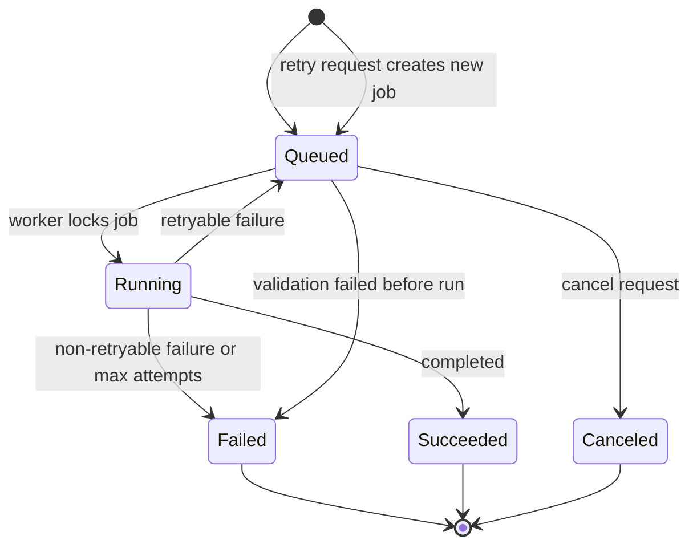
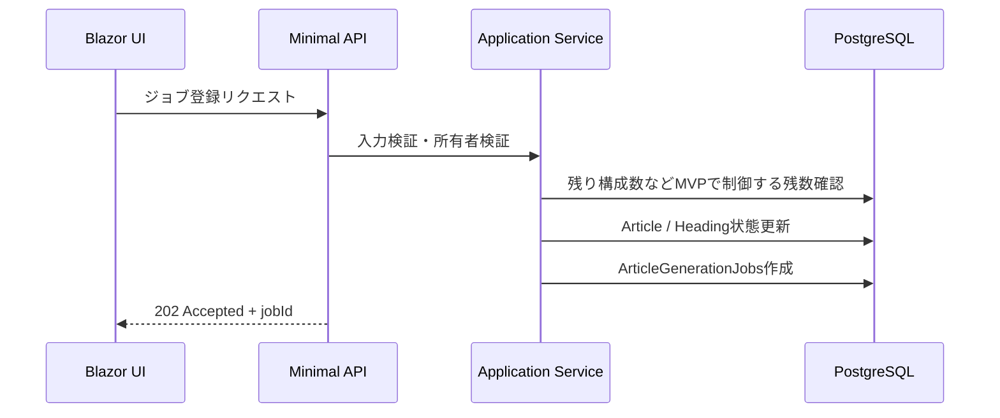

# ジョブ設計書

## 1. 目的

本書は、AIライティングツールにおけるバックグラウンドジョブ処理の設計を定義する。対象は、タイトル候補生成、見出し構成生成、本文生成、リライト、Tavily Web検索、X API Full-Archive Search、WordPress投稿、通知である。画像生成はMVPのジョブ対象に含めない。

ジョブ処理はASP.NET Coreの`BackgroundService`で実装し、PostgreSQL上の`ArticleGenerationJobs`テーブルを永続キューとして扱う。

## 2. 基本方針

- 長時間処理はHTTPリクエスト内で完了を待たない。
- 画面/APIはジョブを登録し、`jobId`を返す。
- ジョブ実行結果はDBへ保存し、画面は`GET /api/jobs/{jobId}`で状態を取得する。
- ジョブは永続化し、アプリ再起動後も再開できる。
- MVPではWorker専用コンテナを分離せず、`app`コンテナ内のHosted Serviceとして`BackgroundService`を実行する。
- 複数ワーカーで同時実行しても同一ジョブを二重処理しない。
- 外部API呼び出しではタイムアウト、再試行、失敗記録を必須とする。
- ジョブ処理ではScopedサービスや`DbContext`を直接Singletonに保持しない。
- 秘密情報、プロンプト全文、外部APIキーはログに出力しない。

## 3. 対象ジョブ

| JobType | 用途 | 主な入力 | 主な出力 |
| --- | --- | --- | --- |
| `TitleGeneration` | タイトル候補生成 | keyword, model, candidateCount | titleCandidates |
| `OutlineGeneration` | 見出し構成生成 | articleId, h2Count, h3Count, prompt settings | ArticleHeadings |
| `BodyGeneration` | 本文生成 | articleId, headingId, targetLength | ArticleHeading.Body |
| `Rewrite` | 要約、長文化、リライト | headingId, operation, body | rewritten body |
| `WebSearch` | Tavily Web検索 | query, maxResults, searchDepth, cacheTtl | SearchResults |
| `XFullArchiveSearch` | X投稿検索 | query, startTime, endTime, maxResults, filters | XSearchPosts |
| `WordpressPost` | WordPress投稿 | articleId, wordpressSiteId, htmlBody | WordpressPost |
| `Notification` | 通知送信 | destination, eventType, message | NotificationLog |

期限切れ検索キャッシュ削除は、ユーザー操作に紐づく`ArticleGenerationJobs`ではなく、専用の`SearchCacheCleanupWorker`で定期実行する。`ArticleGenerationJobs.UserId`は必須のため、システム保守処理をユーザー所有ジョブとして保存しない。

## 4. 関連テーブル

| テーブル | 役割 |
| --- | --- |
| `ArticleGenerationJobs` | ジョブ本体、状態、Payload、Result、ロック情報 |
| `Articles` | 記事ステータス、本文、HTML、投稿状態 |
| `ArticleHeadings` | 見出し、見出し本文、見出し生成状態 |
| `AiGenerationLogs` | AI生成の実行ログ |
| `UsageLedgers` | 文字数利用台帳。MVPでは月次集計と課金換算をしない |
| `SearchResults` | Tavily Web検索結果 |
| `XSearchPosts` | X投稿検索結果 |
| `WordpressPosts` | WordPress投稿履歴 |
| `NotificationLogs` | 通知送信履歴 |

## 5. アプリケーション構成

### 5.1 クラス構成

```text
Infrastructure/
  BackgroundJobs/
    ArticleJobWorker.cs
    JobDispatcher.cs
    JobLeaseService.cs
    JobRetryPolicy.cs
    Handlers/
      TitleGenerationJobHandler.cs
      OutlineGenerationJobHandler.cs
      BodyGenerationJobHandler.cs
      RewriteJobHandler.cs
      WebSearchJobHandler.cs
      XFullArchiveSearchJobHandler.cs
      WordpressPostJobHandler.cs
      NotificationJobHandler.cs
    Maintenance/
      SearchCacheCleanupWorker.cs
Application/
  Generation/
    IGenerationJobService.cs
    IUsageLimitService.cs
```

### 5.2 責務

| クラス/サービス | 責務 |
| --- | --- |
| `ArticleJobWorker` | ループ制御、停止制御、ジョブ取得起点 |
| `JobLeaseService` | ジョブ取得、ロック、状態更新 |
| `JobDispatcher` | `JobType`に応じたHandler呼び出し |
| `IJobHandler<TPayload>` | ジョブ種別ごとの処理 |
| `JobRetryPolicy` | 再試行可否、次回実行時刻の決定 |
| `SearchCacheCleanupWorker` | 期限切れ`SearchResults` / `XSearchPosts`の削除またはNULL化 |
| `IGenerationJobService` | API/画面からのジョブ登録 |
| `IUsageLimitService` | 構成生成回数などの残数確認、文字数利用履歴記録 |

## 6. ジョブ状態

### 6.1 状態一覧

| Status | 説明 |
| --- | --- |
| `Queued` | 実行待ち |
| `Running` | 実行中 |
| `Succeeded` | 成功 |
| `Failed` | 失敗 |
| `Canceled` | キャンセル |

### 6.2 状態遷移



### 6.3 状態更新ルール

| 遷移 | 更新内容 |
| --- | --- |
| `Queued` -> `Running` | `StartedAt`, `LockedBy`, `LockedAt`, `AttemptCount + 1` |
| `Running` -> `Succeeded` | `FinishedAt`, `Progress = 100`, `ResultJson`, `LockedBy = null`, `LockedAt = null` |
| `Running` -> `Queued` | `NextRunAt`, `ErrorCode`, `ErrorMessage`, `LockedBy = null`, `LockedAt = null` |
| `Running` -> `Failed` | `FinishedAt`, `ErrorCode`, `ErrorMessage`, `LockedBy = null`, `LockedAt = null` |
| `Queued` -> `Canceled` | `CanceledAt`, `FinishedAt` |

## 7. ジョブ登録設計

### 7.1 登録フロー



登録時のステータス更新:

| 登録ジョブ | Article更新 | Heading更新 |
| --- | --- | --- |
| `TitleGeneration` | 原則変更なし | - |
| `OutlineGeneration` | `OutlineQueued` | 既存見出しは変更しない |
| `BodyGeneration`一括 | `BodyQueued` | 対象見出しを`Queued` |
| `BodyGeneration`単体 | 原則変更なし | 対象見出しを`Queued` |
| `Rewrite` | 原則変更なし | 対象見出しを`Queued` |
| `WebSearch` / `XFullArchiveSearch` | 原則変更なし | 原則変更なし |
| `WordpressPost` / `Notification` | 原則変更なし | - |

`OutlineGenerating`、`BodyGenerating`、見出しの`Generating`は、Workerがジョブを`Running`へロックして処理を開始する時点で設定する。登録直後の待機状態は、記事・見出し側の`Queued`系ステータスとジョブ側の`Queued`で表す。

### 7.2 登録時チェック

| チェック | 内容 |
| --- | --- |
| 認証 | ログイン済みか |
| 認可 | 対象記事・見出しの所有者か |
| 入力 | Payloadの必須項目、文字数、URL |
| 状態 | 対象記事・見出しが実行可能状態か |
| 残数 | 構成生成回数などMVPで制御する残数が不足していないか。月次利用文字数は集計しない |
| 多重実行 | 同一対象の実行中ジョブがないか |

### 7.3 多重実行防止

同一対象に対して以下の実行中ジョブがある場合、新規登録を拒否する。

| 対象 | 条件 |
| --- | --- |
| 記事全体 | 同一`ArticleId`で`Status in ('Queued', 'Running')`の`OutlineGeneration`または一括`BodyGeneration` |
| 見出し | 同一`HeadingId`で`Status in ('Queued', 'Running')`の`BodyGeneration`または`Rewrite` |
| WordPress投稿 | 同一`ArticleId`で`WordpressPost`が`Queued`または`Running` |

拒否時はAPIで`409 Conflict`を返す。

## 8. Payload設計

### 8.1 共通Payload

```json
{
  "requestedByUserId": "user-id",
  "articleId": "7bc3e1d4-8f30-4c21-8873-3f1a47c9d19c",
  "generationModel": "gemini-3.1-pro-preview",
  "requestedAt": "2026-01-03T04:00:00Z"
}
```

生成系ジョブは`articleId`から`Articles.WritingProfileSnapshotJson`を読み込み、管理人プロフィール、語り手・キャラ設定、読者ペルソナをプロンプトへ反映する。PayloadJsonにはスナップショット本文を重複保存しない。

### 8.2 `TitleGenerationPayload`

```json
{
  "articleId": "7bc3e1d4-8f30-4c21-8873-3f1a47c9d19c",
  "keyword": "クラヲアクト,ミュージカル",
  "generationModel": "gemini-3.1-pro-preview",
  "candidateCount": 5,
  "titleMethod": "Ai"
}
```

### 8.3 `OutlineGenerationPayload`

```json
{
  "articleId": "7bc3e1d4-8f30-4c21-8873-3f1a47c9d19c",
  "keyword": "クラヲアクト,ミュージカル",
  "title": "クラヲアクトミュージカルの魅力を徹底解剖！その秘密とは？",
  "h2Count": 5,
  "h3Count": 12,
  "tone": "Normal",
  "outlineMethod": "Search",
  "generationModel": "gemini-3.1-pro-preview",
  "searchMode": true,
  "isDomesticOnly": true,
  "suggestedKeywords": "クラヲアクト ミュージカル\nクラヲアクト 評判",
  "relatedKeywords": "舞台 音楽 表現",
  "learningType": "Text",
  "learningText": "",
  "additionalPrompt": ""
}
```

### 8.4 `BodyGenerationPayload`

```json
{
  "articleId": "7bc3e1d4-8f30-4c21-8873-3f1a47c9d19c",
  "headingId": "4e4fd809-803f-46ec-902e-8a61df2e29cc",
  "generationModel": "gemini-3.1-pro-preview",
  "targetLength": 500,
  "useWebSearch": true,
  "additionalPrompt": ""
}
```

### 8.5 `WordpressPostPayload`

```json
{
  "articleId": "7bc3e1d4-8f30-4c21-8873-3f1a47c9d19c",
  "wordpressSiteId": "fb2a11db-849e-475d-8e79-9208e8f6f5af",
  "title": "クラヲアクトミュージカルの魅力を徹底解剖！その秘密とは？",
  "htmlBody": "<h2>...</h2><p>...</p>",
  "categoryId": 16,
  "status": "Draft",
  "source": "BulkAutoPost"
}
```

`source`は任意。通常の手動投稿では省略し、一括作成からの自動投稿では`BulkAutoPost`を設定する。

## 9. ジョブ取得・排他制御

### 9.1 取得SQL

PostgreSQLの行ロックを使い、複数ワーカーで同じジョブを取得しない。

```sql
SELECT *
FROM "ArticleGenerationJobs"
WHERE "Status" = 'Queued'
  AND ("NextRunAt" IS NULL OR "NextRunAt" <= now())
ORDER BY "Priority" DESC, "QueuedAt" ASC
FOR UPDATE SKIP LOCKED
LIMIT 1;
```

取得と`Running`への更新は同一トランザクションで行う。

### 9.2 ロック更新

```text
Status = Running
LockedBy = {machineName}:{processId}:{workerId}
LockedAt = now()
StartedAt = now() when first attempt
AttemptCount = AttemptCount + 1
Progress = 0
```

### 9.3 ロック期限切れ

アプリ停止やプロセス異常終了に備え、一定時間更新されていない`Running`ジョブを復旧対象にする。

| 項目 | 値 |
| --- | --- |
| 初期ロック期限 | 30分 |
| 復旧対象 | `Status = Running`かつ`LockedAt < now() - interval '30 minutes'` |
| 復旧後 | 再試行可能なら`Queued`、不可なら`Failed` |

長時間ジョブでは処理中に`LockedAt`を定期更新する。

## 10. Worker実行ループ

### 10.1 ループ方針

- `BackgroundService.ExecuteAsync`で実装する。
- `CancellationToken`を必ず監視する。
- ジョブがない場合は短時間待機する。
- 例外でWorker全体が停止しないよう、ジョブ単位で例外を捕捉する。

### 10.2 疑似コード

```csharp
while (!stoppingToken.IsCancellationRequested)
{
    var job = await leaseService.TryAcquireAsync(stoppingToken);

    if (job is null)
    {
        await Task.Delay(options.IdleDelay, stoppingToken);
        continue;
    }

    try
    {
        await dispatcher.DispatchAsync(job, stoppingToken);
        await leaseService.MarkSucceededAsync(job.Id, result, stoppingToken);
    }
    catch (Exception ex)
    {
        await leaseService.MarkFailureOrRetryAsync(job.Id, ex, stoppingToken);
    }
}
```

### 10.3 並列度

MVPでは`app`コンテナ内の1プロセス1ワーカー、同時実行数1を基本とする。Worker専用コンテナはMVPでは分離しない。
初期実装ではジョブ種別ごとの並列度設定は持たず、すべての`JobType`を共通キュー上で順次処理する。スループットよりも、ジョブの二重実行防止、外部APIの副作用管理、失敗時の追跡しやすさを優先する。
`JobType`、`Priority`、`NextRunAt`、PostgreSQLの`FOR UPDATE SKIP LOCKED`による取得設計は維持し、後続フェーズで種別別並列度や別キュー化を追加できる余地を残す。

将来拡張:

- ジョブ種別ごとの並列度設定
- AI生成と通知/WordPress投稿の別キュー化
- 同一アプリケーションイメージから`web`/`worker`コンテナを分離

Worker分離の判断条件:

- ジョブ滞留が継続する。
- AI生成や検索処理でWeb UIのレスポンスに影響が出る。
- `app`コンテナのCPU、メモリ、スレッド使用量が高止まりする。
- ジョブ種別ごとに異なるスケール、再起動、監視が必要になる。

## 11. ジョブ種別別処理

### 11.1 `TitleGeneration`

処理:

1. 記事と所有者を取得する。
2. キーワード、設定、サイト別ライティング設定スナップショットからタイトル候補プロンプトを作成する。
3. AI Providerへリクエストする。
4. 候補を`ResultJson`へ保存する。
5. `AiGenerationLogs`と`UsageLedgers`を記録する。

成功時:

- 記事タイトルは自動更新しない。
- 画面で候補選択後に記事へ反映する。

失敗時:

- 記事ステータスは変更しない。
- ジョブのみ失敗状態にする。

### 11.2 `OutlineGeneration`

処理:

1. `Articles.Status`を`OutlineGenerating`へ更新する。
2. 必要に応じて`WebSearch`と`XFullArchiveSearch`を実行し、`SearchResults`と`XSearchPosts`へ保存する。
3. 事前学習テキストを整形する。
4. サイト別ライティング設定スナップショットを反映して見出し構成プロンプトを作成する。
5. AI Providerへリクエストする。
6. H2/H3構造を検証する。
7. 既存見出しを置き換える、または新規見出しとして保存する。
8. `Articles.Status`を`OutlineReady`へ更新する。
9. `AiGenerationLogs`と`UsageLedgers`を記録する。

失敗時:

- `Articles.Status`を`Failed`へ更新する。
- 既存見出しがある場合は削除しない。

### 11.3 `BodyGeneration`

処理:

1. 対象見出しを`Generating`へ更新する。
2. 記事情報、見出し、検索結果、追加プロンプト、サイト別ライティング設定スナップショットから本文生成プロンプトを作る。
3. AI Providerへリクエストする。
4. 生成本文を`ArticleHeadings.Body`へ保存する。MVPでは本文履歴を作成せず、現在値を上書きする。
5. `ActualLength`を更新する。
6. 対象見出しを`Generated`へ更新する。
7. 記事内の全対象見出しが生成済みなら、結合済み本文とHTML本文を更新し、`Articles.Status`を`Completed`へ更新する。
8. `Articles.AutoPostToWordpress = true`かつ`AutoPostQueuedAt`が未設定の場合、投稿先サイトの所有者と有効状態を確認し、`WordpressPost`ジョブを`Draft`で登録する。
9. 自動投稿ジョブを登録した場合は`Articles.AutoPostQueuedAt`を設定する。
10. `AiGenerationLogs`と`UsageLedgers`を記録する。

失敗時:

- 対象見出しを`Failed`へ更新する。
- 記事全体は既存本文を保持し、必要に応じて`Failed`へ更新する。

### 11.4 `Rewrite`

処理:

1. 対象見出し本文を取得する。
2. 操作種別とサイト別ライティング設定スナップショットに応じてプロンプトを作る。
   - `Rewrite`
   - `Summarize`
   - `Expand`
   - `Refresh`
3. AI Providerへリクエストする。
4. 結果を対象見出し本文へ反映する。MVPでは本文履歴を作成せず、現在値を上書きする。
5. `AiGenerationLogs`と`UsageLedgers`を記録する。

失敗時:

- DBへ反映せず、既存の現在本文をそのまま残す。
- 対象見出しを`Failed`へ更新する。

### 11.5 `WebSearch`

処理:

1. 記事キーワード、見出し、検索設定から検索クエリを作成する。
2. 検索条件を正規化し、`QueryHash`を作成する。
3. 有効な`SearchResults`キャッシュがあれば外部APIを呼ばずに返す。
4. Tavily Search APIへリクエストする。
5. URL重複、低品質な結果を除外する。
6. データ種別ごとに保持期限を設定する。
7. `SearchResults`へ保存する。

保持期限:

- 検索結果JSON: 1から24時間。MVP既定6時間
- 本文、要約、スニペット: 24時間から7日。MVP既定72時間
- URL、タイトル、取得日時、ドメイン名: 30から180日。MVP既定90日

環境別上書き:

| 環境 | Tavily検索結果JSON | Tavily本文・要約・スニペット |
| --- | --- | --- |
| `dev` | 24時間 | 24時間 |
| `staging` | 6時間 | 24時間 |
| `production` | 24時間 | 7日 |
| `strict` | 24時間 | 24時間 |

失敗時:

- 既存の検索結果は保持する。
- 記事ステータスは原則変更しない。

### 11.6 `XFullArchiveSearch`

処理:

1. 記事キーワード、関連語、除外語、期間、言語からX検索クエリを作成する。
2. 検索条件を正規化し、`QueryHash`を作成する。
3. 有効な`XSearchPosts`キャッシュがあれば外部APIを呼ばずに返す。
4. 月間安全上限と`max_results`を確認する。
5. X API Full-Archive Searchへリクエストする。
6. `PostId`で既存投稿を確認し、同じ投稿を再保存しない。
7. 投稿本文、投稿URL、投稿日時など必要最小限を`XSearchPosts`へ保存する。
8. 投稿本文、投稿者名、プロフィール情報、メディアURLの保持期限を最大24時間に設定する。

取得上限:

- 契約はPay-per-useとする。
- Full-Archive Searchは必要時のみ実行する。
- `max_results`は通常100、大量調査時500までとする。
- 月間安全上限は10,000から50,000 posts程度から開始する。
- 月間安全上限を超える見込みがある場合、ジョブを`Failed`または待機状態にし、管理者確認を要求する。

失敗時:

- 既存のX投稿検索結果は保持する。
- 記事ステータスは原則変更しない。

X投稿を記事内で引用する場合は、WordPress投稿前に再hydrationして削除、非公開化、編集の有無を確認する。

`TopicRisk = compliance_strict`または`HumanReviewRequired = true`の場合、人間確認が完了するまでWordPress公開投稿は登録しない。下書き投稿は許可する。

トピック判定:

- `legalFinanceHealth`または`politicsSafetyReputation`に一致した場合は`compliance_strict`にする。
- `freshness`、`newsTrend`、`pricing`、`productAvailability`、`comparisonReview`、`techSaaS`、`sourceSignals`に一致した場合は`strict`にする。
- 複数カテゴリに一致した場合は、より厳しい`compliance_strict`を優先する。
- 一致しない場合は`normal`にする。

X投稿生データ保持期限:

| 環境 | 保持期間 | 表示・公開前 |
| --- | --- | --- |
| `dev` | 6時間 | 任意 |
| `staging` | 6時間 | 推奨 |
| `production` | 24時間 | 必ず再取得 |
| `strict` | 1時間 | 必ず再取得 |

### 11.7 `WordpressPost`

処理:

1. 記事、投稿先WordPressサイト、HTML本文を取得する。
2. Application Passwordを復号する。
3. 投稿ステータスを確認する。未指定時は`Draft`を使用する。
4. WordPress REST APIへ投稿する。
5. 成功時に`WordpressPosts`へ`PostId`、`PostUrl`を保存する。
6. `Articles.Status`を`Posted`へ更新する。
7. 必要に応じて`Notification`ジョブを登録する。

一括作成からの自動投稿:

- `source = BulkAutoPost`のジョブは`Draft`のみ登録する。
- `categoryId`が未指定の場合は`WordpressSites.DefaultCategoryId`を使用する。
- 同一記事に`Queued`または`Running`の`WordpressPost`ジョブがある場合は登録しない。
- `WordpressPosts`に成功済み履歴がある場合は自動投稿を再登録しない。

失敗時:

- `WordpressPosts.Status`を`Failed`へ更新する。
- `Articles.Status`は`Completed`のまま保持する。

### 11.8 `Notification`

処理:

1. 通知設定を取得する。
2. 通知本文を作成する。
3. Discord Webhookへ送信する。
4. `NotificationLogs`を保存する。

失敗時:

- `NotificationLogs.Status`を`Failed`へ更新する。
- 元ジョブの成功/失敗は変更しない。

## 12. リトライ設計

### 12.1 再試行対象

| エラー | 再試行 |
| --- | --- |
| HTTP 408 | する |
| HTTP 429 | する |
| HTTP 500系 | する |
| ネットワーク一時障害 | する |
| タイムアウト | する |
| 入力不正 | しない |
| 認証失敗 | しない |
| 権限エラー | しない |
| 残り構成数などMVPで制御する残数不足 | しない |
| WordPress URL不正 | しない |

### 12.2 最大試行回数

| JobType | MaxAttempts |
| --- | --- |
| `TitleGeneration` | 3 |
| `OutlineGeneration` | 3 |
| `BodyGeneration` | 3 |
| `Rewrite` | 2 |
| `WebSearch` | 2 |
| `XFullArchiveSearch` | 2 |
| `WordpressPost` | 3 |
| `Notification` | 3 |

### 12.3 バックオフ

指数バックオフを基本とする。

| AttemptCount | NextRunAt |
| --- | --- |
| 1 | 1分後 |
| 2 | 5分後 |
| 3 | 15分後 |

HTTP 429で`Retry-After`が取得できる場合は、その値を優先する。

## 13. キャンセル設計

### 13.1 MVP範囲

MVPでは`Queued`のみキャンセル可能とする。

```text
Queued -> Canceled
```

### 13.2 後続フェーズ

`Running`ジョブのキャンセルは、外部API呼び出しや途中保存との整合が難しいため後続フェーズとする。

対応する場合:

- `CancellationRequestedAt`を追加する。
- Handler内の処理境界でキャンセルを確認する。
- 外部APIがキャンセル不可の場合は完了後に結果反映を破棄する。

## 14. 利用文字数記録

### 14.1 記録タイミング

AI Providerからレスポンスを受け取り、生成結果をDBへ保存できた後に`UsageLedgers`へ記録する。

MVPでは利用文字数を月次集計、課金換算、残量算出、上限制御に使用しない。ジョブ結果の監査と運用確認のために記録する。

### 14.2 二重記録防止

- `UsageLedgers.JobId`で対象ジョブの既存台帳を確認する。
- 同一ジョブで複数AI呼び出しがある場合は`Operation`や明細を分ける。
- ジョブ再実行時は新しいジョブIDを発行する。

### 14.3 失敗時

| 状況 | 記録 |
| --- | --- |
| AI API呼び出し前に失敗 | 記録しない |
| AI APIがエラー応答 | 原則記録しない |
| AI API成功後、保存に失敗 | 復旧可能なら再保存。重複記録しない |
| 出力を保存して成功 | 記録する |

### 14.4 Provider別トークン換算

MVPではAI Providerごとの詳細なトークン/文字数換算ルールは定義しない。`UsageLedgers`には文字数ベースの利用履歴を記録し、固定係数によるトークン換算は行わない。

後続フェーズでOpenAI GPT、Anthropic Claudeなど複数Providerを追加する場合は、Provider別TokenCounterを実装し、公式APIまたは公式Tokenizerで事前見積もりする。Providerレスポンスから実トークン使用量を取得できる場合は、推定値より実績値を優先して保存・利用する。

## 15. 記事・見出しステータス連動

### 15.1 記事ステータス

| ジョブ | Worker開始時 | 成功時 | 失敗時 |
| --- | --- | --- | --- |
| `OutlineGeneration` | `OutlineGenerating` | `OutlineReady` | `Failed` |
| `BodyGeneration`一括 | `BodyGenerating` | `Completed` | `Failed`または部分失敗 |
| `BodyGeneration`単体 | 原則変更なし | 全見出し完了なら`Completed` | 原則変更なし |
| `WordpressPost` | 原則変更なし | `Posted` | `Completed`を維持 |

### 15.2 見出しステータス

| ジョブ | Worker開始時 | 成功時 | 失敗時 |
| --- | --- | --- | --- |
| `BodyGeneration` | `Generating` | `Generated` | `Failed` |
| `Rewrite` | `Generating` | `Generated` | `Failed` |

## 16. 画面との連携

### 16.1 ジョブ登録

画面はジョブ登録APIの`202 Accepted`を受け取り、`jobId`を保持する。

対象API:

- `POST /api/articles/{articleId}/generation/title-candidates`
- `POST /api/articles/{articleId}/generation/outline`
- `POST /api/articles/{articleId}/generation/headings/{headingId}/body`
- `POST /api/articles/{articleId}/generation/body`
- `POST /api/articles/{articleId}/generation/headings/{headingId}/rewrite`
- `POST /api/articles/{articleId}/wordpress-posts`

### 16.2 状態取得

画面は数秒間隔で以下を呼び出す。

```http
GET /api/jobs/{jobId}
```

ポーリング間隔:

| 状況 | 間隔 |
| --- | --- |
| `Queued` | 3秒 |
| `Running` | 2秒 |
| `Succeeded` / `Failed` / `Canceled` | 停止 |

MVPではSignalRによるジョブ状態のプッシュ通知は実装せず、上記のポーリングで状態を取得する。Blazor Interactive Server自体がリアルタイム接続を使用するため、初期実装ではジョブ状態専用のHub、ユーザー別配信、再接続、スケールアウト対応を追加しない。
SignalRは、ジョブ一覧ダッシュボード、複数ジョブの一括監視、ポーリング負荷増加、即時通知UXが必要になった後続フェーズで検討する。

### 16.3 表示

| JobStatus | 表示 |
| --- | --- |
| `Queued` | 生成待ち |
| `Running` | 生成中、進捗 |
| `Succeeded` | 完了、結果再取得 |
| `Failed` | エラー概要、再実行ボタン |
| `Canceled` | キャンセル済み |

## 17. エラー設計

### 17.1 エラー分類

| ErrorCode | 説明 | 再試行 |
| --- | --- | --- |
| `ValidationError` | 入力不正 | 不可 |
| `UnauthorizedExternalApi` | 外部API認証失敗 | 不可 |
| `RateLimited` | レート制限 | 可 |
| `Timeout` | タイムアウト | 可 |
| `ExternalServerError` | 外部API 5xx | 可 |
| `UsageLimitExceeded` | 残り構成数などMVPで制御する残数不足 | 不可 |
| `NotFound` | 対象データなし | 不可 |
| `Conflict` | 状態不整合 | 不可 |
| `UnknownError` | 予期しない例外 | 可。ただし最大回数まで |

### 17.2 ErrorMessage

画面表示できる短い概要のみ保存する。

保存しない情報:

- APIキー
- Authorizationヘッダー
- Cookie
- WordPress Application Password
- プロンプト全文
- 外部APIの生レスポンス全文

詳細調査が必要な情報は構造化ログへ出すが、秘密情報はマスクする。

## 18. トランザクション設計

### 18.1 ジョブ取得

ジョブ取得、ロック、`Running`への更新は1トランザクションで行う。

### 18.2 外部API呼び出し

外部API呼び出し中にDBトランザクションを開いたままにしない。

処理単位:

1. ジョブ取得トランザクション
2. 外部API呼び出し
3. 結果保存トランザクション

### 18.3 結果保存

生成結果、ログ、利用文字数、ステータス更新は同一トランザクションで保存する。

例:

- `ArticleHeadings.Body`更新
- `ArticleHeadings.Status`更新
- `AiGenerationLogs`追加
- `UsageLedgers`追加
- `ArticleGenerationJobs.Status`更新

## 19. 設定値

Optionsクラス例:

```csharp
public sealed class BackgroundJobOptions
{
    public int IdleDelaySeconds { get; init; } = 3;
    public int LockTimeoutMinutes { get; init; } = 30;
    public int MaxJobsPerLoop { get; init; } = 1;
    public int DefaultMaxAttempts { get; init; } = 3;
    public string WorkerIdPrefix { get; init; } = "app";
    public int SearchCacheCleanupIntervalMinutes { get; init; } = 60;

    public TimeSpan IdleDelay => TimeSpan.FromSeconds(IdleDelaySeconds);
    public TimeSpan LockTimeout => TimeSpan.FromMinutes(LockTimeoutMinutes);
    public TimeSpan SearchCacheCleanupInterval => TimeSpan.FromMinutes(SearchCacheCleanupIntervalMinutes);
}
```

`BackgroundJobs:*Seconds` / `BackgroundJobs:*Minutes`の設定値は同名の数値プロパティへバインドし、Worker内では`TimeSpan`へ変換して使う。`SearchCacheCleanupInterval`は`SearchCacheCleanupWorker`の実行間隔である。削除件数だけをログに出し、検索本文、X投稿本文、外部APIレスポンス全文はログへ出さない。

外部APIタイムアウト:

| 対象 | タイムアウト |
| --- | --- |
| AIテキスト生成 | 120秒 |
| Tavily Web検索 | 30秒 |
| X Full-Archive Search | 30秒 |
| WordPress投稿 | 60秒 |
| 通知 | 30秒 |

## 20. ヘルスチェック

### 20.1 `/health/ready`

確認内容:

- PostgreSQLへ接続できる。
- `ArticleGenerationJobs`へ軽量クエリを実行できる。
- `ArticleJobWorker`が直近でループしている。
- `SearchCacheCleanupWorker`が直近でループしている。

### 20.2 Worker稼働記録

MVPではメモリ上の最終ループ時刻で確認する。将来的に`WorkerHeartbeats`テーブルを追加できる。

## 21. ログ設計

### 21.1 構造化ログ項目

| 項目 | 内容 |
| --- | --- |
| `jobId` | ジョブID |
| `jobType` | ジョブ種別 |
| `articleId` | 記事ID |
| `headingId` | 見出しID |
| `userId` | ユーザーID |
| `attemptCount` | 試行回数 |
| `elapsedMs` | 処理時間 |
| `errorCode` | エラーコード |

### 21.2 ログレベル

| Level | 用途 |
| --- | --- |
| Information | ジョブ開始、成功、再試行予定 |
| Warning | 再試行可能な失敗、外部API一時障害 |
| Error | 最終失敗、想定外例外 |
| Debug | 開発時の詳細。Productionでは抑制 |

## 22. セキュリティ

- Handler内で対象記事、見出し、WordPressサイトの所有者整合性を再確認する。
- Payload内の`UserId`だけを信用しない。
- WordPress Application Passwordは処理直前に復号し、使用後は保持しない。
- 外部URL取得ではSSRF対策を行う。
- ログ、`ResultJson`、`ErrorMessage`に秘密情報を保存しない。

## 23. テスト観点

### 23.1 単体テスト

- `JobRetryPolicy`がエラー種別ごとに正しく再試行可否を返す。
- `NextRunAt`がAttemptCountに応じて計算される。
- Payloadのバリデーションが機能する。
- 利用文字数の記録が正しい。
- Tavily検索結果がキャッシュされる。
- X投稿が`PostId`で重複保存されない。
- 記事・見出しステータス遷移が正しい。

### 23.2 結合テスト

- ジョブ登録APIが`ArticleGenerationJobs`を作成する。
- `FOR UPDATE SKIP LOCKED`相当で二重取得されない。
- 成功時に生成結果、ログ、利用台帳が保存される。
- 失敗時に`Failed`または再試行`Queued`へ遷移する。
- WordPress投稿失敗時に記事本文が失われない。

### 23.3 E2Eテスト

- 記事作成画面から構成生成ジョブを登録できる。
- 画面がジョブ完了を検知し、結果を表示できる。
- 本文生成失敗時に再実行できる。
- WordPress投稿ジョブ登録後、投稿履歴を確認できる。
- WordPress投稿ジョブ登録時、投稿ステータス未指定なら下書きになる。

## 24. 運用・保守

### 24.1 滞留ジョブ監視

監視対象:

- `Queued`のまま一定時間を超えたジョブ
- `Running`のままロック期限を超えたジョブ
- `Failed`が急増しているジョブ種別
- 外部API別の失敗率

### 24.2 手動復旧

管理者向けに後続フェーズで以下を検討する。
MVPでは管理者向けの失敗ジョブ横断画面は提供せず、記事詳細・生成結果画面上のジョブ状態表示、エラー概要、再実行ボタンで対応する。

- 失敗ジョブの再実行
- Queuedジョブのキャンセル
- Running期限切れジョブの復旧
- ジョブ詳細Payloadの安全な確認

### 24.3 アーカイブ

初期実装ではジョブを削除しない。運用後に以下を検討する。

- 90日以上前の成功ジョブをアーカイブ
- 古い`ResultJson`の軽量化
- 検索結果、通知ログの保持期間設定
- Tavily検索結果JSON、本文、メタデータの保持期限に応じた削除
- X投稿生データの環境別TTLに応じた削除または匿名化

## 25. 決定事項

- Worker専用コンテナはMVPでは分離しない。
- MVPでは`app`コンテナ内のHosted Serviceとして`BackgroundService`を実装し、1プロセス1ワーカー、同時実行数1を基本とする。
- 初期実装ではジョブ種別ごとの並列度設定は持たず、全ジョブ共通で同時実行数1とする。
- MVPではSignalRによるジョブ状態プッシュ通知は実装せず、`GET /api/jobs/{jobId}`のポーリングで状態を取得する。
- MVPではAI Providerごとの詳細なトークン/文字数換算ルールは定義せず、固定係数によるトークン換算は行わない。
- MVPでは失敗ジョブの管理者向け横断画面は実装せず、記事詳細・生成結果画面の失敗表示と再実行操作で対応する。
- 後続フェーズでジョブ量、メモリ使用量、Web UIレスポンスへの影響を見て、同一イメージから`web`/`worker`コンテナへ分離する。
- 後続フェーズで複数AI Providerを追加する際にProvider別TokenCounterを実装し、公式APIまたは公式Tokenizerによる事前見積もりと、Providerレスポンスの実トークン使用量保存を検討する。
- 後続フェーズで失敗ジョブ一覧、強制再実行、Running期限切れ復旧、ジョブ詳細Payloadの安全な確認を行う管理者向け画面を検討する。
