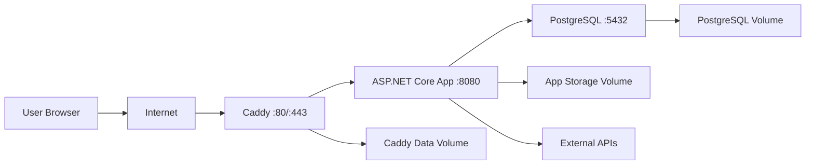

# 運用設計書

## 1. 目的

本書は、AIライティングツールをVPS上で安定運用するための運用方針、構成、監視、バックアップ、デプロイ、障害対応、セキュリティ運用を定義する。

対象技術は、Blazor Web App、ASP.NET Core、PostgreSQL、EF Core、BackgroundService、Docker Compose、Caddy、VPSである。

## 2. 前提

### 2.1 対象環境

| 項目 | 内容 |
| --- | --- |
| 実行環境 | Linux VPS |
| コンテナ管理 | Docker Compose |
| Web公開 | CaddyによるHTTPS終端、リバースプロキシ |
| アプリ | ASP.NET Core / Blazor Web App |
| DB | PostgreSQL |
| 非同期処理 | ASP.NET Core BackgroundService |
| 永続化 | Docker volume / VPS内ディスク |
| 外部連携 | AI API、Tavily Search API、X API Full-Archive Search、WordPress REST API、Discord Webhook |

### 2.2 運用対象サービス

| サービス | 役割 | 起動方式 |
| --- | --- | --- |
| `caddy` | HTTPS、リバースプロキシ、静的転送 | Docker Compose |
| `app` | Blazor UI、API、BackgroundService | Docker Compose |
| `postgres` | アプリケーションDB | Docker Compose |

MVPでは`app`サービス内でWebアプリとBackgroundServiceを同居させる。ジョブ量が増えた場合は、同一イメージから`web`と`worker`へ分離する。

## 3. 運用方針

- 本番環境への変更はDockerイメージ更新とCompose再起動で行う。
- DBデータ、Data Protectionキー、Caddyデータは永続volumeに保存する。MVPでは画像生成・画像アップロードを扱わない。
- 外部APIキーとDBパスワードは環境変数またはVPS上の秘密情報ファイルで管理する。WordPress Application PasswordとDiscord Webhook URLはユーザーが画面から登録し、DBへ暗号化保存する。
- 本番ログに秘密情報、プロンプト全文、外部APIレスポンス全文を出力しない。
- BackgroundServiceのジョブはDB上の状態で追跡し、コンテナ再起動後も再開できるようにする。
- 障害時は、アプリログ、ジョブログ、DB状態、外部APIレスポンスの順に切り分ける。
- 重大な操作は手順化し、属人化を避ける。

## 4. インフラ構成

### 4.1 論理構成



### 4.2 ネットワーク方針

| 通信 | 公開範囲 | 備考 |
| --- | --- | --- |
| HTTP 80 | 外部公開 | CaddyがHTTPSへリダイレクト |
| HTTPS 443 | 外部公開 | CaddyでTLS終端 |
| App 8080 | Docker内部のみ | 外部公開しない |
| PostgreSQL 5432 | Docker内部のみ | VPS外部へ公開しない |

### 4.3 VPS要件

| 項目 | MVP目安 | 備考 |
| --- | --- | --- |
| CPU | 2 vCPU以上 | AI生成自体は外部API依存 |
| メモリ | 2GB以上 | PostgreSQL、.NET、Caddyを同居 |
| ディスク | 40GB以上 | DB、ログ、バックアップを保存 |
| OS | Ubuntu LTS系 | Docker公式サポートを優先 |
| swap | 1GB以上 | 小規模VPSでのOOM抑止 |

## 5. Docker Compose運用

### 5.1 Compose管理方針

- `docker compose up -d`でサービスを起動する。
- `docker compose pull`またはイメージ差し替え後に`docker compose up -d`で反映する。
- `postgres`のvolumeは削除しない。
- 本番では`restart: unless-stopped`を設定する。
- `app`はヘルスチェック成功後にCaddyから疎通確認する。
- `app`コンテナのhealthcheckは`/health/ready`を確認し、付属Caddyは`service_healthy`後に起動する。
- ホストの共通Caddyを使う場合は`docker-compose.shared-caddy.yml`を重ね、appとPostgreSQLを`127.0.0.1`だけへ公開し、付属Caddyを起動しない。

### 5.2 サービス起動順

| 順序 | サービス | 条件 |
| --- | --- | --- |
| 1 | `postgres` | DB accepting connections |
| 2 | `app` | DB接続、マイグレーション適用済み |
| 3 | `caddy` | `app`のHTTP応答確認 |

`depends_on`だけではアプリケーションレベルの準備完了を保証しないため、アプリ側にreadiness health checkを実装する。

### 5.3 永続volume

| Volume | 保存内容 | バックアップ対象 |
| --- | --- | --- |
| `postgres_data` | PostgreSQLデータ | 対象 |
| `app_storage` | MVPでは画像保存に使用しない。後続フェーズの添付ファイル、エクスポートファイル用 | 後続フェーズで対象 |
| `app_keys` | ASP.NET Core Data Protectionキー | 対象 |
| `caddy_data` | Caddy証明書、ACME情報 | 対象 |
| `caddy_config` | Caddy設定 | 対象 |

## 6. Caddy運用

### 6.1 役割

- HTTP/HTTPSの外部公開口となる。
- Let's Encrypt等によるTLS証明書を自動取得・更新する。
- ASP.NET Coreアプリへリバースプロキシする。
- 必要に応じてアクセスログを出力する。

### 6.2 Caddyfile方針

```text
example.com {
    encode zstd gzip

    reverse_proxy app:8080 {
        header_up X-Forwarded-Proto {scheme}
        header_up X-Forwarded-Host {host}
    }

    log {
        output file /var/log/caddy/access.log
        format json
    }
}
```

実ドメインは本番環境で設定する。ASP.NET Core側ではForwarded Headersを有効にし、HTTPSリダイレクト、Cookie Secure属性、認証リダイレクトURLが正しく動作することを確認する。

### 6.3 TLS証明書

| 項目 | 方針 |
| --- | --- |
| 取得 | Caddyの自動取得を使用 |
| 更新 | Caddyの自動更新に任せる |
| 保存 | `caddy_data` volume |
| 障害時 | DNS、80/443公開、Caddyログを確認 |

## 7. アプリケーション運用

### 7.1 実行モード

| 項目 | 値 |
| --- | --- |
| `ASPNETCORE_ENVIRONMENT` | `Production` |
| 待受URL | `http://+:8080` |
| 公開URL | `https://{domain}` |
| ログ形式 | JSONまたは構造化ログ |

### 7.2 ヘルスチェック

| エンドポイント | 用途 | 内容 |
| --- | --- | --- |
| `/health/live` | liveness | プロセス生存確認 |
| `/health/ready` | readiness | PostgreSQL接続、BackgroundService状態確認 |
| `/health/deps` | 依存先確認 | 外部APIの簡易疎通。管理者限定 |

`/health/live`は軽量にし、外部APIを呼び出さない。外部API障害でコンテナが不必要に再起動されないようにする。

### 7.3 設定値

| 種別 | 管理方法 | 例 |
| --- | --- | --- |
| 非秘密情報 | `appsettings.Production.json`または環境変数 | 文字数上限、ジョブ並列数 |
| 秘密情報 | VPS上の`.env`またはsecret file | DBパスワード、AI APIキー |
| ユーザー設定 | DB | WordPress連携先、通知設定 |
| 実行時状態 | DB | ジョブ状態、使用量、失敗理由 |

`.env`やsecret fileはGit管理しない。

### 7.4 Data Protection

ASP.NET CoreのCookie認証や一部トークン保護に必要なData Protectionキーは、コンテナ再作成で失われないよう永続volumeへ保存する。

| 項目 | 方針 |
| --- | --- |
| 保存先 | `app_keys` volume |
| 暗号化 | VPS単体運用ではファイル権限で保護。必要に応じて証明書保護 |
| バックアップ | 対象 |
| 注意 | キー喪失時は既存ログインセッション等が無効になる |

## 8. PostgreSQL運用

### 8.1 基本方針

- PostgreSQLは外部公開しない。
- アプリ用DBユーザーは必要最小権限にする。
- 管理者用DBユーザーとアプリ用DBユーザーを分ける。
- マイグレーション実行はデプロイ手順内で管理する。
- バックアップは`pg_dump`を基本とする。

### 8.2 接続管理

| 項目 | 方針 |
| --- | --- |
| 接続文字列 | 環境変数で指定 |
| SSL | Docker内部通信のためMVPでは不要。外部DB利用時は必須 |
| Pooling | Npgsql既定値を基準に負荷確認後調整 |
| タイムアウト | 接続、コマンドともに明示設定を検討 |

### 8.3 マイグレーション

| タイミング | 方針 |
| --- | --- |
| 開発 | `scripts/db-migrate.ps1`。ローカルツールマニフェストの`dotnet-ef 10.0.8`を使用 |
| 本番 | デプロイ手順内で明示実行 |
| 自動適用 | MVPでは避ける。起動時自動適用は小規模運用のみ検討 |
| ロールバック | DBバックアップ取得後に実施 |

本番マイグレーション前には必ずDBバックアップを取得する。
本番Composeでは`docker compose --profile tools run --rm migrate`を使用し、リポジトリのローカルツールマニフェストで`dotnet-ef 10.0.8`へ固定する。appコンテナへSDKやEF CLIは含めない。

## 9. BackgroundService運用

### 9.1 監視対象

| 項目 | 正常基準 |
| --- | --- |
| 待機ジョブ数 | 継続的に増え続けない |
| 実行中ジョブ数 | 設定した並列数以内 |
| 失敗ジョブ数 | 突発的増加がない |
| リトライ回数 | 上限到達が頻発しない |
| 平均処理時間 | 設定した目安内 |
| 外部APIエラー率 | 連続失敗がない |
| 検索キャッシュ削除Worker | 定期実行され、期限切れ生データが残り続けない |

### 9.2 ジョブ復旧方針

| 状態 | 復旧方針 |
| --- | --- |
| `Queued` | 通常処理対象 |
| `Running` | `LockedAt`の期限切れ後、再試行可能なら`Queued`へ戻す |
| `Queued` + `NextRunAt`未来 | `NextRunAt`到達後に再実行 |
| `Failed` | MVPでは記事詳細・生成結果画面から再実行可。管理者向け横断画面での復旧は後続フェーズ |
| `Succeeded` | 再実行しない |
| `Canceled` | 再実行しない |

コンテナ再起動時に`Running`のまま残ったジョブは、ロック期限切れ後に再取得する。

### 9.3 ジョブ停止

- 通常停止時は`CancellationToken`を尊重し、実行中の処理を安全に中断する。
- 外部API呼び出し中の中断は、保存済みステップを基準に再開または再実行する。
- WordPress投稿など副作用のある処理は、冪等キーまたは投稿履歴で二重投稿を防ぐ。

## 10. ログ設計

### 10.1 ログ種別

| ログ | 出力元 | 用途 |
| --- | --- | --- |
| アクセスログ | Caddy | リクエスト状況、攻撃兆候 |
| アプリログ | ASP.NET Core | API、画面、認証、例外 |
| ジョブログ | BackgroundService | 生成、投稿、通知の追跡 |
| DBログ | PostgreSQL | 接続、遅延、エラー |
| 外部連携ログ | Infrastructure | API失敗、レート制限、タイムアウト |

### 10.2 ログ項目

| 項目 | 内容 |
| --- | --- |
| `timestamp` | 発生時刻 |
| `level` | `Information` / `Warning` / `Error` |
| `traceId` | HTTPリクエスト追跡ID |
| `userId` | 対象ユーザーID |
| `jobId` | ジョブID |
| `articleId` | 記事ID |
| `provider` | 外部APIプロバイダー |
| `eventName` | イベント名 |
| `elapsedMs` | 処理時間 |
| `errorCode` | アプリ内エラーコード |

### 10.3 ログ禁止項目

- APIキー
- DBパスワード
- WordPress Application Password
- Discord Webhook URL
- 認証Cookie
- ユーザーの秘密メモ
- AIプロンプト全文
- 外部APIレスポンス全文

必要な場合は、トークン数、文字数、ハッシュ値、エラーコードのみ記録する。

### 10.4 ログローテーション

| 対象 | 方針 |
| --- | --- |
| Dockerログ | `json-file`の`max-size`、`max-file`を設定 |
| Caddyアクセスログ | 日次またはサイズベースでローテーション |
| PostgreSQLログ | サイズベースでローテーション |
| 保存期間 | MVPは14日から30日 |

## 11. 監視設計

### 11.1 監視項目

| 分類 | 項目 | 閾値例 |
| --- | --- | --- |
| 死活 | HTTPS応答 | 2回連続失敗 |
| アプリ | `/health/ready` | 2回連続失敗 |
| DB | 接続可否 | 1分以上不可 |
| リソース | CPU | 80%以上が10分継続 |
| リソース | メモリ | 85%以上が10分継続 |
| リソース | ディスク | 80%以上 |
| ジョブ | `Failed`件数 | 1時間で5件以上 |
| ジョブ | `Queued`滞留 | 30分以上 |
| 外部API | レート制限 | 連続発生 |
| Tavily | 検索失敗率 | 連続失敗または429増加 |
| X API | Full-Archive Search失敗率 | 連続失敗または429増加 |
| X API | 月間取得件数 | 10,000から50,000 postsの安全上限に近づく |
| 検索キャッシュ | キャッシュヒット率 | 急激な低下 |
| 検索データ保持 | 期限切れX投稿生データ | 環境別TTL超過が残らない |
| TLS | 証明書期限 | 14日未満 |

### 11.2 通知先

| 通知種別 | 通知先 |
| --- | --- |
| サービス停止 | 管理者メールまたはDiscord |
| ジョブ大量失敗 | Discord |
| ディスク逼迫 | 管理者メール |
| バックアップ失敗 | 管理者メールまたはDiscord |

MVPではVPS外部の簡易死活監視サービスとDiscord通知を組み合わせる。

### 11.3 メトリクス

将来的にPrometheus等を導入する場合、以下を収集対象とする。

| メトリクス | 内容 |
| --- | --- |
| `http_requests_total` | HTTPリクエスト数 |
| `http_request_duration_seconds` | HTTP応答時間 |
| `background_jobs_total` | ジョブ数 |
| `background_job_duration_seconds` | ジョブ処理時間 |
| `external_api_errors_total` | 外部APIエラー数 |
| `ai_tokens_used_total` | AI使用トークンまたは文字数 |
| `db_query_duration_seconds` | DBクエリ時間 |

## 12. バックアップ設計

### 12.1 バックアップ対象

| 対象 | 方式 | 頻度 |
| --- | --- | --- |
| PostgreSQL | `pg_dump` | 日次 |
| app_keys | `tar` | 変更時、日次 |
| caddy_data | `tar` | 週次 |
| Compose設定 | Git管理または別途保管 | 変更時 |
| 環境変数テンプレート | 秘密値を除いてGit管理 | 変更時 |

MVPでは画像ファイルや添付ファイルを保存しないため、`app_storage`はバックアップ対象に含めない。後続フェーズでファイル保存を追加した時点で対象に加える。

### 12.2 保存期間

| 種別 | 保存期間 |
| --- | --- |
| 日次バックアップ | 7日 |
| 週次バックアップ | 4週 |
| 月次バックアップ | 3か月 |

小規模運用では、容量を確認しながら保存期間を調整する。

### 12.3 保存先

| 保存先 | 方針 |
| --- | --- |
| VPS内 | 短期復旧用 |
| 外部ストレージ | 災害復旧用 |

VPS内バックアップだけではVPS障害に対応できないため、最低1日1回は外部ストレージへ退避する。

### 12.4 バックアップ検証

- 月1回、検証環境でリストア手順を実行する。
- `pg_dump`ファイルの存在だけでなく、DBへ復元できることを確認する。
- MVPでは画像データを保存しないため、画像と記事データの参照整合性確認は行わない。
- Data Protectionキー復元後にログインセッションや保護データの挙動を確認する。

## 13. リストア設計

### 13.1 DBリストア手順

1. 現在のサービス状態を確認する。
2. 必要に応じて`app`を停止する。
3. 現在のDB volumeまたはDBを退避する。
4. 対象バックアップを展開する。
5. `psql`または`pg_restore`で復元する。
6. `app`を起動する。
7. `/health/ready`を確認する。
8. 管理画面で記事、ジョブ、WordPress設定を確認する。

### 13.2 ファイルリストア手順

MVPでは画像ファイルや添付ファイルを保存しないため、ファイルリストアは通常不要。後続フェーズで`app_storage`をバックアップ対象に追加した場合は以下を手順化する。

1. `app`を停止する。
2. `app_storage`の現在状態を退避する。
3. バックアップを展開する。
4. ファイル所有者と権限を確認する。
5. `app`を起動する。
6. 記事詳細、投稿画面で参照確認する。

### 13.3 RTO/RPO

| 指標 | MVP目標 |
| --- | --- |
| RTO | 4時間以内 |
| RPO | 24時間以内 |

有料ユーザーや業務利用が増えた場合は、バックアップ頻度と冗長化を見直す。

## 14. デプロイ設計

### 14.1 デプロイ前確認

- Gitの対象ブランチ、タグを確認する。
- テスト結果を確認する。
- DBマイグレーション有無を確認する。
- 外部API仕様変更や設定追加の有無を確認する。
- `.env`に必要な環境変数が存在することを確認する。
- 本番DBバックアップを取得する。

### 14.2 デプロイ手順

1. 本番VPSへログインする。
2. 対象リリースのイメージまたはソースを配置する。
3. 本番DBバックアップを取得する。
4. 必要に応じて`docker compose --profile tools run --rm migrate`でDBマイグレーションを実行する。
5. `docker compose up -d`でサービスを更新する。
6. `docker compose ps`で起動状態を確認する。
7. 共通Caddyを含む公開URLから`curl -fsS`で`/health/live`、`/health/ready`を確認する。
8. 管理者ログイン、記事一覧、記事作成ジョブ登録を確認する。
9. Caddyログとアプリログに異常がないことを確認する。

### 14.3 ロールバック方針

| 状況 | 対応 |
| --- | --- |
| アプリ起動失敗 | 前バージョンのイメージへ戻す |
| マイグレーション前 | 前バージョンへ戻す |
| マイグレーション後 | DBバックアップから復元するか、互換性のある前バージョンへ戻す |
| 外部API障害 | 対象機能を停止、ジョブを再試行待ちにする |

DBスキーマ変更を含むリリースでは、アプリの前後方互換性を優先する。

## 15. 障害対応設計

### 15.1 障害分類

| 分類 | 例 |
| --- | --- |
| Web停止 | HTTPS接続不可、Caddy停止 |
| App停止 | コンテナ終了、起動失敗 |
| DB障害 | 接続不可、ディスク不足、ロック滞留 |
| ジョブ障害 | 生成停止、失敗大量発生 |
| 外部API障害 | AI APIエラー、Tavily検索失敗、X投稿検索失敗、WordPress投稿失敗、Discord通知失敗 |
| データ障害 | 記事欠損、二重投稿 |
| セキュリティ | 不正ログイン、秘密情報漏えい疑い |

### 15.2 初動

1. 影響範囲を確認する。
2. 直近のデプロイ、設定変更、外部API障害情報を確認する。
3. `docker compose ps`でサービス状態を確認する。
4. Caddy、app、postgresのログを確認する。
5. `/health/live`、`/health/ready`を確認する。
6. 必要に応じて一時的にジョブ投入を停止する。

### 15.3 主な切り分け

| 症状 | 確認箇所 | 対応 |
| --- | --- | --- |
| HTTPSに接続できない | DNS、Caddy、80/443、証明書 | Caddy再起動、DNS確認 |
| ログインできない | Cookie、Data Protectionキー、DB | キーvolume、認証ログ確認 |
| 記事作成が進まない | ジョブ状態、Workerログ、外部API | ジョブ再実行、APIキー確認 |
| 検索結果が取得できない | Tavily APIキー、X Bearer Token、検索条件、レート制限 | 条件見直し、キャッシュ利用、再試行 |
| WordPress投稿失敗 | URL、認証、カテゴリ、REST API | 接続テスト、資格情報更新 |
| 通知が届かない | Discord Webhook URL、HTTPステータス、APIレスポンス | 送信テスト、設定確認 |
| DB接続失敗 | postgres状態、接続文字列、ディスク | DB再起動、容量確保 |

### 15.4 事後対応

- 障害発生時刻、検知時刻、復旧時刻を記録する。
- 原因、影響範囲、対応内容、再発防止策を記録する。
- 必要に応じて監視閾値、ログ、ジョブリトライ設定を見直す。

## 16. セキュリティ運用

### 16.1 VPS

- SSHは公開鍵認証を使用する。
- パスワードログインを無効化する。
- root直接ログインを無効化する。
- OSパッケージを定期更新する。
- 80/443/SSH以外は原則公開しない。
- SSHポートは必要に応じて接続元制限を行う。

### 16.2 アプリ

- 管理者機能は認証必須にする。
- ユーザーごとの記事、WordPress設定、ジョブは認可で分離する。
- 初期AdminはSeedで作成し、2人目以降のAdminは管理画面から追加または昇格する。
- Adminロール追加、降格、無効化は監査ログへ記録する。
- 本人退会と管理者によるユーザー削除は物理削除であり、対象ユーザーに紐づく業務データも削除される。
- 本人退会では、現在パスワード確認、Runningジョブなし、最後のAdminではないことを確認する。
- 管理者によるユーザー削除では、削除前に対象ユーザー、Runningジョブ有無、最後のAdminではないことを確認する。
- 最後のAdminユーザーの降格、無効化、削除は拒否する。
- CSRF対策を有効化する。
- Cookieは`Secure`、`HttpOnly`、`SameSite`を適切に設定する。
- 外部入力をHTML表示する場合はXSS対策を行う。
- WordPress Application Passwordは平文表示しない。

### 16.3 秘密情報

| 秘密情報 | 運用 |
| --- | --- |
| AI APIキー | 環境変数、定期ローテーション |
| Tavily APIキー | 環境変数、ログ出力禁止 |
| X API Bearer Token | 環境変数、ログ出力禁止 |
| DBパスワード | 強固な値、Git管理禁止 |
| WordPress Application Password | DB暗号化保存、画面再表示不可 |
| Discord Webhook URL | DB暗号化保存、ログ出力禁止 |
| Caddy証明書 | volume権限保護 |

初期Adminパスワードは初回Seed後にローテーションし、`.env`または秘密情報ファイルから削除または無効化する運用を推奨する。

### 16.4 インシデント時

秘密情報漏えいが疑われる場合は、対象キーを即時無効化し、再発行する。影響範囲を確認し、該当期間のアクセスログ、ジョブログ、外部連携ログを確認する。

## 17. パフォーマンス運用

### 17.1 監視観点

- 記事一覧の応答時間
- 記事詳細の表示時間
- ジョブ登録APIの応答時間
- BackgroundServiceの平均処理時間
- DBクエリ時間
- 外部API待ち時間

### 17.2 改善方針

| 課題 | 方針 |
| --- | --- |
| 記事一覧が遅い | ページング、インデックス、必要列のみ取得 |
| ジョブが滞留する | 並列数調整、worker分離 |
| DB負荷が高い | クエリ最適化、インデックス追加 |
| 外部API待ちが長い | タイムアウト、リトライ、段階保存 |

## 18. 定期メンテナンス

### 18.1 日次

- サービス死活確認
- バックアップ成功確認
- ジョブ失敗件数確認
- ディスク使用量確認
- 期限切れ検索キャッシュ削除結果確認
- X投稿生データの環境別TTL超過残存確認

### 18.2 週次

- OS、Docker、アプリログのエラー傾向確認
- PostgreSQLバックアップの外部退避確認
- Caddy証明書更新状況確認
- 不要な一時ファイル、古いログの削除
- Tavilyメタデータ、X集計データの保持件数確認
- X API Full-Archive Searchの月間取得件数確認

### 18.3 月次

- リストア訓練
- セキュリティ更新適用
- 外部APIキー、WordPress連携失敗状況の棚卸し
- DBサイズ、記事数、ジョブ数の増加傾向確認
- 監視閾値の見直し
- 検索キャッシュ保持期間の見直し
- トピック判定辞書の見直し
- 誤判定ログ、手動修正履歴、テストケース追加状況の確認
- 公開済み記事の更新対象、統合候補、削除候補の確認

### 18.4 トピック判定辞書メンテナンス

| 項目 | 方針 |
| --- | --- |
| 担当 | 運営者本人 |
| 更新頻度 | 月1回 + 誤判定に気づいた時 |
| 更新対象 | strict判定キーワード、除外キーワード、トピックカテゴリ、TTLポリシー |
| 管理形式 | YAMLまたはJSON |
| 反映条件 | テストケース追加、判定結果確認後に反映 |

### 18.5 検索キャッシュ保持期間

| 環境 | Tavily検索結果JSON | Tavily本文・要約・スニペット | X投稿生データ | X ID | X表示・公開前 |
| --- | --- | --- | --- | --- | --- |
| `dev` | 24時間 | 24時間 | 6時間 | 長期保持可 | 任意 |
| `staging` | 6時間 | 24時間 | 6時間 | 長期保持可 | 推奨 |
| `production` | 24時間 | 7日 | 24時間 | 長期保持可 | 必ず再取得 |
| `strict` | 24時間 | 24時間 | 1時間 | 長期保持可 | 必ず再取得 |

productionとstrictでは、X投稿を画面表示またはWordPress投稿本文に引用する前に必ず再取得し、削除、非公開化、編集の有無を確認する。

## 19. 運用コマンド例

実際のサービス名、Composeファイル名、パスは本番環境に合わせて調整する。

### 19.1 状態確認

```bash
docker compose ps
docker compose logs --tail=200 app
docker compose logs --tail=200 postgres
docker compose logs --tail=200 caddy
```

### 19.2 再起動

```bash
docker compose restart app
docker compose restart caddy
```

### 19.3 PostgreSQLバックアップ

```bash
mkdir -p backups
chmod 700 backups

BACKUP_FILE="backups/web_writing_tool_$(date +%Y%m%d_%H%M%S).dump"
docker compose exec -T postgres \
  sh -c 'pg_dump \
    --format=custom \
    --no-owner \
    --no-privileges \
    --username "$POSTGRES_USER" \
    "$POSTGRES_DB"' > "$BACKUP_FILE"

sha256sum "$BACKUP_FILE" > "$BACKUP_FILE.sha256"
ls -lh "$BACKUP_FILE" "$BACKUP_FILE.sha256"
```

注意:

- 本番Migration前とデプロイ前には必ずバックアップを取得する。
- `.env`に定義した`POSTGRES_DB`、`POSTGRES_USER`を使う。
- バックアップファイルはDB内容を含むため、VPS上では権限を制限し、外部ストレージへ退避する。
- `app_keys`もCookieと暗号化済みデータの復号に必要なため、DBバックアップと同じタイミングで退避する。

Data Protectionキーのバックアップ:

```bash
KEYS_BACKUP_FILE="backups/app_keys_$(date +%Y%m%d_%H%M%S).tar.gz"
docker run --rm \
  -v web-writing-tool_app_keys:/source:ro \
  -v "$(pwd)/backups:/backup" \
  alpine:3.20 \
  tar -czf "/backup/$(basename "$KEYS_BACKUP_FILE")" -C /source .

sha256sum "$KEYS_BACKUP_FILE" > "$KEYS_BACKUP_FILE.sha256"
```

### 19.4 PostgreSQLリストア

リストアは既存DBを書き換えるため、必ず対象バックアップ、Gitリビジョン、現在のサービス状態を確認してから実行する。

```bash
RESTORE_FILE="backups/web_writing_tool_YYYYMMDD_HHMMSS.dump"
sha256sum -c "$RESTORE_FILE.sha256"

docker compose ps
docker compose stop app

SAFETY_BACKUP_FILE="backups/pre_restore_$(date +%Y%m%d_%H%M%S).dump"
docker compose exec -T postgres \
  sh -c 'pg_dump \
    --format=custom \
    --no-owner \
    --no-privileges \
    --username "$POSTGRES_USER" \
    "$POSTGRES_DB"' > "$SAFETY_BACKUP_FILE"

docker compose exec -T postgres \
  sh -c 'pg_restore \
    --clean \
    --if-exists \
    --no-owner \
    --no-privileges \
    --username "$POSTGRES_USER" \
    --dbname "$POSTGRES_DB"' < "$RESTORE_FILE"

docker compose up -d app
curl -fsS https://example.com/health/ready
```

復元後確認:

- `/health/ready`が成功する。
- 管理者ログイン、記事一覧、記事詳細、ジョブ一覧が確認できる。
- WordPress設定とDiscord通知設定が暗号化データとして復号できる。
- 復元対象時点以降のデータが失われることを関係者へ共有済みである。

Data Protectionキーのリストアが必要な場合:

```bash
KEYS_RESTORE_FILE="backups/app_keys_YYYYMMDD_HHMMSS.tar.gz"
docker compose stop app
docker run --rm \
  -v web-writing-tool_app_keys:/target \
  -v "$(pwd)/backups:/backup:ro" \
  alpine:3.20 \
  tar -xzf "/backup/$(basename "$KEYS_RESTORE_FILE")" -C /target
docker compose up -d app
curl -fsS https://example.com/health/ready
```

### 19.5 ヘルスチェック

```bash
curl -fsS https://example.com/health/live
curl -fsS https://example.com/health/ready
```

## 20. 運用受け入れ基準

- VPS上で`docker compose up -d`により全サービスが起動する。
- HTTPSでアプリへアクセスできる。
- `/health/live`、`/health/ready`が正常応答する。
- DB、Data Protectionキー、Caddyデータが永続化される。
- 日次DBバックアップが取得され、リストア検証ができる。
- アプリログ、ジョブログ、Caddyログを確認できる。
- 記事作成ジョブの失敗を検知できる。
- WordPress投稿失敗、Discord通知失敗を追跡できる。
- デプロイ手順とロールバック方針が定義されている。
- 秘密情報がGit、ログ、画面に露出しない。

## 21. MVP運用決定事項と見直し条件

MVPでは以下の初期方針を採用する。運用実績、利用者数、記事生成量、契約・プライバシーポリシー要件により見直す。

| 項目 | MVP方針 | 見直し条件 |
| --- | --- | --- |
| 本番ドメイン | 単一の本番FQDNを使用する。Cookie Domainは原則未設定とし、認証Cookieはホスト限定にする。Caddyfile、`PublicBaseUrl`、通知URLは同一ドメインを基準に設定する。 | サブドメイン間で認証共有が必要になった場合、またはステージング・本番のURL構成を分離する場合 |
| VPSスペック | 初期推奨値は2 vCPU、4GB RAM、80GB SSDとする。最低要件は4.3の2 vCPU、2GB RAM、40GB SSDを下限とする。 | CPU 80%以上が10分継続、メモリ85%以上が10分継続、ディスク80%以上、またはジョブ滞留が継続する場合 |
| 外部バックアップ先 | S3互換ストレージへ日次退避する。VPS内バックアップは短期復旧用、外部バックアップは災害復旧用として扱う。 | 添付ファイル保存開始、RPO短縮、有料ユーザー増加、またはバックアップ容量・費用が増加した場合 |
| 監視サービス | MVPでは外部Uptime監視サービスとDiscord通知を組み合わせる。`/health/live`を外部監視し、`/health/ready`とジョブ失敗は運用通知で確認する。 | SLA管理、メトリクス分析、リソース推移の可視化、オンコール運用が必要になった場合 |
| worker分離時期 | MVPでは`app`内のBackgroundServiceとして同居させ、同時実行数1を基本とする。 | `Queued`ジョブ滞留が30分以上続く、Web UI応答が悪化する、メモリ高止まりが発生する、またはジョブ種別ごとのスケール・再起動が必要になった場合 |
| ログ保存期間 | MVPでは30日保存を基本とする。Dockerログ、Caddyアクセスログ、PostgreSQLログはローテーションを設定する。 | 契約、監査、プライバシーポリシー、ディスク容量、インシデント調査要件により保存期間を変更する場合 |
| AI使用量制限 | MVPでは課金連動の月次集計ではなく、事故防止用の月間安全上限とユーザー別停止設定を扱う。上限到達時は新規ジョブ登録を拒否し、管理者へ通知する。 | 課金、プラン別上限、残量表示、Provider別トークン換算、月次集計を実装する段階 |
